# 如意 Ruyi Escapade · 本地 AI 全能工作台


> **Ruyi — an offline-first, Windows-native, all-in-one AI workbench that non-programmers can use safely.**

[](./LICENSE)
[](https://github.com/wangzhe04/ruyi-workbench-oss/actions/workflows/e2e.yml)
[](./THIRD-PARTY-NOTICES.md)
[](./dev-harness)
[](./ruyi-workbench/app/server.js)

一台 Windows 机器 + 任意一个可用的模型端点（任意 OpenAI 兼容 API、Claude Code 或 Kimi Code）= 一个**能真正替你动手**的本地 AI 工作台:读写文件、跑脚本、操控桌面和 Office、派一队子代理协作调研——每一步可审计、可撤销、成本透明,**有网没网都能正常运行**。

> **当前稳定技术版本：`v2.6.2`。** 这是加入固定预算上下文压缩与安全重播种策略的 Escapade 2.6 补丁版本；发布资产统一使用 `v2.6.2`。

<picture>
  <source media="(prefers-color-scheme: light)" srcset="docs/screenshots/hero-light.png" />
  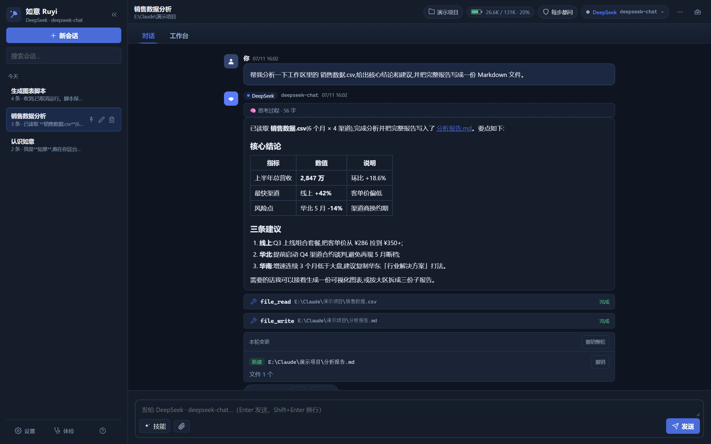
</picture>

<sub>▲ 真实工作流:一句话让 AI 读取工作区里的 CSV → 分析并落一份报告文件 → 对话里给出结构化结论;每个工具调用有卡片、每处文件改动可「撤销」、每轮消耗有账。</sub>

**快速跳转**:[新手从这里开始](#新手从这里开始) · [这是什么](#如意是什么) · [Harness-Bench-360 横评](#harness-bench-360-横评快照) · [与同类软件对比](#与同类软件的对比) · [界面导览](#界面一览) · [核心能力](#核心能力一览当前-master) · [从源码运行(开发者)](#从源码运行开发者) · [English](#english)

---

## 新手从这里开始

**不写代码也能用,全程不需要打开命令行。** 拿到发布包(`dist\Ruyi-<变体>.zip`)之后:

1. **先把 ZIP 完整解压**(不要在压缩包预览里直接运行),建议解压到 `C:\Ruyi` 这类短路径。
2. **双击 `Start-Workbench.cmd`**。工作台会自己启动并打开界面,不需要装 Node、不需要 `npm install`。
3. **跟着欢迎向导走**:选语言 → 接一个模型(填一个 API 密钥就行,或者用本机 Ollama) → 选工作文件夹 → 选安全档。全程有人话说明和当场校验,大约五分钟。
4. **遇到问题看应用内手册**:左下角「帮助」→ 使用手册。手册、日志、体检、重新走一遍引导都在如意里,不用去别处找文件。向导可以「以后再说」,随时从「帮助」里重开。

> 装好之后想让 AI 替你操作桌面和 Office,见下面的[安装桌面控制(ACC)](#进阶操作指引)。开发者从源码运行请看[从源码运行(开发者)](#从源码运行开发者)。

---

## 如意是什么

**如意(Ruyi)** 是一个 clean-room 实现的 Windows 本地 AI 工作台:把「模型对话」升级成「模型替你干活」。它不是又一个聊天壳,也不是程序员专属的编程 CLI——它面向**同一台机器上的两种人**:不写代码的知识工作者(整理文件、汇总报表、写周报、操作 Office),和要干工程活的进阶用户(跑脚本、审代码、多 Agent 调研)。

三组数字勾勒它的形状:

| | |
|---|---|
| **1 个运行产物** | 后端运行时产物是单文件 `app/server.js`(3.5 万+ 行;由 `app/build.js` 把 `app/src/` 的 30 个有序源码模块拼接而成,字节级可复现),**零 npm 运行时依赖**,只用 Node 内建模块——`node server.js` 直接跑,无需 `npm install`,政企内网过审成本最低 |
| **63 个原生工具 · 108 个 ACC 工具** | 文件/终端/搜索/Git/联网/编排等原生工具按实际 `TOOL_HANDLERS` 可达全集计 63 个；可选 ACC 提供截图/OCR/UIA/键鼠/窗口/Office/PDF/编辑/抓取/记忆等 108 个工具。外部 MCP 另行按连接器计数，不再混入 ACC 数字 |
| **8 套模板 · 9 种角色 · 243 项 e2e** | 内置 8 套多 Agent 工作流模板与 9 种节点角色。当前默认回归 236 项，另有 7 项需真实 API/桌面环境的 live probe 按需启用；另含 15 组 unit suite 与 16 组 ACC smoke |

> 原名 **Win Claude Workbench**,自 v0.8 起更名**如意 Ruyi**——去 "Claude" 化是开源发布的法务考量(商标风险 + 旧提示词曾致 provider 模型自称「我是 Claude」的身份错认)。「如意」取「称心如意、如你所愿」之意,图标为青花如意云纹。

## Harness-Bench-360 横评快照

我们在开源 [HarnessBench](https://github.com/Qihoo360/harness-bench) 的文件系统任务、程序化 Oracle、过程轨迹与安全评估方法上做了 **Harness-Bench-360（HB360）扩展**，用同一 `deepseek-v4-flash` 模型对 106 个真实任务、4 种 harness 进行了一次受控横评。以下是 **2026-08-09 的本地测试快照**：

| Harness | Outcome | Process | Security | Efficiency | HarnessBench Combined<br>O×P×S | HB360 Combined+E<br>O×P×S×E | 估算成本 | 平均耗时 |
|---|---:|---:|---:|---:|---:|---:|---:|---:|
| **Ruyi** | 77.2 | 98.1 | 100.0 | **65.1** | **75.7** | **49.6** | **$0.60** | 97s |
| Hermes Agent | **80.6** | **98.8** | 100.0 | 51.3 | **79.6** | 41.9 | $0.92 | 159s |
| Codex (WSL2) | 76.9 | 78.2 | 100.0 | 63.6 | 60.1 | 36.6 | $1.58 | **90s** |
| OpenClaw | 63.2 | 74.4 | 100.0 | 50.1 | 47.0 | 23.0 | $1.18 | 156s |

这组结果显示的不是“每个单项都第一”，而是 Ruyi 在质量、过程可靠性、成本和时延之间取得了更均衡的折中：上游原生 Combined（O×P×S）由 Hermes 以 79.6 领先，Ruyi 为 75.7；加入工程效率后，Ruyi 凭 **Efficiency 65.1（四家最高）**，在 HB360 Combined+E 中以 **49.6** 排名第一，同时取得最低估算成本 **$0.60**。单项 Outcome 与速度则分别由 Hermes 和 Codex 领先。Ruyi 的 106 项中有 101 项有效结果；4 个 harness 共有 5 项预期失败，便于把环境/任务问题与框架差异分开看。

> **口径与边界：**表中同时列出两种分数：HarnessBench Combined = Outcome × Process × Security；HB360 Combined+E = Outcome × Process × Security × Efficiency。前者侧重结果、过程与安全，后者额外衡量 harness 工程效率，两种 Combined **不能直接横比**。上游 Combined 由表内展示值计算并四舍五入到 1 位小数；HB360 Combined+E 来自 benchmark 汇总结果。成本按统一基准价和修正后的缓存记账归一化，是测试估算而非供应商账单；本表是单机、单模型、单次测试快照，不是官方排行榜。原始逐任务结果保留在独立 benchmark 工程中，未随本仓库发布。

### Escapade 2.6.0 重点更新

- Agent CLI 设置升级为可选驱动，除 Claude Code 外新增 Kimi Code 的探测、登录、启动、会话续接和 MCP 桥接支持。
- 新增 WinForms + WebView2 原生桌面壳，补齐圆角、任务栏语义、边缘/四角自由缩放与平滑滚动。
- Claude Code MCP/Skills 自动映射；后台子 Agent 进入可持续追踪的 DAG，支持长工具存活检测、插话与语义防卡。
- 工具安全与可靠性继续加固；HB360 场景下采用按需工具目录、自检、只读批量并行和耗时遥测，减少无效提示词与等待。
- 右侧工作区改为面向任务的 6 个入口；底层搜索、读文件、终端、桌面和 MCP 工具不再作为“手动运行器”暴露，诊断信息集中到“设置 → 体检”。

## 与同类软件的对比

市面上的 AI 工具大致分三类:云端对话应用(网页/客户端聊天壳)、编程 CLI Agent(面向开发者的终端工具)、云端自动化 Agent(任务托管在别人服务器上)。如意占的是它们都没占的位置——**本地、动手、可撤销、非程序员可用**:

| 维度 | 云端对话应用 | 编程 CLI Agent | 云端自动化 Agent | **如意 Ruyi** |
|---|---|---|---|---|
| 运行位置 | 厂商服务器 | 本机终端 | 厂商沙箱 | **本机,数据不出门** |
| 无外网 / 内网部署 | ✗ | 部分(模型仍需在线) | ✗ | **✓ 端点可指向内网模型** |
| 操控本机桌面/Office | 基本没有 | 弱(以代码为主) | 在云端虚拟机里 | **✓ 108 工具直接控本机,纯文本模型也能用(OCR+UIA 文字定位,不依赖视觉模型)** |
| 做错了能撤销吗 | 无此概念 | 靠 git | 很难 | **✓ 文件检查点+对话回溯成对交付,权限弹窗上就写着「可撤销」** |
| 多 Agent 协作 | 无/黑箱 | 有但多为命令行输出 | 黑箱 | **✓ DAG 图形编辑器 + 实时协作监控画布** |
| 成本透明 | 订阅价 | 部分 | 订阅价 | **✓ 分币种逐笔记账,子代理/压缩全入账,不虚报成本** |
| 非程序员可用 | ✓(但只能聊) | ✗ | ✓(但不可控) | **✓ 简易/专业双模式,一键任务卡** |
| 部署/审计成本 | — | 需 Node/Python 生态 | — | **单文件零依赖,离线 zip 解压即用** |

五个别处很难同时拿到的点:

1. **操作级撤销** —— 文件检查点 + 对话回溯**成对交付**,可撤销性直接体现在权限弹窗时刻(见下方截图)。多数 computer-use 产品的 OS 级撤销基本缺席,这是最强的安全差异化。
2. **纯文本模型也能操控桌面** —— OCR + UIA 文本 grounding,不依赖视觉模型。受限内网往往只有文本模型,这直接决定可用性下限(视觉是增强,不是前提)。
3. **内网部署优先 + 零依赖可审计** —— 单文件后端、零 npm 运行时依赖、前端无框架无构建,全部离线可跑;安全团队要审的面最小。
4. **中文优先 + 中英双语** —— 默认中文体验，同时可在设置中切换简体中文、英文或跟随系统；设置、Provider 卡片、权限/能力弹层、模型菜单、产物、快捷键、命令面板、技能库与结构化 API 错误均由语言资源渲染。内置技能和一键任务随界面语言本地化，用户/项目自定义内容保持作者原文。会写代码的和不写代码的共用一套壳，双模式切换。
5. **双引擎不锁定** —— 任意 OpenAI 兼容端点(DeepSeek / 通义千问 / 智谱 GLM / 内网 vLLM·Ollama)或 Agent CLI（Claude Code / Kimi Code）,随时切换、上下文跨引擎续接。

## 界面一览

| | |
|---|---|
| 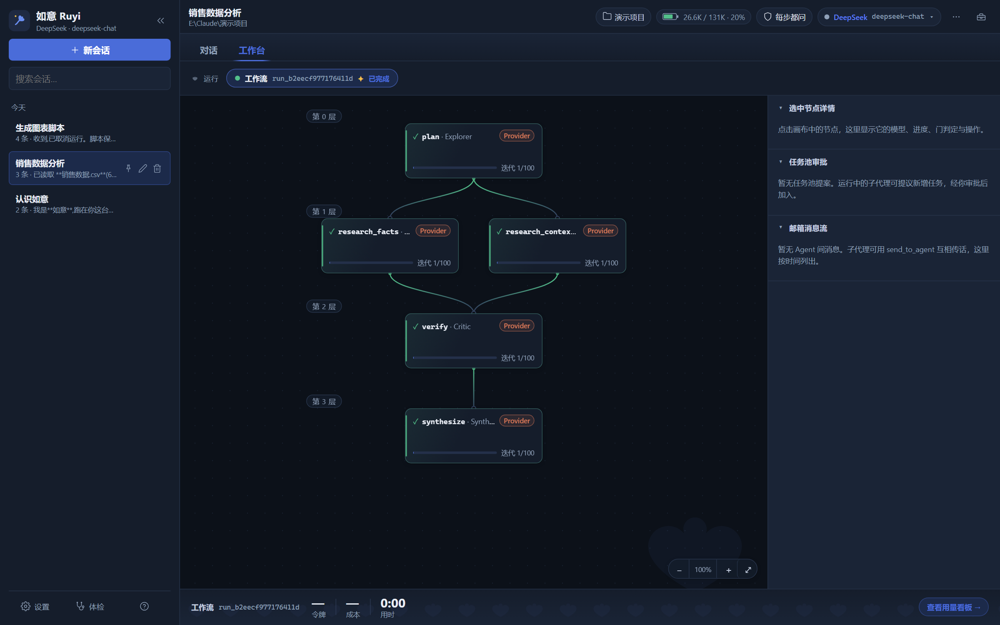 | 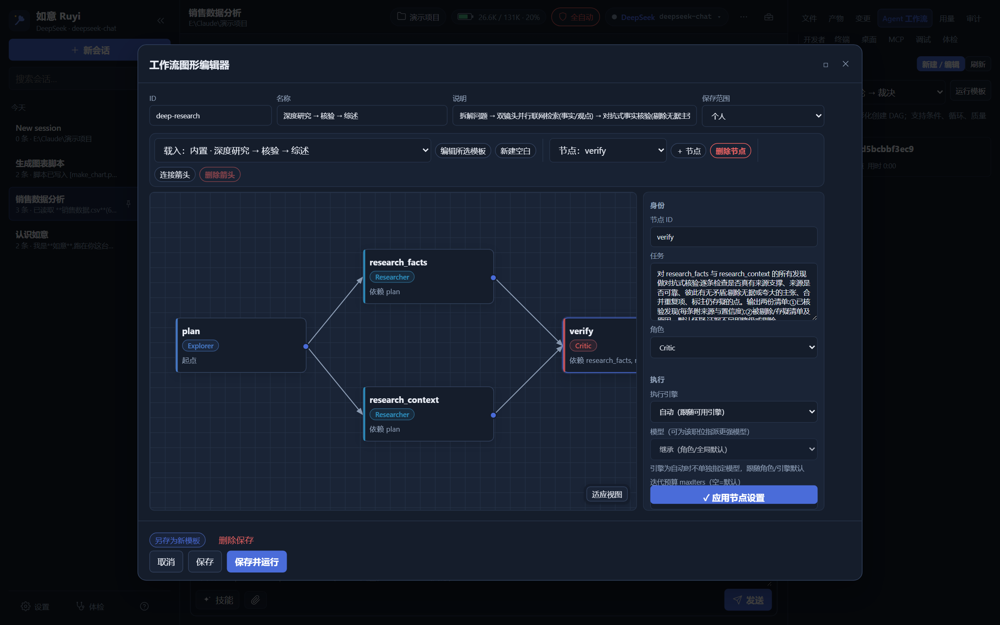 |
| **工作台画布**:多 Agent 工作流实时协作图——谁在跑、跑到哪、卡在哪;右栏是节点详情、任务池审批、Agent 邮箱 | **工作流图形编辑器**:拖节点、连箭头、按角色配色;检查器可给每个节点指派引擎/模型/工具级别/质量门 |
| 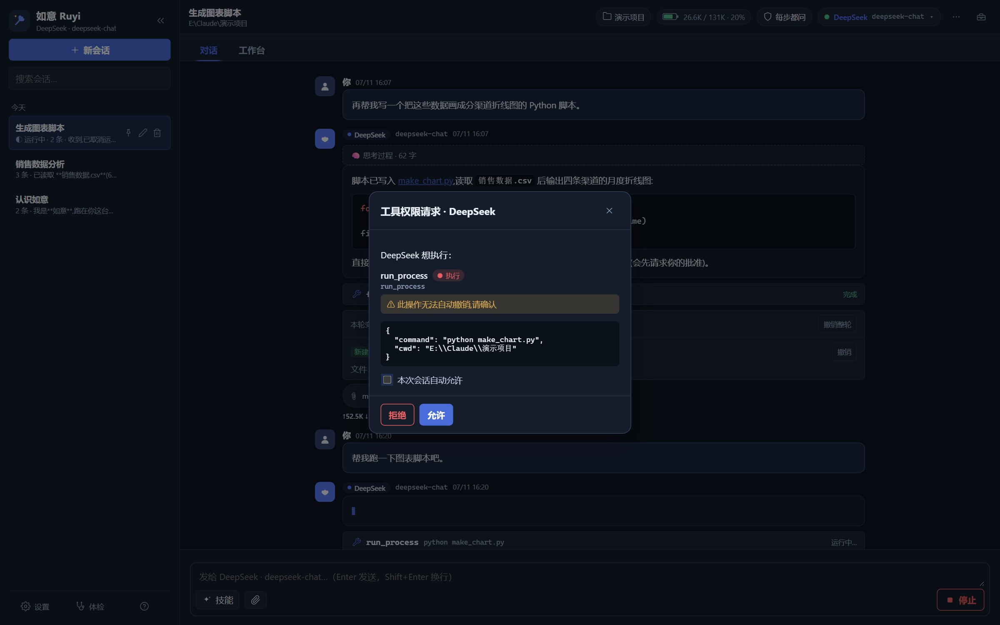 | 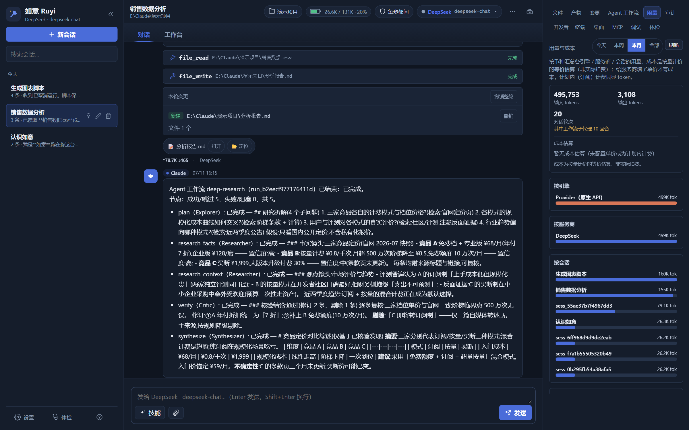 |
| **权限审批**:执行级操作弹卡确认,「此操作无法自动撤销」写在脸上;可拒绝、可本会话内自动允许 | **用量与成本**:输入/输出 token、对话轮次(含工作流子代理回合)、按引擎/服务商/会话三维拆分,诚实计账 |
| 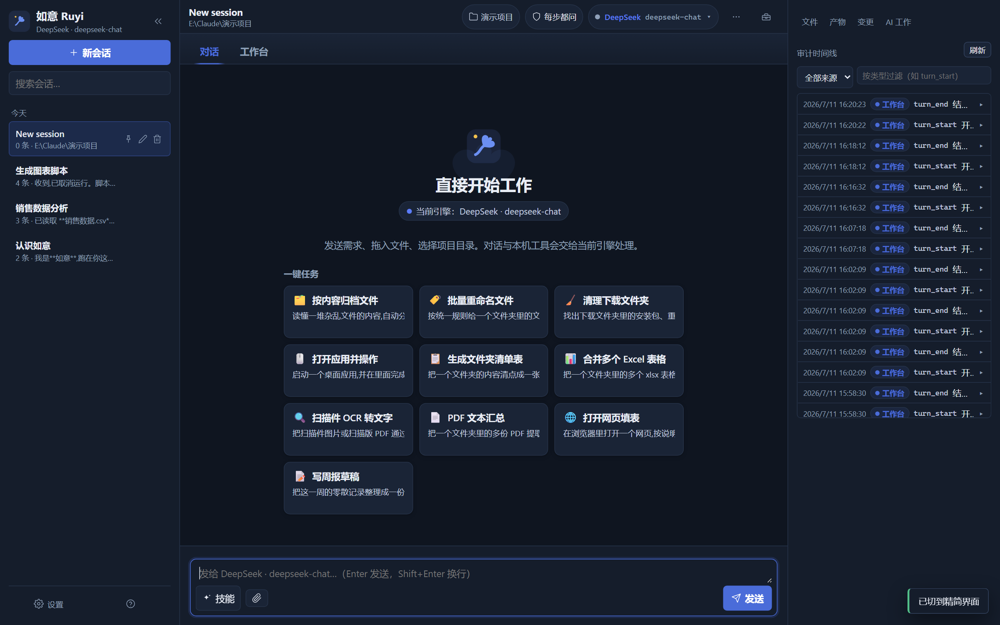 | 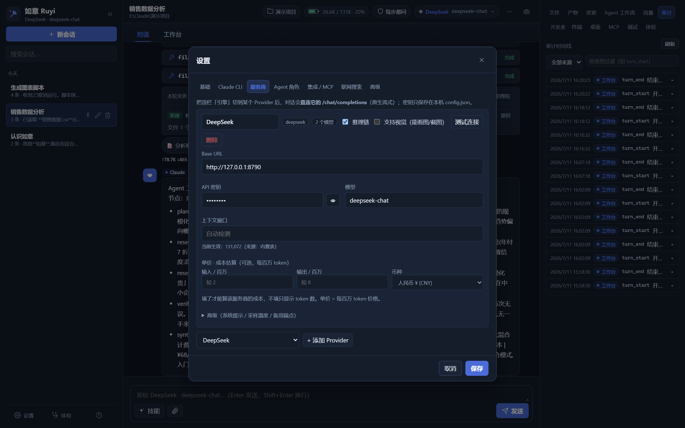 |
| **简易模式**:非程序员画像——一键任务卡(归档/重命名/合并 Excel/OCR/PDF 汇总/写周报…),开发者页签自动隐藏 | **模型服务**:填 Base URL + 密钥即接入任意 OpenAI 兼容端点;密钥只存本机、界面掩码;可配单价用于成本估算 |

<details>
<summary><b>更多截图(文件面板 / 检查点 / 审计 / 技能库 / 记忆 / 首启引导…)</b></summary>

| | |
|---|---|
| 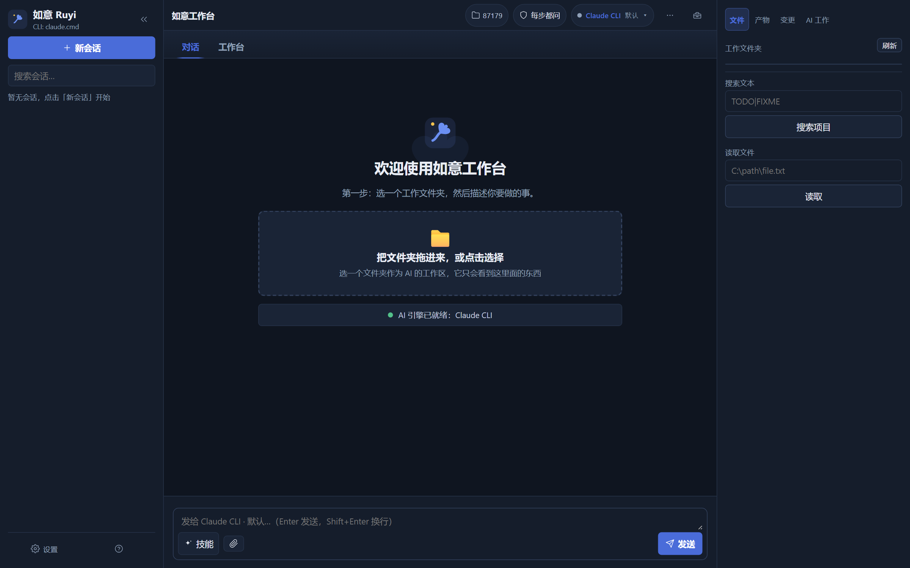 | 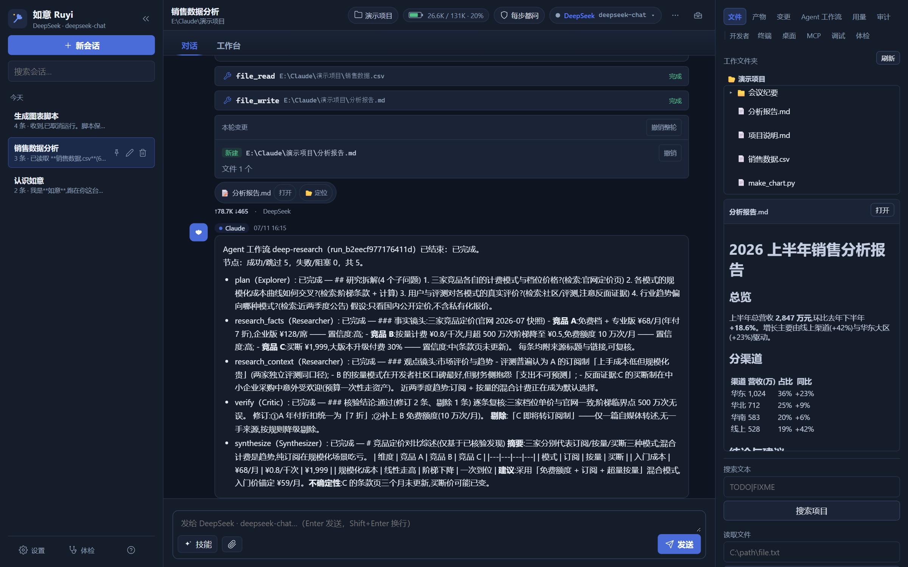 |
| **首次启动**:选一个工作文件夹就能开始;自动探测本机 Claude CLI 与可用引擎 | **文件页签**:工作区文件树 + 单击预览;AI 只能看到工作区内的东西 |
| 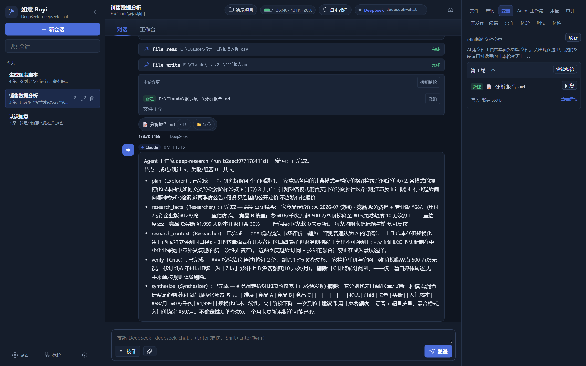 | 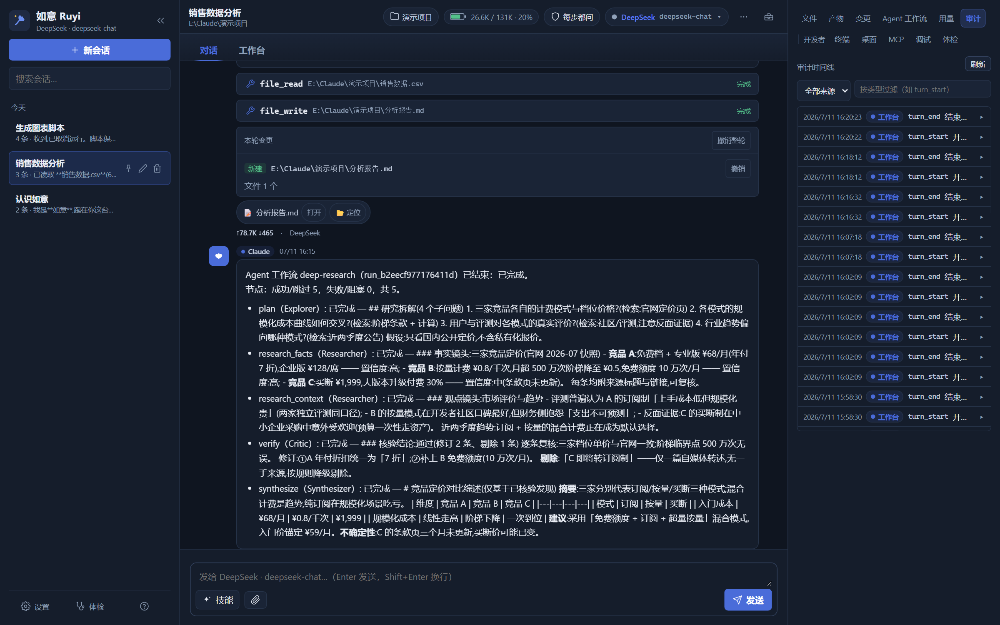 |
| **变更页签**:每轮的文件改动逐条列出,单条撤销或整轮回滚 | **审计时间线**:每个回合、每次工具调用、每次权限决定都有据可查 |
| 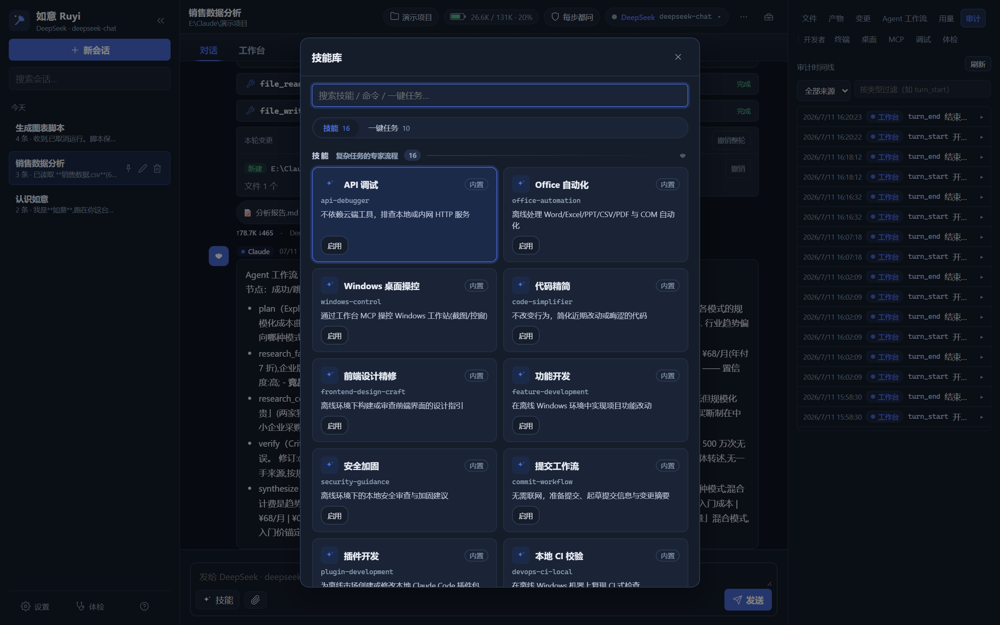 | 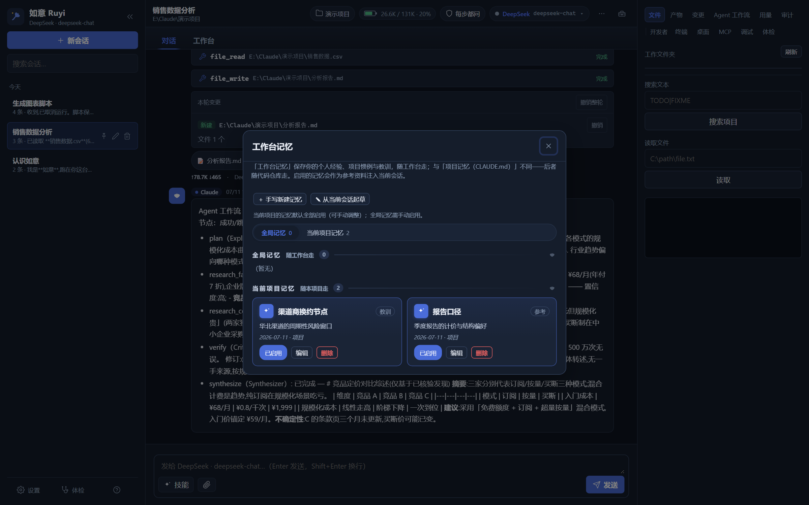 |
| **技能库**:内置/用户/项目/Playbook 四源技能,支持会话启用与全局常驻 | **工作台记忆**:跨会话的个人经验与项目惯例,起草-确认入库,按项目分组 |
| 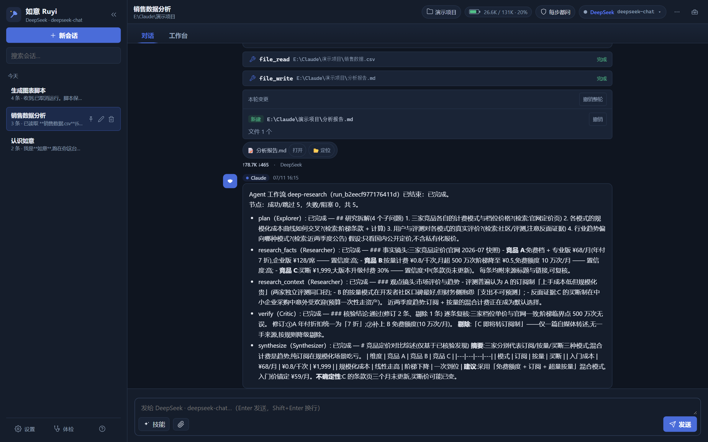 | |
| **工作流汇总**:运行结束后各节点结论回填对话,Explorer 拆解 → Researcher 双镜头 → Critic 核验剔除 → Synthesizer 综述 | |

</details>

## 核心能力一览（当前 master）

| 能力 | 说明 | 详解 |
|------|------|------|
| 双引擎对话 | 任意 OpenAI 兼容端点与 Claude CLI 随时切换,跨引擎上下文续接;DeepSeek 预设可选 Responses API 协议 | [§1](#1-双引擎任意模型端点都能开工) |
| 原生工具环 | 63 个内置工具:文件/终端/搜索/Git/联网/编排,按 read/edit/exec 三级分档 | [§2](#2-原生工具环63-个内置工具) |
| 工具合批与分阶段 | 参数确定且互不依赖的工具在一次模型响应中合批；存在结果依赖时按阶段等待再继续，减少无效模型往返 | [§2](#2-原生工具环63-个内置工具) |
| 结构化交互提问 | 单选、多选、自由输入及“选项＋其他回答”；稳定选项 ID、说明卡与送达确认，双引擎共用 | [§1](#1-双引擎任意模型端点都能开工) |
| 多 Agent 编排 | DAG 工作流、8 套模板、9 种角色、5 种质量门、图形编辑器、实时监控；Claude CLI 原生子 Agent 也可显示只读父子图、等待进度与回传结果 | [§3](#3-多-agent-编排dag--质量门--图形编辑器) |
| 长任务自主推进 | 任务账本 until-done 驱动;零 token 等待;可选的分级崩溃恢复;增量监控(传输量降 ≥80%)与运营指标 | [§3](#3-多-agent-编排dag--质量门--图形编辑器) |
| 信任层 | 文件检查点 + 对话回溯成对交付;5 档权限模式 × 工具三级;全量审计时间线 | [§4](#4-信任层检查点--回溯--权限--审计) |
| 桌面 / Office 操控 | 截图/OCR/UIA/键鼠/窗口/Office/PDF(桌面控制 MCP,ACC v1.9.1,108 工具,可选安装) | [§5](#5-桌面--office-操控acc可选) |
| 技能 / 记忆 / Playbook | 四源技能注册表 + 跨会话工作台记忆 + 可复用任务剧本,全部渐进注入 | [§6](#6-技能--记忆--playbook) |
| 联网检索 | 8 种搜索后端,内置后端零配置可用;SSRF 防御;抓取带离线缓存;DeepSeek Responses 可开服务端搜索 | [§7](#7-联网检索与网页抓取) |
| 成本 / 用量看板 | 分币种逐笔记账,区分官方/第三方计划/按量;Provider 支持缓存命中价与逐模型覆盖;子代理与压缩全入账;月度预算告警 | [§8](#8-用量与成本看板诚实计账) |
| 中英界面 | 设置中支持跟随系统、简体中文、英文；设置、动态弹层、技能库/一键任务与 API 错误可本地化 | [多语言方案](docs/i18n/README.md) |
| 团队模式 | 共享任务池(子代理提案→审批→物化)、Agent 邮箱、对指定节点定向插话 | [§3](#3-多-agent-编排dag--质量门--图形编辑器) |
| 语义防卡 · 防空转 | 主回合结果指纹无进展判定，与同签名连击互补；探索工具宽阈值，warn 先行不 abort | [§3](#3-多-agent-编排dag--质量门--图形编辑器) |
| 智能打断与恢复 | between-tools 批次边界中断 + steerable 打断流；配对安全补 refusal；连续执行 loop-guard 暂停 | [§3](#3-多-agent-编排dag--质量门--图形编辑器) |
| 提示词分层注入与 i18n | system prompt 拆为逐字节稳定的锚点层 + volatile 层注入第一条 user 消息（prefix-cache 友好）；中英双语提示词按 UI 语言加载 | [§3](#3-多-agent-编排dag--质量门--图形编辑器) |
| 分级 UI | 简易/专业双模式、深/浅/跟随系统三主题、V4 毛玻璃视觉系统 | [§9](#9-分级-ui简易专业双模式) |

> 每项功能均经「实现 → 多视角对抗验证 → 修复 → 独立回归」闭环交付。当前共 243 项 e2e：默认运行 236 项，另有 7 项真实 API/桌面环境 probe 按需启用；另含 15 组 unit suite。迭代与发布规则见 [优化路线图](docs/OPTIMIZATION-ROADMAP.md)；面向用户的发行摘要见 [`CHANGELOG.md`](./CHANGELOG.md)。

## 功能详解

### 1. 双引擎:任意模型端点都能开工

- **OpenAI 兼容引擎(原生)**:直连 HTTP + SSE 流式,带完整原生工具循环。内置四组预设:**DeepSeek / 通义千问 DashScope / 智谱 GLM / 自定义**(内网 vLLM、Ollama、one-api 网关均可)。DeepSeek 预设默认走官方 **Responses API** 协议(`apiStyle=responses`,服务端工具循环),其它预设走 Chat Completions;主回合/子代理/摘要/Playbook/JSON 修复全链路跟随所选协议。多 Provider 并存,顶栏一键切换模型。
- **Agent CLI 引擎(可选)**:可选择 Claude Code 或 Kimi Code。Claude 支持实时转向、权限桥接与原生 Agent；Kimi 走官方 ACP（JSON-RPC/NDJSON）驱动，桥接原生工具事件、Ruyi 审批和原生计划事件；ACP `request_permission` 走单选，`elicitation/form` 可走多选；Ruyi DAG 中的 Claude CLI 节点仍由 Claude Code 执行。
- **工具提示词智能按需**:默认先按任务装载相关工具包,缺少能力时由 AI 搜索并增量装载；OpenAI 兼容引擎在下一次工具循环加入具体 schema，Claude CLI 通过分级代理调用隐藏工具。简单问题不再反复携带整套约 140 个工具；设置 → 高级可切回“全部常驻”兼容模式。[设计与本机 A/B](ruyi-workbench/docs/TOOL-LOADING_CN.md)
- **跨引擎续接**:同一会话里从 DeepSeek 切到 Claude(或反向),历史自动嫁接,不断上下文。
- **可靠交互提问**:Claude CLI 与 OpenAI 兼容引擎共用 `request_user_input` 通道；支持单选、多选、纯文本和「选项＋其他自填」,选项说明与稳定 ID 随结构化答案交回模型；回答只有在工作台确认已送达后才会关闭，后台会话的提问也会立即提示。
- **上下文电量表**:顶栏实时显示已用/上限 token(自动探测上下文窗口,支持手动锁定);超阈值自动两级压缩(蒸发 → 摘要),也可手动 `压缩`。
- **能力矩阵**:视觉(看图)、推理链、工具调用等能力按端点探测/标注,缺什么 UI 直接告诉你,不让你对着黑箱猜。
- **计划模式**:提问先出 `PLAN:`,你批准了才动手(provider 引擎真流程,不是提示词装饰)。

#### Kimi Code ACP 兼容层与边界

- Kimi 的 ACP `session/update` 中的 `plan_update` 是只读计划快照：同一 `planId` 会原地更新，不显示 Ruyi 审批按钮，也不把它误标成等待审核。真正的 `ExitPlanMode` 仍走现有 `ask_user`，保留原生 `plan_approve` / `plan_opt_N` / `plan_revise` / `plan_reject_and_exit` 选项；能力边界按 ACP 形状区分：`request_permission` 是单选，`elicitation/form` 支持多选，不把所有原生 AskUserQuestion 形状都宣称为多选兼容。
- 版本兼容层对本地 npm 安装的 Kimi Code **0.37.2** 有一个已知、精确匹配的 helper 补丁；它只在明确匹配时启用，不改写用户的 Kimi 安装。未知源码布局或非 npm 安装会明确降级，不能据此宣称同等兼容。
- 当前 ACP prompt 结束后子进程会关闭；Kimi ACP driver 只转发绑定当前 prompt `turn_id` 的事件。因此 Goal / Cron / 后台任务跨回合连续运行不宣称完整兼容，也不承诺 100%。
- `dev-harness/kimi-acp-live-probe.js` 是“本地模拟模型 + 真 Kimi CLI”的探针，不用凭据，也不是真线上模型；它验证的是本机 ACP/工具/桥接链路。

### 2. 原生工具环:63 个内置工具

全部用 Node 内建模块实现(零依赖),按风险三级分档:**read**(只读,自动放行)/ **edit**(写入,先记检查点,可撤销)/ **exec**(执行,最高危,默认逐次确认):

Escapade 2.4 会明确引导两种调用方式：参数已确定且互不依赖的工具在同一条助手消息中合批，省去重复模型往返；若后一步参数或执行条件依赖前一步结果，则先等待当前批次的 `tool_result` 再进入下一阶段。普通工具保持既有顺序、权限、检查点和插话边界，不用一个绕过安全层的“大批处理工具”取代原分发链。

| 类别 | 代表工具 |
|---|---|
| 终端 / 执行(7) | `powershell_run` · 持久终端会话 `shell_start/send/poll/kill/list` · `script_run`(PS/Python/Node 临时脚本) |
| 文件(12) | `file_read/write/edit/delete/move/copy` · `file_list/search/glob` · `archive_zip/unzip`(防 Zip-Slip) · `http_download` |
| 桌面交接(4) | `browser_open` · `office_open` · `desktop_screenshot` · `keyboard_send_keys` |
| 项目智能(6) | `project_snapshot` · `dependency_inventory` · `code_review_scan` · `frontend_audit` · `claude_md_audit` · `docs_search`(全部离线扫描器) |
| Git(4) | `git_status/diff/log`(只读)· `git_commit` |
| 联网(3) | `web_search` · `web_fetch`(SSRF 防御 + 离线缓存)· `http_request`(本机/内网 API 调试) |
| 规划 / 编排(4) | `request_user_input`(可靠收集用户选择)· `todo_write`(驱动 UI 步骤条)· `spawn_agent`(隔离子回合)· `orchestrate_agents`(启动 DAG 工作流) |
| 按需注册(3) | `skill_read`(技能全文拉取)· `propose_task`(任务池提案)· `send_to_agent`(Agent 邮箱) |

外部 MCP 工具(桌面控制、drop-in 连接器)会**桥接**进这个循环,并沿用同一套分级审批。

### 3. 多 Agent 编排:DAG + 质量门 + 图形编辑器

一句「深度调研一下竞品定价」,如意会派一队各司其职的子代理,并在**工作台画布**上实时画出协作图(见上方截图)。

**8 套内置模板**(节点数为默认值,均可在编辑器里改):

| 模板 | 形状 | 适用 |
|---|---|---|
| 深度研究 → 核验 → 综述 | 拆解 → 双镜头并行检索 → 对抗核验 → 带引用综述(5 节点) | 要可靠、可追溯结论的调研 |
| 代码审计 | 建库地图 → 正确性/安全/质量三维并行 → 核验 → P1/P2/P3 排期(6 节点) | 接手陌生代码库、上线前体检 |
| 实现 → 审查 → 修复 → 测试 | 审查不过才进修复,最后独立验收(4 节点) | 有明确验收标准的开发任务 |
| Bug 定位 | 复现 → 双假设并行 → 验证 → 根因修复(5 节点) | 难缠 bug 的系统化排查 |
| 需求 → 多方案 → 选型 → 落地清单 | 三种取向并行出方案 → 加权横评 → 可执行清单(6 节点) | 技术选型、架构决策 |
| 文档生成 | 提纲 → 分节并行撰写 → 事实核查 → 统稿落盘(5 节点) | 从零写长文档 |
| 数据洞察 | 探查 → 方案 → 主线/交叉双分析 → 核验 → 洞察(6 节点) | 数据分析与报告 |
| 正反辩论 → 裁决 | 正反并行 → 交叉审查裁决(3 节点) | 有争议的决策 |

**9 种节点角色**(各带提示词、工具面、预算与配色):Explorer 探索 · Worker 实现 · Reviewer 审查 · Verifier 验证 · Planner 规划 · Researcher 调研 · Critic 对抗评审 · Synthesizer 汇总 · Analyst 分析。

**编排原语**:节点级引擎/模型指派(如「检索用快模型、核验用强模型」)· 依赖边 · 条件执行(审查不过才修复)· 循环(直到满足条件,防空转)· 失败策略(阻塞/继续/重试)· 资源租约(防死锁)· Git worktree 隔离(并行改文件不打架)· 结构化输出 Schema · **5 种质量门**(review / verify / vote 法定人数 / cross_review / dedupe,其中 vote 与 dedupe 为确定性算法,不烧 token)。

**AI 主动编排 + 按难度选模型**:对话里出现「调研 / 审计 / 排查 / 选型 / 写文档」这类意图时,两个引擎都会收到模板清单、意图→模板映射,以及**当前可用模型的能力档位清单**(按引擎分组、快 / 均衡 / 强分档)——模型可自主发起 `orchestrate_agents`,并**按每个节点的任务难易自主指派模型**:简单/大批量节点用快模型省成本提速、核心推理/综合/质量门用强模型保质量(带「简单任务别套模板」护栏防过度编排)。也可一键开启「按工具级别自动派档」,让没显式指定模型的节点由后端按 read→快 / exec→强 兜底。

**对话框「Agent 团队」**:需要明确使用多 Agent 协作时,点一下再发送。本轮强制调用 `orchestrate_agents`：优先匹配预设工作流,没有合适模板时自行设计最小必要 DAG。节点默认先探测并使用“子代理优先端点 / 模型”；端点失效或模型不存在时回退到当前对话正在使用的端点与模型。开关发送后自动复位,该契约通过结构化请求分别注入 OpenAI 兼容驱动与 Claude CLI,不会改写用户原始消息。

**团队模式 v2**:运行中的子代理可 `propose_task` **提案追加节点**,经你审批物化进 DAG(运行时嵌套委派的可观测替代);节点间可用 `send_to_agent` 单向异步传话(与用户插话分池);你还能对**指定节点**中途**定向插话**,下一次模型调用前生效。

**长任务自主推进(可跑数小时、崩了能续)**:不是把「继续执行」粗暴地变成无限循环,而是让目标、等待、恢复和人工接管都可见、可控。

- **任务账本**:把目标拆成带验收证据的里程碑,可选 `until-done` 自动推进;连续无进展会停滞,预算用尽则存档暂停——进度保留,不把「还没做完」伪装成报错或完成。
- **等待不烧 token**:`wait_for` 可等到指定时间、文件出现、进程存在或 URL 可达;等待节点不占并发槽、不调用模型,并对工作区路径、进程探测和 URL 请求分别设护栏。
- **恢复按副作用分级**:每一步状态原子落盘,重启后先诚实标出中断点。开启自动恢复后,纯读 / 等待 / 确定性质量门可继续;命令执行、已写入或能力不明的节点一律暂停等待确认,**绝不盲目重放不可逆副作用**。
- **上下文、产物与监控都有边界**:子代理的上游结论按预算收敛,文件产物可单独追溯;监控改走增量事件流(相比全量轮询传输量降 ≥80%),运行干预次数、失败分类和预算超支率随手可查。

**语义防卡 · 防空转**(51a):主回合结果指纹(`resultFingerprint`)无进展判定——连续 N 轮工具输出均为相同结构/无新写入文件/无新 URL → 判定循环暂停;与"同签名连击"互补（连击看工具名+参数,loop-guard 看结果产出）;探索类工具(`read_file`/`file_search`/`glob`等)宽阈值;warn 先行不直接 abort,用户可主动"调整方向"解锁。

**智能打断与恢复**(51b):between-tools 批次边界中断——steer 队列(`steerQueue`)在每轮结束时检查,命中时注入定向提示到下一轮 system prompt（Codex 级立即生效）;配对安全补 `refusal`——被打断的回合若模型已产出 refusal 片段,系统自动补完安全拒绝语义,避免半句 refusal 暴露给用户;连续执行 loop-guard 暂停后,用户发消息即触发恢复。

**提示词分层注入与 i18n**(51c-b/51d):provider 引擎 system prompt 拆为两层——① **锚点层**（`buildStableSystemPrompt`：身份+工具协议+provider 追加指令）,同一会话逐字节稳定,prefix-cache 友好;② **volatile 层**（`buildVolatileParts`：能力探测/桌面状态/搜索配置/风格/项目/技能/记忆/任务账本）,每轮合并为 Markdown 块注入第一条 user 消息。首轮 token 开销下降约 1000–3000,多轮累积节省显著。中英双语系统提示词通过 `06b-prompt-registry.js`(PROMPT_PACK_VERSION='2026-w51-1')按 UI 语言从 `i18n/prompt-packs/` 按需加载。

### 4. 信任层:检查点 / 回溯 / 权限 / 审计

「让 AI 动手」的前提是「动错了能收回来」:

- **文件检查点**:每个写操作(写/改/删/移/复制/解压/下载)先把「改前状态」压缩入检查点日志——单条撤销、整轮回滚,对话里每轮变更直接列出(见上方截图)。代码任务还会在回合开始建立轻量工作区基线,补捉 Claude 原生编辑/脚本等绕过文件工具的改动；基线共享 2 秒启动预算并限制文件数/内存，超大仓库超时会明确标记并只保留可证明的部分覆盖，不阻塞开工也不误归因旧改动。变更中心可优先调用该代码类型的 Windows 默认编辑器，一键打开单文件或整轮 Diff（危险的脚本宿主关联会被拒绝）。
- **对话回溯**:把会话拨回任意轮次,可选同时回滚该轮之后的文件改动——**对话和文件一起回**,不是只删聊天记录。
- **5 档权限模式 × 工具三级**:默认「每步都问」(exec 逐次确认),另有 接受编辑 / 计划模式 / 全自动 / 跳过确认;审批卡上明示风险级别与「此操作无法自动撤销」;只读/编辑级可记住「本会话自动允许」,**执行级永远不能被持久放行**。
- **自主性授权书**:需要连续执行时,可从本机 UI 签发一张比当前权限更窄的临时授权——文件路径 glob、命令前缀、联网许可、次数和有效期都可限定,支持本次运行/本会话范围并可随时撤销;不会出现「全工具、全工作区、无限次」的宽泛预设。
- **审计时间线**:每个回合、每次工具调用、每次权限决定落 NDJSON 审计日志,右栏可按来源/类型过滤(见上方截图);记录经密钥脱敏后才下发。
- **本机加固**(部分成果,详见 [SECURITY.md](./SECURITY.md)):服务只绑 `127.0.0.1` + 页面 token;Host 白名单抗 DNS-rebinding;`web_fetch`/`http_download` 拒绝私网/回环地址(SSRF);数据目录敏感文件(密钥、会话、审计)对文件工具**双向拒绝**(含 junction/短名绕路);API 响应里密钥一律掩码。

### 5. 桌面 / Office 操控(ACC,可选)

`mcp/ai-computer-control/` 是随发行包捆绑的**桌面控制 MCP**(v1.9.1,Python ≥3.12,共 **108 个工具**),装好后工作台自动探测,并把工具同时供给两个引擎:

启动时，工作台会先验证候选 Python 能否导入 ACC；完整离线包内的 `python_embed` 和安装器部署到 `%LOCALAPPDATA%\ai-computer-control\runtime\python` 的运行时均可直接识别。发现缺少依赖的旧运行时会自动跳过并回退到旧版安装器的 `venv` 或可用的系统 Python。

- **看**:全屏/区域/窗口截图、OCR 文字识别与定位、UIA 控件树读取、模板匹配。
- **动**:鼠标(移动/点击/拖拽/滚轮)、键盘(输入/组合键)、窗口管理(9 工具)、应用启停、剪贴板、对话框处理、宏录制回放。
- **办公**:Word/Excel/PPT/PDF 读写,Excel 美化与图表、PPT 生成走**三套内置设计系统**(青花商务/墨白极简/活力现代),中文字体纪律(`w:eastAsia`)内建。
- **关键设计**:①**文字 grounding 优先**——OCR+UIA 让纯文本模型也能精准定位控件,视觉模型只是增强;②**观察-验证**工具(`observe`/`act_and_verify`)把「点了没生效」变成可判定;③可选依赖缺失时**优雅降级**(无 winsdk 则 OCR 停用,其余照常);④文件类改动同样进工作台检查点,可撤销;⑤变更类操作自动落 NDJSON 审计。
- **浏览器目标**:默认 `system`，URL 以新标签页/窗口交给用户实际默认浏览器和现有登录会话，不再隐式启动 Chrome for Testing；工作台标签页是受保护页，浏览器工具不会导航、复用或关闭它。设置 → 集成/MCP 可改为已安装浏览器、指定可执行文件、CDP 已有浏览器或显式的隔离测试浏览器。系统模式不拥有用户窗口，也不会在 `browser_close` 时关掉它。
- **Direct3D 降级**:管理型 Chromium 会启用 renderer accessibility；若硬件加速页面仍只向 UIA 暴露浏览器外壳，工具会返回 `accessibilityLimited`，自动引导 AI 改走 CDP/DOM、OCR 或截图坐标。OCR 的 winsdk 字节输入已做跨版本兼容。
- **对话式工具配置**:用户明确提出“添加/删除/启停 MCP”或“更改浏览器目标”时，AI 可先用脱敏清单检查现状、说明差异，再经执行级权限确认写入配置并刷新连接；不会回显环境变量值，也不能静默替换内置程序或降低权限等级。

### 6. 技能 / 记忆 / Playbook

- **技能库**:四源注册表——内置 toolkit(20 技能:代码审查/文档处理/表格分析/结构化写作/调研/API 调试/安全检查…)、用户库(`dataRoot/skills`)、项目库(`.ruyi/skills/`)、Playbook 并入;技能可仅对当前会话启用,也可设为全局常驻(各上限 8)。卡片可展开完整细则;系统提示词只放紧凑索引,provider 引擎经 `skill_read` 按需拉全文,Claude 引擎经 `--append-system-prompt` 展开——**两引擎同一套技能**。13 个内置命令在 Claude CLI 下保持 `/name` 语义,在 Provider 下会插入同一份完整任务模板。
- **工作台记忆**:跨会话的个人经验/项目惯例/教训,**起草-确认**才入库(AI 不会偷偷写),按项目分组、可迁移;注入时带围栏标记且默认只进当前项目相关内容。与随代码仓库走的 `CLAUDE.md` 项目记忆分工明确。
- **Playbook**:把跑顺了的任务「存为剧本」,AI 自动起草步骤与参数,确认后进技能库,下次一键复跑(内置 15 个常用剧本,表单内可预览完整执行与验收说明)。

### 7. 联网检索与网页抓取

- `web_search` 支持 **8 种后端**:内置(零配置,必应中国→百度 HTML 解析,无需任何 Key)/ SearXNG / Bing / Brave / Tavily / 博查 / 自定义 / 关闭。
- **服务端搜索(DeepSeek Responses)**:开启 per-provider `serverWebSearch` 后,`web_search` 映射为 DeepSeek 服务端 `{type:'web_search'}` 工具——由模型侧执行搜索并回带结果,省掉一轮本地往返;关闭或不支持时自动回退上面 8 种本地后端。
- `web_fetch` 抓正文并抽取标题/主体(≤3 跳转、10s、2MB 上限),**失败回退离线缓存**;拒绝内网/回环地址。
- 子代理与工作流节点同样可以联网(Researcher 角色默认带检索),因此「深度研究」模板在有网环境是真检索,断网或受限内网环境自动退化为基于本地材料的分析。

### 8. 用量与成本看板:诚实计账

- **分币种逐笔记账**,绝不强行换算汇率;给服务商填了单价才估成本,没填就只显示 token,并明确标注「等价估算(非实际扣费)」。
- 第三方 Coding Plan(如火山方舟 Ark)标注「计划内计费」,**不计入真实花费**——不虚报你没花的钱。
- **所有烧 token 的路径全入账**:工作流子代理回合、自动/手动压缩、Playbook 起草……看板上「对话轮次」直接标出「其中工作流子代理 N 回合」。
- 按 **引擎 / 服务商 / 会话** 三维拆分,支持今天/本周/本月/全部;可设月度软预算,超了告警不拦人。

### 9. 分级 UI:简易/专业双模式

- **简易模式**(默认):一键任务卡(按内容归档/批量重命名/清理下载/合并 Excel/OCR/PDF 汇总/网页填表/写周报…)、开发者页签隐藏、术语全部人话。
- **专业模式**:右栏保持 6 个任务入口——工作区文件/产物/变更/Agent 工作流/用量/活动；底层搜索、读取、终端、桌面与 MCP 调用由 AI 按权限执行，不作为手动运行器暴露。连接器配置仍在设置中，状态、存储、性能与原始日志统一收进「设置 → 体检」。
- **V4 毛玻璃视觉系统**:深/浅/跟随系统三主题、scene-bg 微渐变 + 噪点、三档玻璃(框架/浮层/卡片)、黛紫·香槟点色、SVG 图标体系;`Ctrl+K` 命令面板直达所有功能(第50波定稿,设计稿见 [UI-DESIGN-V4](docs/UI-DESIGN-V4.md))。
- **语言**:设置中可选跟随系统、简体中文或英文。运行时语言包与审校基准、错误码契约见[多语言兼容方案](docs/i18n/README.md)。

## 从源码运行(开发者)

> 只写给要改代码或做集成的人。**不写代码的用户请看开头的[新手从这里开始](#新手从这里开始)** ,双击启动器即可,不需要命令行。

**前置**:Windows 10/11 + [Node.js](https://nodejs.org/) **≥ 20**。零 npm 运行时依赖,不需要 `npm install`。

```powershell
git clone https://github.com/wangzhe04/ruyi-workbench-oss.git
cd ruyi-workbench-oss\ruyi-workbench
node .\app\server.js serve --open
```

浏览器会自动打开工作台(只监听 `127.0.0.1`,带页面 token):


1. **选工作文件夹**:把文件夹拖进来(或点击选择)。AI 的文件操作被限制在工作区内,数据目录敏感文件另有硬拒绝。
2. **接一个模型**(二选一,或都要):
   - **OpenAI 兼容端点**(推荐新手):设置 → 服务商 → 选 DeepSeek/通义/智谱预设或自定义,填 Base URL + API 密钥 → 「测试连接」变绿即可。国产模型注册即得免费额度,几分钟能用起来;内网 vLLM/Ollama 填内网地址即可。
   - **Agent CLI**(可选):Claude Code 与 Kimi Code 均可自动探测，也可在 设置 → Agent CLI 选择驱动并指定路径。安装 Kimi Code 可运行 `npm install -g @moonshot-ai/kimi-code`，随后运行 `kimi` 并用 `/login` 登录。
3. **说一句人话**:比如「帮我分析一下工作区里的 销售数据.csv,给出结论,并把完整报告写成 Markdown」。你会看到:思考过程 → 工具卡片(读文件/写文件)→ 结构化结论 → 本轮变更(带撤销按钮)→ 本轮消耗。

数据目录默认 `~/.win-claude-workbench`(存量兼容),可用环境变量 `RUYI_HOME` 覆盖。

## 进阶操作指引

<details>
<summary><b>跑一个多 Agent 模板 / 自定义工作流</b></summary>

- **快速运行**:右栏「Agent 工作流」页签 → 下拉选模板 → 「运行模板」;或在对话里直接说「深度调研 ××」让 AI 自己发起。
- **图形编辑**:「新建 / 编辑」打开编辑器 → 载入模板或新建空白 → 拖节点、连箭头 → 检查器里改任务/角色/引擎/模型/迭代预算/质量门 → 「保存并运行」。内置模板保存即成个人副本,不会改坏原件。
- **过程干预**:切到「工作台」画布看实时协作图;点节点看详情;子代理提案的新任务在「任务池审批」里等你点头;要补充信息就对指定节点定向插话。
</details>

<details>
<summary><b>安装桌面控制(ACC)</b></summary>

完整离线包**不要求目标机预装 Python**；源码开发或普通 pip 安装需要 Python ≥3.12。二选一:

```powershell
# 方式一:完整离线包解压后双击（推荐）
.\mcp\ai-computer-control\install.bat

# 方式二:pip 装离线依赖清单
pip install -r mcp\ai-computer-control\requirements_offline.txt
```

装好后重启工作台即自动探测(设置 → 集成/MCP 可确认)。完整离线包包含经过校验的 Python 3.12 运行时、纯 wheel 依赖缓存和匹配的 Chromium；目标机不会联网或现场编译。普通源码安装时，大多数可选依赖缺失会**优雅降级**。
</details>

<details>
<summary><b>离线 / 受限内网部署</b></summary>

在有网机器上打包,拷到内网解压即用:

```powershell
cd ruyi-workbench
# 精简包(不含桌面控制)
powershell -ExecutionPolicy Bypass -File .\tools\package-offline.ps1 -SkipExeBuild -Variant 'offline-slim'
# 完整包(首次构建 ACC 运行时需联网；目标机完全离线)
powershell -ExecutionPolicy Bypass -File .\tools\package-offline.ps1 -SkipExeBuild -IncludeAcc -BuildAccOffline -Variant 'offline-full-acc'
```

在 `ruyi-workbench` 目录内，`npm run package:offline` 与 `npm run package:offline:full` 默认都从已验证缓存生成包含 ACC、CPython 3.12 和 `winsdk` OCR 的 Full 包；`npm run package:offline:full:fresh` 会联网重建该运行时，只有显式执行 `npm run package:offline:slim` 才生成不含桌面控制的 Slim 包。分发到干净电脑时默认直接选择包内 `python_embed\python.exe`，不依赖目标机 Python 或历史安装；已安装 Full runtime 与系统 Python 仅作后续兼容降级。任何名称含 `full` 却未传 `-IncludeAcc` 的调用都会被打包器拒绝。

产物 `dist\Ruyi-<变体>.zip`(内含 node.exe 源码运行器,目标机**无需安装任何东西**),解压后双击 `Start-Workbench.cmd`。完整包会在首次启动时自动校验、安装并注册 ACC，后续启动走快速检查，开箱即用。也支持 `npx pkg` 打成单体 `Ruyi.exe`,以及增量 overlay 升级包(见 [管理员手册](ruyi-workbench/docs/manuals/ADMIN-GUIDE_CN.md))。

> **必须先完整解压 ZIP，不能直接在压缩包预览中运行 `Start-Workbench.cmd`。**Full ACC 发布包必须使用短文件名（例如 `Ruyi-v2.0.1-full.zip`），并建议解压到 `C:\Ruyi` 等短路径。产品代号显示在 Release 标题中，技术文件名保持短且稳定。Chromium/WinSDK 含深层目录，Windows 默认解压器会把 ZIP 文件名和临时目录也计入旧路径上限；若提示路径过长，不能选择“跳过”，否则 ACC 完整性校验会拒绝桌面控制组件，但基础工作台仍会启动并给出恢复提示。打包脚本会对这一安全预算做强制检查。
</details>

<details>
<summary><b>接入更多 MCP 连接器(drop-in,免配置)</b></summary>

把任意 stdio MCP 做成文件夹,放进发行包 `mcp/` 或数据目录 `mcp/`,写一个 `ruyi-mcp.json`(`{id, command, args…}`),**重启即自动注册**——不改配置文件;删文件夹即卸载。工具默认桥接给两个引擎，并由按需目录发现、纳入同一套分级审批(`bridgedToolTiers` 可给桥接工具定级)。详见 [mcp/README.md](mcp/README.md)。
</details>

<details>
<summary><b>常用 CLI 与排障</b></summary>

```powershell
node .\app\server.js doctor       # 体检:引擎/依赖/端口/数据目录一图看清(UI 的「设置」内也有体检面板)
node .\app\server.js mcp-config   # 输出可粘贴进 .mcp.json 的工作台 MCP 配置
node .\app\server.js install      # 把工作台 MCP 注册进本机 Claude CLI
node .\app\server.js mcp          # 以 stdio MCP server 方式运行(供 CLI 调用)
```

项目文本搜索始终可用：运行时依次检查 `RUYI_RG_PATH`、发行包 `vendor-bin/rg.exe` 和系统 `PATH` 中的 `rg`；都没有时自动使用内置 Node 扫描器，只是大型仓库速度会慢一些。能力面板会显示当前使用的是「ripgrep 加速」还是「内置搜索」。

手册:[用户手册(任务导向)](ruyi-workbench/docs/manuals/USER-GUIDE_CN.md) · [管理员手册(部署/安全边界/计费)](ruyi-workbench/docs/manuals/ADMIN-GUIDE_CN.md) · [架构说明](ruyi-workbench/docs/ARCHITECTURE_CN.md)
</details>

## 目录结构

```
.
├── .github/                        Windows e2e CI、Issue 表单与 PR 模板
├── ruyi-workbench/               如意工作台(Node 后端 + 原生 JS 三栏 UI + 自身 MCP server)
│   ├── app/server.js             主服务(零 npm 运行时依赖);双引擎 + 原生工具循环 + MCP stdio 桥
│   ├── app/public/               index.html / app.js / css/{tokens,base,components,views,themes} + styles.css 兼容清单
│   ├── docs/                     架构说明 + 手册(USER-GUIDE / ADMIN-GUIDE)
│   └── tools/                    离线打包 / overlay 升级 / 开发脚手架
├── mcp/
│   ├── ai-computer-control/      内置桌面控制 MCP(108 工具:截图/OCR/UIA/键鼠/窗口/浏览器/Office/PDF)
│   └── README.md                 drop-in 连接器(文件夹即插即用)说明
├── dev-harness/                  验证脚手架(243 项 e2e,默认 236 项,Node 直跑)
├── docs/
│   ├── screenshots/              本 README 的界面截图(演示实例拍摄)
│   ├── branding/                 品牌图标(青花如意云纹 SVG)
│   └── OPTIMIZATION-ROADMAP.md   迭代记录与验收(§0–§28)
├── LICENSE                       Apache-2.0(含 ai-computer-control)
├── THIRD-PARTY-NOTICES.md        第三方组件与许可清单
├── CHANGELOG.md                  双语发行说明
├── CONTRIBUTING.md               贡献指南(含五条硬约束)
├── CODE_OF_CONDUCT.md             社区行为准则
├── SUPPORT.md                     使用支持与问题分流
└── SECURITY.md                   安全策略与威胁模型
```

## 测试

全部 e2e 离线可跑,Node 直跑,无需装包:

```powershell
node dev-harness\plan-mode.e2e.js       # 单件
node dev-harness\repo-hygiene.e2e.js    # 合规回归
node dev-harness\meta-guard.e2e.js      # 门面数字/鉴权路由覆盖护栏
```

每件文件头部注释都写明了它断言的边界;末行 `... E2E: ALL PASS` 为通过判据。串行跑(端口固定,并行会撞)。

**需自备条件的实弹件**(不在离线回归清单里):

| e2e | 需要 |
|---|---|
| `deepseek-live` / `deepseek-tools` | 真实 DeepSeek API 密钥(命令行参数传入) |
| `desktop-bridge-live` / `desktop-mcp-smoke` | 已装 ACC 依赖的 Python 环境(缺依赖时相关断言 SKIP) |

## 安全与隐私

- 服务仅监听 `127.0.0.1` + 页面 token;Host 白名单抗 DNS-rebinding;不对外暴露。
- 所有写操作进检查点日志,可逐条回滚;执行级操作永不持久放行。
- 联网工具带 SSRF 防御(拒绝私网/回环);数据目录敏感文件对文件工具双向拒绝;API 响应密钥掩码。
- 零遥测:不上报任何数据;唯一的出站流量是你配置的模型端点与搜索后端。
- 威胁模型与已知边界详见 [`SECURITY.md`](./SECURITY.md)。

## 品牌与兼容标识

为不破坏存量接入,以下**存量兼容标识有意保持不变**:MCP server id `win-claude-workbench`、默认数据目录 `~/.win-claude-workbench`、环境变量 `WIN_CLAUDE_WORKBENCH_HOME`(`RUYI_HOME` 优先,旧变量继续识别)。

## Clean-room 声明

本项目为 **clean-room 独立实现**:**不含** Anthropic 泄露源码、**不分发**官方 Claude CLI(用户在内网机器上自备并注册)、**不复制**第三方插件源码。随包前端静态库(marked / highlight.js 及主题)的许可义务见 [`THIRD-PARTY-NOTICES.md`](./THIRD-PARTY-NOTICES.md)。

> 本 README 中的界面截图取自本机演示实例:模型端点为本地脚本化的演示服务(内容为脚本预置),密钥为占位假值;界面、工具卡、检查点、工作流运行与用量记账均为真实功能实拍。

## 参与开源

- 提交修复、功能或文档前，请先阅读 [`CONTRIBUTING.md`](./CONTRIBUTING.md) 中的离线、clean-room、Windows 兼容和 e2e 红线。
- Bug 与功能建议请使用仓库的 GitHub Issue 表单；使用问题与复现材料的整理方式见 [`SUPPORT.md`](./SUPPORT.md)。
- 当前及历史版本的变更摘要见 [`CHANGELOG.md`](./CHANGELOG.md)。
- 请遵守 [`CODE_OF_CONDUCT.md`](./CODE_OF_CONDUCT.md)，让讨论保持友善、聚焦且可协作。
- **不要在公开 Issue、PR 或讨论中披露未修复的安全问题**；请按 [`SECURITY.md`](./SECURITY.md) 的方式私密报告。

## 许可

[Apache-2.0](./LICENSE)(含 `ai-computer-control`)· 第三方组件见 [`THIRD-PARTY-NOTICES.md`](./THIRD-PARTY-NOTICES.md) · Copyright 2026 Ruyi Workbench contributors。

---

## English

**Ruyi (如意)** is an offline-first, Windows-native, all-in-one AI workbench you can drive from any model endpoint — any OpenAI-compatible API or an Agent CLI (Claude Code / Kimi Code). One Windows machine plus one reachable model = a local workbench that actually **does the work**: reads/writes files, runs scripts, drives the desktop and Office, and dispatches a team of sub-agents — every step auditable, reversible, and honestly metered. **Works with or without an internet connection.**

> Formerly **Win Claude Workbench**, renamed to **Ruyi** at v0.8 (trademark caution for open-sourcing, plus an old system prompt that made provider models misidentify as "I am Claude"). *Ruyi* means "as you wish"; the mark is a blue-and-white *ruyi* cloud motif.

### Why Ruyi (five differentiators)

1. **Operation-grade undo/rewind** — file checkpoints and conversation rewind ship as a pair; reversibility surfaces right on the permission prompt. OS-level undo is largely absent from most computer-use products.
2. **Text-only models can still drive the desktop** — OCR + UIA text grounding, no vision model required. Air-gapped networks often have text-only models; vision is an enhancement, not a prerequisite.
3. **Air-gap first, auditable, zero runtime deps** — a single `server.js` with **zero npm runtime dependencies** (Node built-ins only), framework-less vanilla-JS frontend, offline zip deployment. Minimal audit surface for enterprise/government review.
4. **Chinese-first with English support, built for non-programmers** — the interface defaults to Chinese and can follow the system language or switch to Simplified Chinese or English. Settings, Provider cards, safety/capability popovers, model menus, artifacts, shortcuts, the command palette, the skill library, and stable API errors are localized. Built-in skills and quick tasks follow the UI language, while user and project-authored content remains in its original language; simple/pro UI is shared by coders and non-coding knowledge workers.
5. **Dual engine, no lock-in** — any OpenAI-compatible endpoint (DeepSeek / Qwen / GLM / on-prem vLLM·Ollama) or an Agent CLI (Claude Code / Kimi Code), switchable mid-session with cross-engine context continuation.

> **Current stable technical release: `v2.6.1`.** Escapade 2.6 adds Kimi Code as a selectable Agent CLI alongside Claude Code; release assets use `v2.6.1`.

#### Kimi Code ACP compatibility and limits

- Kimi uses the official ACP (JSON-RPC/NDJSON) driver. Ruyi bridges native tool events, its approval bridge, and native plan events. In ACP, `request_permission` is single-select while `elicitation/form` supports multi-select; this does not claim that every native AskUserQuestion shape supports multi-select. The `session/update` `plan_update` notification renders as a read-only snapshot keyed by `planId`; the real `ExitPlanMode` path remains the existing `ask_user` flow with the native `plan_approve`, `plan_opt_N`, `plan_revise`, and `plan_reject_and_exit` options.
- The compatibility layer has one known exact helper patch for local npm Kimi Code **0.37.2**. It is enabled only on an exact match and does not rewrite the user's Kimi installation. Unknown source layouts and non-npm installs explicitly degrade; this is not a claim of equivalent compatibility.
- The current ACP child process closes when the prompt ends, and the Kimi ACP driver forwards only events bound to the current prompt `turn_id`. Cross-turn Goal, Cron, and background-task continuity is not claimed as complete, and Ruyi does not promise 100% compatibility.
- `dev-harness/kimi-acp-live-probe.js` is a real-CLI probe against a local simulated model: it uses no credentials and is not a live online-model test. It checks the local ACP/tool/bridge path.

### Harness-Bench-360 snapshot

Ruyi was evaluated in a local extension of [HarnessBench](https://github.com/Qihoo360/harness-bench): 106 real filesystem tasks, the same `deepseek-v4-flash` model, and four harnesses. In the 2026-08-09 snapshot, the upstream HarnessBench Combined (Outcome × Process × Security) ranked Hermes first at 79.6 and Ruyi second at **75.7**. With engineering efficiency included, Ruyi's **Efficiency score of 65.1—the highest of the four—** lifted it to first place at **49.6 HB360 Combined+E**, ahead of Hermes Agent (41.9), Codex on WSL2 (36.6), and OpenClaw (23.0). Ruyi also recorded the lowest normalized estimated cost (**$0.60**) and a 97-second average runtime. Hermes led Outcome; Codex was fastest.

Both scores are reported: HarnessBench Combined = Outcome × Process × Security, while HB360 Combined+E additionally multiplies by Efficiency. They answer different questions and are not directly comparable. The upstream values above are calculated from the displayed component scores and rounded to one decimal; Combined+E uses the benchmark aggregate. Costs are normalized benchmark estimates, not invoices. This is a single-machine, single-model test snapshot—not an official leaderboard—and five tasks were common expected failures across all four harnesses.

### Capabilities (current master) · Escapade

Dual-engine chat with structured `request_user_input` prompts (single choice, multiple choice, free text, and choices plus a custom answer; delivery-acknowledged across Claude CLI and OpenAI-compatible providers; the DeepSeek preset defaults to the **Responses API** protocol with server-side tool loops, other presets use Chat Completions) · **tool batching and staged dependencies** (independent fixed-argument calls share one model response; result-dependent work waits for the next stage) · **63 native built-in tools** (read/edit/exec tiers) · desktop/Office control (screenshot / OCR / UIA / keyboard-mouse / window / browser / Office / PDF — bundled ACC MCP v1.9.1, 108 tools, optional) · multi-agent orchestration (DAG workflows, **8 built-in templates**, **9 node roles**, **5 quality-gate modes**, graphical editor, live monitor canvas, intent-triggered auto-orchestration, plus a one-turn **Agent team** composer toggle shared by both drivers) · **team mode** (shared task pool with propose→approve→materialize, agent mailbox, directed steering of a running node) · **semantic anti-stall** (result-fingerprint no-progress detection, warn-first no-abort, exploratory-tool lenient threshold) · **intelligent interruption & recovery** (between-tools batch-boundary interrupt, pairing-safe refusal completion, loop-guard pause with user-triggered resume) · **prompt layering & i18n** (system prompt split into byte-stable anchor layer + volatile layer injected into first user message for prefix-cache friendliness; bilingual prompts loaded per UI language via `06b-prompt-registry.js`) · trust layer (file checkpoints + conversation rewind as a pair, 5 permission modes × 3 tool tiers, full audit timeline) · Skills registry (four sources, progressive injection across both engines) · cross-session workbench memory (draft-then-confirm) · Playbooks · web search (8 backends incl. a zero-config built-in; DeepSeek Responses can run search server-side via a per-provider toggle) with SSRF defenses · honest cost/usage dashboard (per-currency, sub-agents and compaction all metered) · a user-facing six-tab workspace pane with low-level runners moved out of the primary UI · localization runtime and dual catalogs for Simplified Chinese and English. The repository contains **243 e2e cases** (236 default; 7 live API/desktop probes are opt-in), plus 15 unit suites and 16 ACC smoke groups.

### Detailed documentation

| Topic | English | 中文 |
|---|---|---|
| Everyday operation | [User Guide](ruyi-workbench/docs/manuals/USER-GUIDE_EN.md) | [用户手册](ruyi-workbench/docs/manuals/USER-GUIDE_CN.md) |
| Deployment, engines, security, and regression | [Administrator Guide](ruyi-workbench/docs/manuals/ADMIN-GUIDE_EN.md) | [管理员手册](ruyi-workbench/docs/manuals/ADMIN-GUIDE_CN.md) |
| Offline package | [Offline Deployment](ruyi-workbench/docs/OFFLINE_DEPLOYMENT_EN.md) | [离线部署说明](ruyi-workbench/docs/OFFLINE_DEPLOYMENT_CN.md) |
| Runtime design | [Architecture](ruyi-workbench/docs/ARCHITECTURE_EN.md) | [架构说明](ruyi-workbench/docs/ARCHITECTURE_CN.md) |
| Built-in skills and quick tasks | — | [技能与一键任务目录](ruyi-workbench/docs/SKILLS-CATALOG_CN.md) |
| Clean-room rationale | [Source Review](ruyi-workbench/docs/SOURCE_REVIEW_EN.md) | [源码审阅结论](ruyi-workbench/docs/SOURCE_REVIEW_CN.md) |
| UI language contract | [Localization Guide](docs/i18n/README_EN.md) | [多语言兼容方案](docs/i18n/README.md) |

The complete bilingual documentation index is available in [docs/README.md](docs/README.md).

### Quick start

**Prerequisites:** Windows 10/11 + [Node.js](https://nodejs.org/) **≥ 20**. Zero npm runtime deps — no `npm install` needed.

```powershell
cd ruyi-workbench
node .\app\server.js serve --open
```

First launch walks you through picking a workspace folder and configuring a provider (DeepSeek preset recommended; on-prem vLLM/Ollama work too). The optional Agent CLI engine supports Claude Code and Kimi Code and coexists with providers. Data dir defaults to `~/.win-claude-workbench`; override with `RUYI_HOME`.

### Desktop control (optional)

`mcp/ai-computer-control/` is a bundled **desktop-control MCP** (108 tools, ACC v1.9.1, requires **Python ≥3.12** for source installs). Browser URLs default to the user's system browser; managed, custom-executable, CDP, and explicitly isolated bundled modes are configurable. The verified full offline release includes CPython 3.12, a wheel-only dependency cache, and matching Chromium, so the target needs neither Python nor network access. Optional dependencies degrade gracefully in source installs.

At startup the workbench verifies that a candidate Python can import ACC. It recognizes both the release's `python_embed` runtime and the installer's `%LOCALAPPDATA%\ai-computer-control\runtime\python\python.exe`, while retaining the legacy `venv` fallback. `-IncludeAcc` now requires a checksummed, pre-hydrated payload; add `-BuildAccOffline` to build it on the connected packaging machine.

### Tests

All e2e run offline via `node dev-harness\<name>.e2e.js` (no packages to install). Run them **serially** — ports are fixed. Live tests (`deepseek-live`, `desktop-bridge-live`, …) require your own key / Python and are skipped by default.

### Security

Binds `127.0.0.1` + a page token; Host allowlist against DNS rebinding; every write goes through a rollback-able checkpoint journal; networked tools carry SSRF defenses; sensitive data-dir files are hard-denied to file tools; API responses mask secrets; zero telemetry. See [`SECURITY.md`](./SECURITY.md).

### Community

- Read [`CONTRIBUTING.md`](./CONTRIBUTING.md) before sending a fix, feature, or documentation update—the offline, clean-room, Windows-compatibility, and e2e constraints are non-negotiable.
- Use the repository's GitHub Issue forms for bugs and feature ideas; [`SUPPORT.md`](./SUPPORT.md) explains where to ask usage questions and what to include in a report.
- See [`CHANGELOG.md`](./CHANGELOG.md) for current and historical release highlights.
- Participate under the [`CODE_OF_CONDUCT.md`](./CODE_OF_CONDUCT.md).
- **Do not disclose unfixed vulnerabilities in public issues, PRs, or discussions.** Report them privately as described in [`SECURITY.md`](./SECURITY.md).

> Screenshots in this README were taken from a local demo instance: the model endpoint is a scripted local stub (canned content) with a placeholder API key; the UI, tool cards, checkpoints, workflow runs and usage accounting are the real features in action.

### License

[Apache-2.0](./LICENSE) (includes `ai-computer-control`). Third-party components are listed in [`THIRD-PARTY-NOTICES.md`](./THIRD-PARTY-NOTICES.md). Copyright 2026 Ruyi Workbench contributors.
