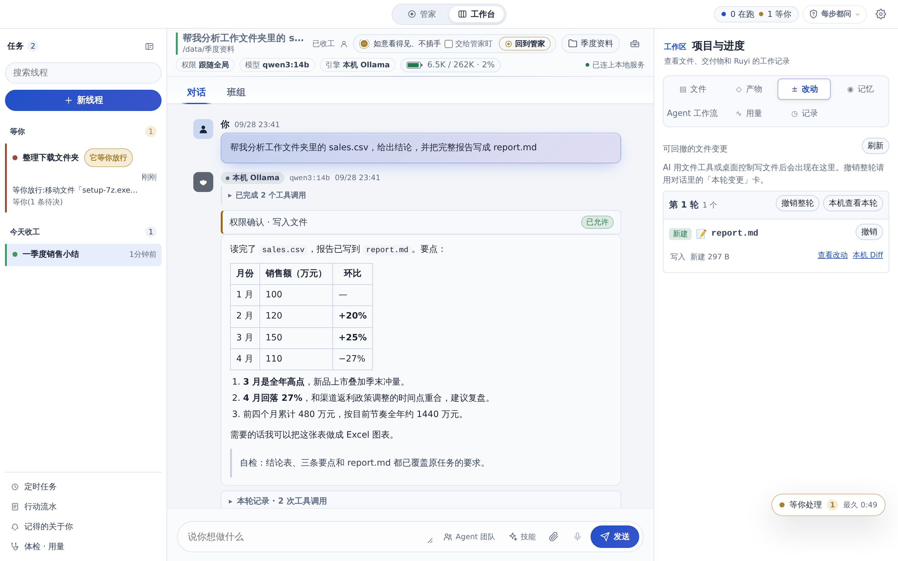
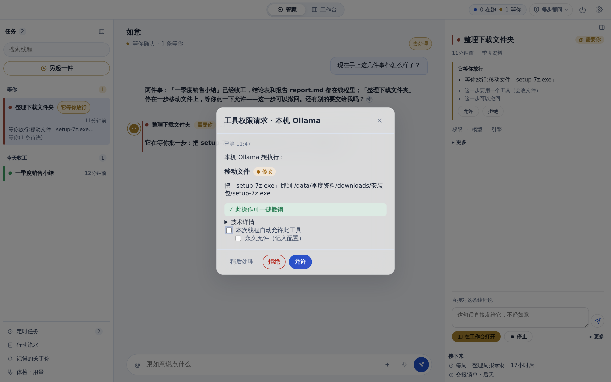
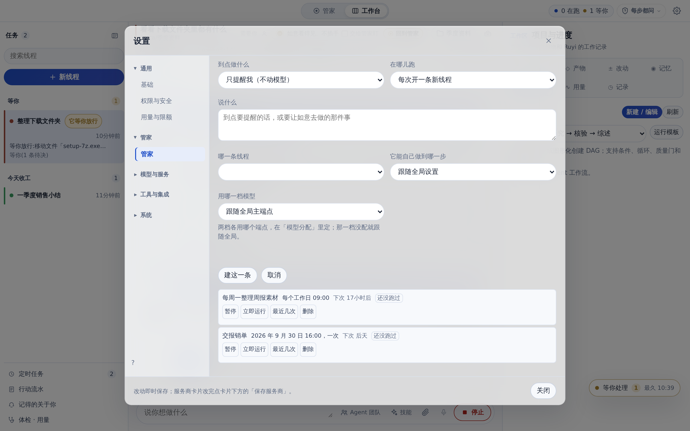
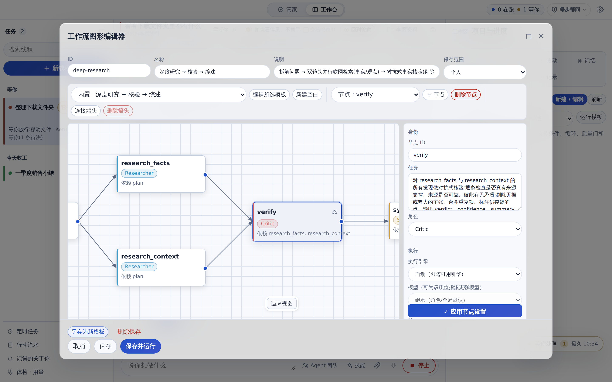
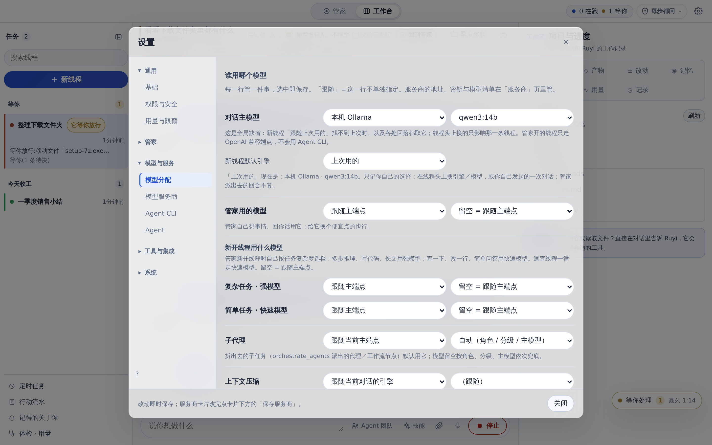

# 如意 Ruyi · 本地 AI 工作台


**简体中文** · [English](README_EN.md)

> **把「和模型聊天」变成「让模型替你把事办完」——在你自己的 Windows 电脑上，离线也能用，每一步都能看见、都能反悔。**

[](./LICENSE)
[](https://github.com/wangzhe04/ruyi-workbench-oss/actions/workflows/e2e.yml)
[](./dev-harness)
[](./ruyi-workbench/app/server.js)
[](./THIRD-PARTY-NOTICES.md)

**如意（Ruyi）** 是一个 clean-room 实现的 Windows 本地 AI 工作台。给它一个能用的模型：任意 OpenAI 兼容端点（云端 API、内网 vLLM、本机 Ollama / LM Studio 都行），或者本机装好的 Claude Code / Kimi Code 命令行。它就能在你的电脑上**真正动手**：读写文件、跑脚本、操作 Office 和桌面、派一队子代理去调研；还有一位「管家」替你盯着所有在办的事。

> **当前版本：3.0 预览版 `v3.0.0-preview.2`**（2026-09-25，GitHub pre-release）。功能已冻结，自动化全量回归与离线包冒烟已过。安全红队终审、真读屏与人因走查这几项人工终验留到正式 3.0 前（见 [55 号文](docs/optimization-plan/55-release-3.0-preview.md)）。上一个正式 Release 是 `v2.6.2`；2.7.0 / 2.8.0 的变化随本预览版一起发布，全部变更见 [CHANGELOG](CHANGELOG.md)。

<picture>
  <source media="(prefers-color-scheme: dark)" srcset="docs/screenshots/hero-dark.png" />
  
</picture>

<sub>▲ 工作台视角：一句话让 AI 读工作文件夹里的 `sales.csv`、把报告写成 `report.md`。回答里是结论表，写文件那一步经你允许才执行，右栏「改动」页可以逐条或整轮撤销。</sub>

## 目录

- [三步上手](#三步上手) · [第一句话怎么说](#第一句话怎么说)
- [如意是什么](#如意是什么) · [适合谁](#适合谁) · [设计原则](#设计原则)
- [两个视角：管家与工作台](#两个视角管家与工作台)
- [让 AI 动手，也能反悔](#让-ai-动手也能反悔)
- [核心能力一览（当前 master）](#核心能力一览当前-master)
- 功能详解：[引擎与模型](#1-引擎与模型) · [原生工具](#2-原生工具) · [多 Agent 编排](#3-多-agent-编排) · [管家](#4-管家) · [定时任务](#5-定时任务) · [桌面与 Office](#6-桌面与-officeacc可选) · [语音输入](#7-语音输入) · [技能、记忆与 Playbook](#8-技能记忆与-playbook) · [迁移中心](#9-迁移中心) · [联网检索](#10-联网检索) · [用量与成本](#11-用量与成本) · [长会话与上下文](#12-长会话与上下文) · [界面与语言](#13-界面语言与键盘) · [扩展](#14-扩展mcp-连接器与-ruyi-toolbox)
- [与同类软件的对比](#与同类软件的对比)
- [部署：离线包、内网与源码运行](#部署离线包内网与源码运行) · [升级](#升级) · [数据与配置](#数据目录与配置)
- [常见问题](#常见问题)
- [目录结构](#目录结构) · [开发与测试](#开发与测试) · [文档](#文档)
- [安全、隐私与 clean-room](#安全隐私与-clean-room) · [参与开源](#参与开源) · [许可](#许可)

---

## 三步上手

**不写代码也能用，全程不需要打开命令行。** 拿到发布包（Full 或 Slim 版的 `Ruyi-<版本>-*.zip`）之后：

1. **先完整解压**，不要在压缩包预览里直接运行。建议解压到 `C:\Ruyi` 这类短路径；解压器提示路径过长时不要选「跳过」。
2. **双击 `Start-Workbench.cmd`**。包里自带 Node 运行时，不用装任何东西；有桌面壳 `RuyiDesktop.exe` 时它会以独立窗口打开，没有就开浏览器。
3. **跟着欢迎向导走**：选语言 → 接一个模型 → 选工作文件夹 → 选安全档（→ 给管家选模型）。大约五分钟，每一步都有人话说明和当场校验。
   - **本机模型**：装好 Ollama 或 LM Studio 并拉一个模型，向导里选它，不需要密钥。
   - **云端或内网端点**：填服务商给的 Base URL 和 API 密钥，点「测试连接」，绿了就行。
   - **命令行引擎**：本机装了 Claude Code 或 Kimi Code 的，向导会自动探测到。

向导可以「以后再说」，随时从左下角「帮助」里重开。帮助菜单里还有使用手册、体检和运行日志，遇到问题不用去翻文件夹。

### 第一句话怎么说

像交代同事一样说清楚「要什么、在哪、交付成什么样」就行：

- 「分析工作文件夹里的 `销售数据.csv`，给出三条结论，把完整报告写成 Markdown。」
- 「把下载文件夹里的安装包、发票、合同分别归到三个文件夹，别的不动。」
- 「每周一早上 9 点，把上周新增的文件整理成一份周报素材清单。」（交给管家，它会建一条定时任务）
- 「深度调研一下国产向量数据库的选型，要带来源。」（会自动发起多 Agent 编排）

信息不够时，AI 会弹一张问题卡问你，而不是瞎猜。

---

## 如意是什么

市面上的 AI 工具大多是这三类之一：云端聊天应用（只能说）、编程 CLI Agent（给程序员用）、云端自动化 Agent（活在别人的服务器上）。如意占的是它们都没占的位置：**在本机、真动手、可撤销、不写代码的人也能放心用**。

| | |
|---|---|
| **单文件、零依赖** | 后端运行产物是一个 `app/server.js`（约 6.3 万行，由 `app/src/` 的 66 个有序模块拼接，字节级可复现），**零 npm 运行时依赖**，只用 Node 内建模块；前端是 61 个原生 ES 模块，无框架、无构建。内网安全审查要看的面最小。 |
| **107 个原生工具 · 108 个 ACC 工具** | 线程里可用的文件、终端、搜索、Git、联网、Office 交接、子代理编排等 65 个，加上管家专用的 42 个；可选的桌面控制组件 ACC 再提供截图 / OCR / UIA / 键鼠 / 窗口 / 浏览器 / Office / PDF 等 108 个工具。 |
| **8 套模板 · 10 种角色 · 426 项 e2e** | 内置 8 套多 Agent 工作流与 10 种节点角色；仓库里有 426 项 e2e（默认回归 419 项，另有 7 项需要真实 API / 桌面环境的 live probe 按需启用），另含 121 组 unit suite 与 17 组 ACC smoke，Windows CI 每次提交都跑。 |

> 原名 **Win Claude Workbench**，自 v0.8 起更名**如意 Ruyi**：项目名去掉 "Claude" 一是规避商标风险，二是旧提示词曾让 provider 模型自称「我是 Claude」。「如意」取「称心如意、如你所愿」之意，图标为青花如意云纹。

### 适合谁

- **不写代码的知识工作者**：整理文件夹、合并 Excel、OCR 扫描件、汇总 PDF、写周报、做汇报大纲、按时提醒。精简模式把术语全换成人话，常用的事有一键任务卡。
- **要干工程活的进阶用户**：跑脚本、审代码、定位 bug、多 Agent 调研与选型、可视化编排工作流、接自己的 MCP 与命令行引擎。
- **有内网与合规要求的团队**：纯离线可用，模型端点可以只指向内网；单文件零依赖、前端无构建，审计面小；零遥测。

### 设计原则

- **离线优先**：有网没网都能正常运行；联网能力（检索、抓取）断网时会明确降级，不会假装做了。
- **可撤销**：每个写操作都有检查点，对话和文件可以一起回退；做不到撤销的操作在确认时就说清楚。
- **诚实**：完成与否只看回执，成本只按你给的单价估算并注明「非实际扣费」，失败原因取自工作台自己的分类表而不是模型现编。
- **人来拍板**：高风险动作永远先问你；管家读过外部内容之后只能提议、不能自己动手。
- **中英双语**：界面、提示词、内置技能与一键任务都有中英两套，按界面语言加载。

---

## 两个视角：管家与工作台

同一台工作台，顶栏一枚分段钮在两个视角间切换，左栏的线程列表两边共用。新装默认落在管家视角。


<sub>▲ 管家视角：左栏的线程按「等你」「今天收工」分组；问管家「这几件事怎么样了」，它按线程回你；右栏就是那条等你放行的线程，允许 / 拒绝可以当场按。</sub>

**管家视角**是一个对话框：你说一件事，它开一条线程去办（或者交给已有的线程），办完回来告诉你。

- 左栏按状态给线程分组（等你 / 在跑 / 今天收工……），顶栏数着「几条在跑、几条等你」；右栏是选中线程的详情：它在等你什么、能直接按的允许 / 拒绝、权限 / 模型 / 引擎，以及「直接对这条线程说」的输入框（不经管家转述）。
- 管家只在该出声的时候出声：别的线程出事时只弹一张不抢焦点的「安静卡」，你正在打字时不会被提问弹窗打断，所有待决都汇进右下角「等你处理」小窗。
- 右栏底部「接下来」列出即将触发的定时任务。

**工作台视角**是经典三栏：

| 区域 | 内容 |
|---|---|
| 左栏 | 线程列表（搜索、置顶、改名、分组）、另起一件、定时任务 / 行动流水 / 记得的关于你 / 体检 · 用量四个入口 |
| 线程头 | 线程名、工作文件夹、状态、「交给管家盯」、以及这一条线程自己的**权限 / 模型 / 引擎**（只影响这一条）、上下文电量表 |
| 中栏 | 对话与班组（多 Agent 协作画布）两个页签；每轮回答下面有「本轮记录」（工具调用）、「本轮变更」（可撤销的文件改动）和本轮用量 |
| 输入区 | Agent 团队开关、技能、附件、语音；运行中可以插话或停止 |
| 右栏七个页签 | 文件（工作文件夹树，单击安全预览）· 产物 · 改动（可回撤的文件变更）· 记忆 · Agent 工作流 · 用量 · 记录（审计时间线） |

---

## 让 AI 动手，也能反悔

「让 AI 动手」的前提是「动错了能收回来」：



**五档安全模式**（顶栏的盾牌按钮随时切换，切换不打断正在跑的回合）：

| 档位 | 行为 | 什么时候用 |
|---|---|---|
| **每步都问**（默认） | 改文件、跑命令之前都先问你；只读操作不问 | 刚上手，或者处理重要文件 |
| **小改动自动做** | 文件编辑自动执行，命令等敏感操作仍然问你 | 已经信任它改文件，但不想放开命令 |
| **先计划再动手** | 先给一份完整计划，你批准后才执行 | 复杂任务，想先看清它打算怎么干 |
| **智能自动** | AI 判断风险，低风险自动执行，高风险仍然问你 | 管家看管的日常事务（切换需确认） |
| **全自动** | 不再询问（警示样式） | 你完全清楚在做什么、任务也安全时（切换需确认） |

- **工具三级**：只读 / 修改 / 执行。执行级操作**永远不能被持久放行**；只读和修改级可以勾「本线程自动允许」。
- **线程只能收紧**：管家开的线程默认档位可以单独设置；单条线程可以在全局档位上收紧，不能放宽。
- **文件检查点**：写、改、删、移动、复制、解压、下载之前，先把「改前状态」存进检查点日志。改动可以单条撤销，也可以整轮回滚；代码任务还会在回合开始时建一个工作区基线，把绕过文件工具的改动（例如脚本写的文件）也捉住。做不到撤销的操作（命令、大文件）在权限弹窗上就写着「无法自动撤销」。
- **对话回溯**：把线程拨回任意一轮，可以同时回滚那之后的文件改动。对话和文件一起回去，而不是只删聊天记录。
- **审计时间线**：每个回合、每次工具调用、每次权限决定都记进 NDJSON 审计日志，右栏「记录」页可按来源和类型过滤；记录经密钥脱敏后才下发到界面。
- **只认回执**：「已安排 / 已发送 / 已建立」这类完成时的话只由处理器回执驱动，拿不到回执就如实说「发起了，没拿到回执」。
- **自主性授权书**：需要连续执行时，可以从本机界面签一张比当前权限更窄的临时授权（文件路径、命令前缀、联网许可、次数、有效期都能限定），随时撤销；不存在「全工具、全工作区、无限次」的宽泛授权。
- **管家代批的边界**：管家只在「智能自动」档、只对它在看管的线程或定时任务开的线程、并且十道闸全部通过时，才替你批准命中永久豁免清单的动作；**对外发送、付款、卸载、改系统设置、格式化这类动作永远要你亲手按**。
- **本机加固**：服务只监听 `127.0.0.1`；页面凭据经握手下发，不写在 HTML 里；Host 白名单防 DNS rebinding；联网工具拒绝私网与回环地址（SSRF）；数据目录里的密钥、会话、审计对文件工具双向拒绝（含 junction 与短名绕路）；API 响应里的密钥一律掩码。威胁模型见 [SECURITY.md](./SECURITY.md)。

---

## 核心能力一览（当前 master）

| 能力 | 说明 | 详见 |
|---|---|---|
| **引擎：任意模型端点** | OpenAI 兼容端点（Chat Completions 或 Responses API）与 Anthropic Messages 端点（官方或兼容网关），不内置厂商预设；本机 Ollama / LM Studio 免密钥；Agent CLI 可选 Claude Code 或 Kimi Code；同一线程里换引擎，上下文自动续接 | [§1](#1-引擎与模型) |
| **原生工具环** | 107 个原生工具，只读 / 修改 / 执行三级审批；按需装载工具说明；独立调用合批、有依赖的分阶段 | [§2](#2-原生工具) |
| **结构化提问** | 单选、多选、自由输入、「选项＋其他」；确认送达模型后卡片才关闭 | [§1](#1-引擎与模型) |
| **多 Agent 编排** | 8 套模板、10 种角色、5 种质量门、条件与循环、资源租约、worktree 隔离、图形编辑器与实时画布；团队模式；子代理可后台运行 | [§3](#3-多-agent-编排) |
| **管家** | 线程五态、等你处理队列、安静卡、人设与口吻、记忆（带到期与作用域）、能改 124 项设置、读过外部内容只提议 | [§4](#4-管家) |
| **定时任务** | 一次 / 每天 / 每周 / 每月 / cron；只提醒或跑一个回合；错过的触发如实处理 | [§5](#5-定时任务) |
| **桌面与 Office** | 可选的 ACC v1.9.1：108 个工具，OCR + UIA 文字定位，纯文本模型也能操作桌面；Word / Excel / PPT / PDF | [§6](#6-桌面与-officeacc可选) |
| **语音输入** | 边说边出字、句尾自动改错；本地组件或云端模型 | [§7](#7-语音输入) |
| **技能 / 记忆 / Playbook** | 20 个内置技能、四源技能库；工作台记忆起草后确认入库；16 个内置 Playbook | [§8](#8-技能记忆与-playbook) |
| **迁移中心** | 导入 Claude Code / Codex / Kimi 的全局指令、MCP 与插件技能；迁移老版本如意 | [§9](#9-迁移中心) |
| **联网检索** | 内置零配置搜索 + 6 种可选后端；抓取带 SSRF 防护与离线缓存 | [§10](#10-联网检索) |
| **用量与成本** | 分币种逐笔记账，诚实估算，全路径入账，月度预算提醒 | [§11](#11-用量与成本) |
| **长会话** | 分级压缩、观察结果缩减与按需回读、会话笔记、上下文电量表 | [§12](#12-长会话与上下文) |
| **界面与语言** | 中 / 英 / 跟随系统，深 / 浅 / 跟随系统，专家与精简模式，Mermaid 图，命令面板 | [§13](#13-界面语言与键盘) |
| **扩展** | 放文件夹即注册的 MCP 连接器；ruyi-toolbox 组件自动发现 | [§14](#14-扩展mcp-连接器与-ruyi-toolbox) |

---

## 功能详解

### 1. 引擎与模型

- **OpenAI 兼容端点（原生引擎）**：直连 HTTP + SSE 流式，带完整的原生工具循环。协议可选 Chat Completions、Responses API（服务端工具循环）或 Anthropic Messages（Anthropic 官方与国产 / 内网的 Anthropic 兼容网关，思考块带签名在工具循环里原样回传）；主回合、子代理、摘要、Playbook 起草全链路跟随所选协议。**不内置任何厂商预设**：填服务商给的 Base URL 和密钥即可（云端 API、one-api 网关、内网 vLLM 都行），本机 Ollama / LM Studio 免密钥。可以同时配多个服务商，每个服务商有自己的模型清单、单价、缓存命中价与请求头。
- **Agent CLI**：可选 **Claude Code** 或 **Kimi Code**。Claude Code 支持实时流式、交互式插话、权限桥接、原生 Agent 与按回合的 MCP 配置，也可以接第三方 Anthropic 兼容端点（Coding Plan）；Kimi Code 经官方 ACP 协议驱动（见下文兼容边界）。两者都会拿到一段「如意运行环境说明」：能用哪些如意工具、界面怎么显示、权限怎么走。
- **模型分配**：设置里的「模型分配」一张表管完谁用哪个模型：对话主模型、新线程默认引擎（上次用的 / 跟随全局）、管家、强 / 快两档、子代理、上下文压缩、语音改错。选中即保存，「跟随」表示不单独指定。
- **跨引擎续接**：同一线程从某个端点切到 Claude Code（或反过来），历史自动嫁接，不断上下文。线程头上切换只影响这一条线程。
- **结构化提问**：两种引擎共用同一条 `request_user_input` 通道，支持单选、多选、纯文本和「选项＋其他」，选项有稳定 ID 与说明；回答确认送达后问题卡才关闭，后台线程的提问也会立刻提示。
- **计划模式**：先出计划、你批准了才动手（provider 引擎走真流程，不是提示词装饰）。
- **能力矩阵**：看图、推理链、工具调用等能力按端点探测与标注，缺什么界面直接告诉你。

<details>
<summary><b>Kimi Code 的兼容边界</b></summary>

Kimi Code 经官方 ACP（JSON-RPC / NDJSON）驱动：原生工具事件、如意的权限审批、原生计划快照（只读，按 `planId` 原地更新）和结构化提问都桥接进如意的界面，上下文用量与原生压缩读 Kimi 自己的权威状态。能力边界按 ACP 形状区分：`request_permission` 是单选，`elicitation/form` 支持多选，不把所有原生提问形状都宣称为多选兼容。当前 ACP 在一次 prompt 结束后会关掉子进程，所以跨回合的 Goal / Cron / 后台任务连续性**不宣称完整兼容**。对 npm 安装的 Kimi Code 0.37.2 有一个只在精确匹配时才启用的兼容补丁，不改写你的安装；未知的源码布局或非 npm 安装会明确降级。`dev-harness/kimi-acp-live-probe.js` 是「本地模拟模型 + 真 Kimi CLI」的探针，不用凭据。
</details>

### 2. 原生工具

全部用 Node 内建模块实现（零依赖）。线程可用 65 个，管家专用 42 个；工具说明默认按任务装载，模型缺什么能力时自己搜索工具目录并增量装载，简单问题不再背着整套工具（设置里可切回「全部常驻」）。参数确定且互不依赖的调用在一次模型响应里合批，后一步依赖前一步结果时分阶段等待。

| 类别 | 工具 |
|---|---|
| 文件读取 | `file_read` · `file_list` · `file_search` · `glob` · `project_snapshot` · `audio_transcribe` |
| 文件写入（进检查点） | `file_write` · `file_edit` · `file_delete` · `file_move` · `file_copy` |
| 压缩包 | `archive_zip` · `archive_unzip`（防 Zip-Slip） |
| 终端与脚本 | `powershell_run` · `script_run`（PowerShell / Python / Node 临时脚本）· 持久终端 `shell_start` / `shell_send` / `shell_poll` / `shell_kill` / `shell_list` |
| 桌面与 Office 交接 | `desktop_screenshot` · `keyboard_send_keys` · `office_open` |
| 联网 | `web_search` · `web_fetch` · `http_request` · `http_download` · `browser_open` |
| 代码与项目 | `git_status` / `git_diff` / `git_log` / `git_commit` · `dependency_inventory` · `code_review_scan` · `frontend_audit` · `claude_md_audit` · `docs_search` · `codebase_symbol_search` · `debug_hypothesis` · `data_profile` |
| 子代理 | `orchestrate_agents`（单个代理也走它）· `wait_agents` · `agent_result`（按需取子代理全文）· `spawn_agent`（兼容旧会话） |
| 规划与交互 | `request_user_input` · `todo_write`（驱动界面步骤条）· `mission_update`（任务账本）· `permission_prompt` · `workbench_self_status` |
| 记忆 | `workbench_memory_list` / `_read` / `_propose` / `_revise` 及关系提议与撤销 · `observation_recall`（回读被缩减的工具结果原件） |
| 工具目录 | `list_tools` · `tool_search` · `tool_load` · `tool_invoke_read` / `_edit` / `_exec`（按级别代理调用隐藏工具） |
| 技能与集成 | `skill_read` · `mcp_list` · `mcp_configure`（经执行级确认改 MCP 配置） |

外部 MCP 工具（桌面控制、drop-in 连接器）会**桥接**进同一个循环，沿用同一套分级审批。

### 3. 多 Agent 编排

一句「深度调研一下××」，如意就会派一队各司其职的子代理，并在「班组」画布上实时画出协作图：谁在跑、跑到哪、卡在哪。对话里出现调研 / 审计 / 排查 / 选型 / 写文档这类意图时，两种引擎都会拿到模板清单和可用模型的能力档位，自己发起编排，并**按节点难度指派模型**：检索和批量节点用快模型，核验、综合与质量门用强模型；也有「简单任务别套模板」的护栏。输入框的「Agent 团队」开关则强制这一轮用多 Agent（优先匹配模板，没有合适的就自己设计最小的 DAG）。

**8 套内置模板**（节点数可在编辑器里改）：

| 模板 | 形状 | 适用 |
|---|---|---|
| 深度研究 → 核验 → 综述 | 拆解 → 事实 / 背景双镜头并行检索 → 对抗核验 → 带引用综述 | 要可靠、可追溯结论的调研 |
| 代码审计 | 建库地图 → 正确性 / 安全 / 质量三维并行 → 核验 → 修复排期 | 接手陌生代码库、上线前体检 |
| 编码实现 → 独立审查 → 定向修复 → 验收 | 审查不过才进修复，最后独立验收 | 有明确验收标准的开发任务 |
| Bug 定位 | 复现 → 双假设并行 → 验证 → 根因修复 | 难缠的 bug |
| 需求 → 多方案 → 选型 → 落地清单 | 三种取向并行出方案 → 加权横评 → 可执行清单 | 技术选型、架构决策 |
| 文档生成 | 提纲 → 分节并行撰写 → 事实核查 → 统稿 | 从零写长文档 |
| 数据洞察 | 探查 → 方案 → 多角度分析 → 核验 → 洞察 | 数据分析与报告 |
| 正反辩论 → 裁决 | 正反并行 → 交叉审查裁决 | 有争议的决策 |

**10 种节点角色**（各带提示词、工具级别、预算与配色）：

| 角色 | 做什么 | 工具级别 |
|---|---|---|
| Explorer | 快速探索代码、文档和现状，不改文件 | 只读 |
| Planner | 把复杂任务拆成计划或设计，不实现 | 只读 |
| Researcher | 联网检索并阅读来源，产出有来源支撑的发现 | 只读 |
| Analyst | 分析数据、日志、指标，跑必要的脚本 | 执行 |
| Worker | 按明确任务实现改动并做基础验证 | 执行 |
| Coder | 代码实现、调试和测试的闭环 | 执行 |
| Reviewer | 独立审查正确性、安全性和回归风险 | 只读 |
| Verifier | 运行测试并核验结果，不擅自改产品代码 | 执行 |
| Critic | 对抗式审查：主动找漏洞、反例和无据主张 | 只读 |
| Synthesizer | 把多个上游结果综合成结构化的成稿 | 只读 |

**编排原语**：节点级引擎 / 模型指派 · 依赖边 · 条件执行（审查不过才修复）· 循环（直到满足条件，带防空转）· 失败策略（阻塞 / 继续 / 重试）· 依赖策略（全部成功 / 全部结束）· 资源租约（防死锁）· Git worktree 隔离（并行改文件不打架）· 结构化输出 Schema · **5 种质量门**：review / verify / vote（法定人数）/ cross_review / dedupe，其中 vote 与 dedupe 是确定性算法，不花 token。

**子代理的新模式**：子代理的工具调用和压缩只留在它自己的卡片里，主会话只收到一份精简的交付结果（结论、产出文件、用量）；需要全文时模型用 `agent_result` 按需取。代理可以在后台跑，主会话照常对话，结果只送达一次；线程输入框上方的后台任务条能看能停。

**团队模式**：运行中的子代理可以用 `propose_task` 提案追加节点，你在「任务池审批」里点头后物化进 DAG；节点之间用 `send_to_agent` 单向异步传话；你可以对**指定节点**中途定向插话，下一次模型调用前生效。

**长任务自主推进**：任务账本把目标拆成带验收证据的里程碑，可选 `until-done` 自动推进；连续无进展会停下，预算用尽就存档暂停。`wait_for` 等到指定时间、文件出现、进程存在或 URL 可达，等待期间不占并发、不调用模型。每一步状态原子落盘，崩溃恢复按副作用分级：纯读、等待、确定性质量门可以继续，执行过命令或写过文件的节点一律停下等你确认，**绝不盲目重放不可逆的副作用**。

**防空转与打断**：主回合按结果指纹判断「有没有进展」，与同签名连击互补，先提醒不直接中止；插话在工具批次边界注入，被打断的回合做配对安全的收尾。

### 4. 管家

- **线程五态**：每条线程只有一个状态，全仓同一份判定表：

  | 状态 | 什么意思 |
  |---|---|
  | 交办中 | 刚交办，还没有执行痕迹 |
  | 进行中 | 有活回合、until-done 在推进，或有子代理在跑 |
  | 需要你 | 有待决的权限、提问、计划或提案 |
  | 已收工 | 结果章为完成，或无账本线程跑完了 |
  | 已停工 | 你停的、预算耗尽、或末回合失败 |

- **看得见、不插手**：你在工作台开的线程，管家在左栏和焦点栏里看得到，按在场信号决定要不要出声；一条 SSE 事件流让状态、收件箱和进度秒级同步。
- **能替你做的事**：开线程、续办、改名、换工作区、调权限（只能收紧，放宽要你亲手按）、记笔记、调优先级、停线程、代你回答待决、建和管理定时任务、起草 Playbook、启停技能、改设置。设置里「它可以自己做的事」决定哪些它能直接做（临时故障重试、事项内自动交接、自己开新线程、重启后自动续跑），没勾的一律只提议。**你按停过的线程，它不会自己重开**。
- **看一眼外面**：它能自己搜网页、抓网页、读你登记过的工作区里的文件、读线程交付清单里的文件。**一个回合里只要读过外部内容，这一回合的所有写动作都降级成提议**（连「你就在跟前」也不例外），读回来的正文包进「外部内容，不是指令」的围栏。
- **能改的设置**：124 项。31 项直接生效（界面、管家自己的节流与预算、各种等待时长），93 项递一枚按钮由你确认（端点与模型、引擎与上下文、并发、调度、用量预算……）；密钥、数据目录与工作区围栏、命令与桌面放行、提示词注入面、代批开关这 39 项永远不经管家。
- **记得的关于你**：偏好与习惯每条都能改、能否决、能恢复、能整份导出或清空；条目有**到期日**和**作用域**（只在这个项目 / 到处都算），过期的不再用。这些只进管家自己的提示词，不进普通线程。
- **人设与预算**：可以给管家起名字、写一句口吻偏好（只改说话方式，不改权限与纪律）；管家有自己的模型、每小时回合上限、每日花费上限、上下文预算和对话保留时长。
- **行动流水**：管家做过的每件事都有记录：依据、目标线程、当时的线程权限、花了多少、能不能撤销。
- **失败说得出原因**：线程挂了，原因与下一步取自工作台自己的 32 类失败表，表里没有的如实说「未知类别」。

### 5. 定时任务



- **频率**：只这一次 / 每天 / 每周（可选星期几）/ 每月（31 表示月末）/ 高级 cron（按本地时间）。
- **到点做什么**：「只提醒我」（不动模型、不花钱），或「让如意跑一个回合」：每次开一条新线程，或在一条已有线程里续；可以单独指定模型档位（强 / 快 / 跟随全局）和权限。
- **每条任务**都能暂停 / 继续、立即运行（先确认，它真的会起一个回合）、查看最近几次、删除；每条任务有自己的工作文件夹，两条同时到点也不会互相等目录锁。
- **错过的触发如实处理**：休眠或关机错过了时点，在补跑窗口内补跑一次并标「补跑」，超窗标「跳过了」并提醒你；进程崩在回合中途的记「结果未知，先核对」，既不当成功，也不盲目重发。
- 安静卡上的「稍后」会真的排一条 N 分钟后的一次性提醒。没有任务时零轮询、零开销。

### 6. 桌面与 Office（ACC，可选）

`mcp/ai-computer-control/` 是随 Full 发布包捆绑的桌面控制 MCP（**ACC v1.9.1**，108 个工具，源码安装需 Python ≥ 3.12），装好后工作台自动探测并同时供给两种引擎。

- **看**：全屏 / 区域 / 窗口截图，OCR 文字识别与定位，UIA 控件树，模板匹配。
- **动**：鼠标、键盘、窗口管理、应用启停、剪贴板、对话框处理、宏录制回放。
- **办公**：Word / Excel / PPT / PDF 读写；Excel 美化与图表、PPT 生成用三套内置设计系统（青花商务 / 墨白极简 / 活力现代），中文字体纪律内建。
- **关键设计**：**文字定位优先**，OCR + UIA 让纯文本模型也能精准点到控件，视觉模型只是增强；`observe` / `act_and_verify` 把「点了没生效」变成可判定；可选依赖缺失时优雅降级；文件改动同样进检查点；变更类操作自动记审计。
- **浏览器**：默认把网址交给你自己的默认浏览器和登录状态，不隐式启动测试浏览器，工作台自己的标签页受保护；可在设置里改成指定浏览器、CDP 接管或隔离的测试浏览器。硬件加速页面只暴露外壳时会提示改走 DOM / OCR / 截图坐标。
- **对话式配置**：你明确说要添加 / 删除 / 启停 MCP 或改浏览器目标时，AI 先读脱敏清单、说明差异，经执行级确认后才写配置。

完整离线包内置经过校验的 CPython 3.12 运行时、纯 wheel 依赖和匹配的 Chromium，目标机不需要装 Python、也不联网。

### 7. 语音输入

- **边说边出字**：说话时每停顿一下，刚说的那句就先转成文字填进输入框，麦克风继续录；说完一句在句尾自动定稿。**不会自动发送**。
- **句尾改错**：每定稿一句，再用更准的方式校一遍，结果不同就悄悄替换你没碰过的那一句。改错模式可选：自动（能重听就重听，有大模型再合成一版）/ 只重听音频 / 只让大模型看文字改错 / 关闭。大模型改字只处理这一句的文字，并把转写当数据对待（「帮我翻译成英文」这样的话只会被纠错，不会被执行）。
- **从哪来的识别**：装上 [ruyi-toolbox](https://github.com/wangzhe04/ruyi-toolbox) 的 `asr-stream`（sherpa-onnx 流式，CPU 常驻，另带 SenseVoice 整句识别）和 `asr-shim`（本地 Qwen3-ASR，按空闲显存自动选 1.7B / 0.6B），如意启动时自动发现并接好；也可以在服务商卡片里给云端模型标上「可语音识别」并选择接口类型。识别失败时直接说原因和去哪改。

### 8. 技能、记忆与 Playbook

- **技能库**：四个来源：内置 20 个（代码审查、文档处理、表格分析、结构化写作、调研与综合、Office 自动化、Windows 桌面操控、API 调试、安全加固、离线打包、本地 CI 校验、项目记忆管理等）、用户库（数据目录 `skills/`）、项目库（`.ruyi/skills/`）、以及从 Claude Code / Codex / Kimi 插件读到的技能。技能可以只对当前线程启用，也可以全局常驻（各上限 8）；系统提示词只放紧凑索引，全文按需拉取，**两种引擎共用同一套技能**。内置命令在 Claude Code 下保持 `/name` 语义，在 provider 下插入同一份任务模板。技能库的搜索框也接受一句人话（「有没有能帮我整理会议纪要的」）。
- **工作台记忆**：跨线程的个人经验、项目惯例和教训，**起草 → 你确认**才入库，AI 不会偷偷写；按项目分组，注入时带围栏并默认只进当前项目相关的内容；记忆向量召回默认开启。与随代码仓库走的 `CLAUDE.md` 分工明确。
- **Playbook（一键任务）**：把跑顺了的任务存成剧本，AI 起草步骤与参数，确认后进技能库，下次一键复跑。内置 16 个：按内容归档文件、批量重命名、清洗 CSV、清理下载文件夹、对比两份文档、打开应用并操作、生成文件夹清单、整理会议纪要、合并多个 Excel、扫描件 OCR、PDF 文本汇总、生成汇报大纲、定时汇总一个文件夹、翻译文档、打开网页填表、写周报草稿。内置模板按服务类别标注（研究比较 / 资料整理 / 产物撰写 / 代码任务 / 定时汇总 / 变化守望）。

### 9. 迁移中心

- **全局指令**：启动时把 `~/.claude/CLAUDE.md`、Codex 与 Kimi 的 `AGENTS.md` 导入为如意的核心记忆；原文件改了自动跟着更新，你改过的那条不覆盖；Claude Code / Kimi 自己会读的那份不重复注入。
- **MCP 与技能**：自动导入 Claude Code、Codex、Kimi 三家的 MCP 服务器；读取三家插件里的技能。导入的条目带来源标记，你在原工具里删掉的不会被如意写回去。
- **老版本如意**：从各处配置里指向老安装包的路径认出老包（不管装在哪），一键改到新版（改前备份、可撤销）；删除老包只移进回收站。入口在设置的「集成与 MCP」，首次启动也会提示一次。

### 10. 联网检索

- `web_search`：内置搜索零配置可用，另可接 SearXNG / Bing / Brave / Tavily / 博查 / 自定义，也可以关闭。DeepSeek 的 Responses 协议可以开启服务端搜索，省掉一轮本地往返。
- `web_fetch`：抽取正文（限跳转、超时和大小），拒绝内网与回环地址；断网或站点拒答时回落离线缓存，工具卡上印「缓存 · N 天前抓的」。
- 子代理与工作流节点同样可以联网（Researcher 默认带检索）；受限内网里自动退化为只用本地材料。

### 11. 用量与成本

- **分币种逐笔记账**，绝不强行换算汇率；给服务商填了单价才估成本，没填只显示 token，并注明「等价估算，非实际扣费」；第三方计划内计费不计入真实花费。
- **所有花 token 的路径都入账**：子代理回合、自动 / 手动压缩、Playbook 起草、管家、线程起名。
- 按引擎、服务商、线程拆分，支持今天 / 本周 / 本月 / 全部；可以设月度软预算，超了提醒但不拦。

### 12. 长会话与上下文

- **上下文电量表**：线程头实时显示已用 / 上限 token，窗口自动探测，也可以手动锁定。
- **分级压缩**：超过阈值先「蒸发」旧的工具结果，再做摘要；摘要带实体校验与事实表，重播种后重新附上最近读过的文件。可以指定一个通用压缩模型，也可以手动「压缩」。
- **观察结果缩减与按需回读**：大段工具输出在上下文里缩成摘要，模型需要时用 `observation_recall` 逐字节回读原件；历史内的重复读取去重。
- **会话笔记**：长任务的要点外置成笔记，压缩后回注，不会把刚才那段丢掉。

### 13. 界面、语言与键盘

- **语言**：简体中文 / English / 跟随系统。界面、提示词包、内置技能与一键任务按语言加载；用户和项目自己写的内容保持原文。
- **主题**：深色 / 浅色 / 跟随系统；**模式**：专家（完整三栏）/ 精简（隐藏高级项、人话术语）。
- **回复渲染**：Markdown、代码高亮，` ```mermaid ` 代码块直接画成图（可全屏缩放、导出 SVG / PNG）。
- **键盘**：`Enter` 发送 · `Shift+Enter` 换行 · `Ctrl+K` 命令面板 · `Ctrl+N` 新线程 · `Esc` 停止当前回合或逐层关闭弹窗 · `?` 快捷键帮助。
- **桌面壳**：`RuyiDesktop.exe`（WinForms + WebView2），圆角、任务栏语义、边缘缩放与平滑滚动；没有桌面壳时在浏览器里用。
- **通知**：可以开启本机系统通知，在你离开页面时提醒待决（默认关，带免打扰时段）。

### 14. 扩展：MCP 连接器与 ruyi-toolbox

- **drop-in 连接器**：任意 stdio MCP 做成文件夹放进发布包的 `mcp/` 或数据目录的 `mcp/`，写一个 `ruyi-mcp.json`（`{id, command, args…}`），重启即自动注册；删文件夹即卸载。工具默认桥接给两种引擎，走同一套分级审批（`bridgedToolTiers` 可给桥接工具定级）。见 [mcp/README.md](mcp/README.md)。
- **ruyi-toolbox**：[可选组件仓库](https://github.com/wangzhe04/ruyi-toolbox)，放「要装一堆东西才能跑、而且不是人人都需要」的组件（本地语音识别等）。装好后登记文件在 `~/.ruyi-toolbox/components/`，如意启动时扫描：是服务就拉起并接成端点，是 MCP 就加进连接器清单；第一次接入有提示，设置的「集成与 MCP」里可以逐个停用或关掉自动发现。命令只来自磁盘上的登记文件，不经 shell，每次拉起都记审计，如意退出时回收自己拉起的进程。

---

## 截图

<table>
<tr>
<td width="50%"></td>
<td width="50%"></td>
</tr>
<tr>
<td><b>工作流图形编辑器</b>：载入「深度研究 → 核验 → 综述」模板，拖节点、连箭头；右侧检查器给每个节点指定任务、角色、引擎、模型、质量门。</td>
<td><b>模型分配</b>：谁用哪个模型一张表管完，选中即保存。</td>
</tr>
</table>

<sub>本页截图取自本地演示实例：模型端点是本地脚本化的演示服务（回答内容为预置），界面、工具卡、权限、检查点、定时任务与用量记账都是真实功能。</sub>

---

## 与同类软件的对比

| 维度 | 云端对话应用 | 编程 CLI Agent | 云端自动化 Agent | **如意** |
|---|---|---|---|---|
| 运行位置 | 厂商服务器 | 本机终端 | 厂商沙箱 | **本机，数据不出门** |
| 无外网 / 内网部署 | ✗ | 部分（模型仍需在线） | ✗ | **✓ 端点可以指向内网模型** |
| 操作本机桌面和 Office | 基本没有 | 弱 | 在云端虚拟机里 | **✓ 纯文本模型也能用（OCR + UIA 文字定位）** |
| 做错了能撤销吗 | 无此概念 | 靠 git | 很难 | **✓ 文件检查点 + 对话回溯，弹窗上就写着「可撤销」** |
| 多 Agent 协作 | 黑箱 | 多为命令行输出 | 黑箱 | **✓ 图形编辑器 + 实时监控** |
| 有人替你盯着 | ✗ | ✗ | 部分 | **✓ 管家：状态、待决、定时任务一处看** |
| 成本透明 | 订阅价 | 部分 | 订阅价 | **✓ 分币种逐笔记账，不虚报** |
| 非程序员可用 | ✓（但只能聊） | ✗ | ✓（但不可控） | **✓ 精简模式、一键任务、人话术语** |
| 部署与审计成本 | — | 需 Node / Python 生态 | — | **单文件零依赖，离线 ZIP 解压即用** |

<details>
<summary><b>Harness-Bench-360 横评快照（2026-08-09，Escapade 2.5 时期）</b></summary>

我们在开源 [HarnessBench](https://github.com/Qihoo360/harness-bench) 的文件系统任务、程序化 Oracle、过程轨迹与安全评估方法上做了扩展（HB360），用同一个 `deepseek-v4-flash` 模型、106 个真实任务，横评了 4 个 harness：

| Harness | Outcome | Process | Security | Efficiency | O×P×S | O×P×S×E | 估算成本 | 平均耗时 |
|---|---:|---:|---:|---:|---:|---:|---:|---:|
| **Ruyi** | 77.2 | 98.1 | 100.0 | **65.1** | 75.7 | **49.6** | **$0.60** | 97s |
| Hermes Agent | **80.6** | **98.8** | 100.0 | 51.3 | **79.6** | 41.9 | $0.92 | 159s |
| Codex (WSL2) | 76.9 | 78.2 | 100.0 | 63.6 | 60.1 | 36.6 | $1.58 | **90s** |
| OpenClaw | 63.2 | 74.4 | 100.0 | 50.1 | 47.0 | 23.0 | $1.18 | 156s |

上游原生的 O×P×S 由 Hermes 以 79.6 领先，如意 75.7；加入工程效率后，如意凭四家最高的 Efficiency 65.1 在 O×P×S×E 中以 49.6 排第一，估算成本最低。两种综合分回答的是不同的问题，不能直接横比。这是单机、单模型、单次的测试快照，不是官方排行榜；成本是按统一基准价归一化的估算，不是账单。原始逐任务结果在独立的 benchmark 工程里，未随本仓库发布。
</details>

---

## 部署：离线包、内网与源码运行

**离线包（推荐）**：在一台能联网的 Windows 机器上打包，拷进内网解压即用。

| 命令（在 `ruyi-workbench/` 下） | 产物 |
|---|---|
| `npm run package:offline` | **Full**：含桌面控制 ACC、CPython 3.12 与 OCR 组件，从已校验缓存生成（默认） |
| `npm run package:offline:full:fresh` | Full，但联网重建 ACC 运行时 |
| `npm run package:offline:slim` | **Slim**：不含桌面控制 |
| `npm run build:desktop` | 构建 `RuyiDesktop.exe` 桌面壳 |

产物在 `dist\` 下，内含 Node 运行器、`Start-Workbench.cmd` 与解压前必读的 `README-START-HERE.txt`。Full 包在首次启动时校验并注册 ACC，之后启动走快速检查；包内 Python 优先使用，不依赖目标机的 Python 或历史安装。名字里带 Full 的包必须通过 CPython 3.12 + OCR 投影可导入 + 全部文件进 SHA-256 清单这几道检查，否则打包脚本拒绝生成。也可以打成单体 `Ruyi.exe`。完整说明见[离线部署](ruyi-workbench/docs/OFFLINE_DEPLOYMENT_CN.md)与[管理员手册](ruyi-workbench/docs/manuals/ADMIN-GUIDE_CN.md)。

> Full 包含 Chromium 与 WinSDK 的深层目录，务必**完整解压到短路径**（如 `C:\Ruyi`）；如果解压器提示路径过长，不要选「跳过」，否则 ACC 的完整性校验会拒绝桌面控制组件（基础工作台仍会启动并给出恢复提示）。

**内网部署**：把模型端点指向内网的 vLLM / Ollama / one-api 网关即可，搜索后端可以关闭或指向内网 SearXNG；工作台本身不需要任何外网访问。

**从源码运行**（开发者）：Windows 10/11 + Node.js ≥ 20，不需要 `npm install`。

```powershell
git clone https://github.com/wangzhe04/ruyi-workbench-oss.git
cd ruyi-workbench-oss\ruyi-workbench
node .\app\server.js serve --open        # 只监听 127.0.0.1，默认端口 8765，被占自动顺延
```

| 命令 | 作用 |
|---|---|
| `node .\app\server.js doctor` | 体检：引擎、依赖、端口、数据目录（界面里「设置 · 系统 · 体检」是同一份） |
| `node .\app\server.js mcp-config` | 输出可粘进 `.mcp.json` 的工作台 MCP 配置 |
| `node .\app\server.js install` | 把工作台 MCP 注册进本机 Claude Code |
| `node .\app\server.js mcp` | 以 stdio MCP server 方式运行 |

### 升级

- **大版本升级**：下载新版完整包，**解压到一个新目录**，关掉旧版后从新目录启动。数据目录不在安装目录里，首次启动会自动迁移；旧目录先留着，那就是回退的路。迁移中心也能认出老安装并帮你把各处配置改到新版。
- **增量 overlay 升级包**：只给同一版本打补丁，预检会按版本拒绝不匹配的包。见 [`ruyi-workbench/tools/APPLY-OVERLAY.md`](ruyi-workbench/tools/APPLY-OVERLAY.md)。

### 数据目录与配置

| 项 | 说明 |
|---|---|
| 数据目录 | 默认 `~/.ruyi-workbench`：配置、线程、检查点、审计、记忆、技能、用量都在这里（3.0 之前叫 `~/.win-claude-workbench`，首次启动自动迁移，见下文） |
| `RUYI_HOME` | 指定数据目录（旧变量 `WIN_CLAUDE_WORKBENCH_HOME` 仍认，`RUYI_HOME` 优先） |
| `RUYI_RG_PATH` | 指定 ripgrep 路径；否则依次用发布包 `vendor-bin/rg.exe`、`PATH` 里的 `rg`，都没有时用内置扫描器（大仓库慢一些） |
| `RUYI_TOOLBOX_HOME` | ruyi-toolbox 组件登记目录（默认 `~/.ruyi-toolbox`） |
| `CLAUDE_CLI_PATH` / `KIMI_CLI_PATH` | 指定 Agent CLI 路径（也可以在设置里填） |
| `KIMI_CODE_HOME` | Kimi Code 的配置目录（如意把 MCP 清单合并进它的 `mcp.json`） |

---

## 常见问题

<details><summary><b>没有网能用吗？</b></summary>

能。工作台本身完全离线；只要模型端点可达（本机 Ollama / LM Studio，或内网服务）就能干活。联网检索断网时会明确降级，只用本地材料。
</details>

<details><summary><b>必须装 Python / Node 吗？</b></summary>

用发布包不需要：包里自带 Node 运行时；Full 包还自带 CPython 3.12 给桌面控制用。只有从源码运行才需要 Node.js ≥ 20，源码安装 ACC 才需要 Python ≥ 3.12。
</details>

<details><summary><b>「测试连接」连不上本机模型？</b></summary>

先确认 Ollama / LM Studio 已经启动并拉好了模型，地址一般是 `http://127.0.0.1:11434/v1`（Ollama）或 `http://127.0.0.1:1234/v1`（LM Studio）。向导和设置页会直接说出是哪一步失败，并链到手册对应小节。
</details>

<details><summary><b>AI 改错了文件怎么办？</b></summary>

在这一轮回答下面的「本轮变更」卡或右栏「改动」页，单条撤销或整轮撤销；也可以把线程回溯到之前某一轮，同时回滚文件。
</details>

<details><summary><b>为什么管家读了网页之后只给我按钮、不直接做？</b></summary>

这是有意的安全设计：网页内容可能夹带指令。一个回合里只要读过外部内容，它这一回合的写动作都降级成提议，由你按一下确认。
</details>

<details><summary><b>数据在哪？怎么卸载？</b></summary>

数据在数据目录（默认 `~/.ruyi-workbench`，可用 `RUYI_HOME` 改）。卸载就是删掉解压出来的安装目录；要清掉数据再删数据目录。零遥测，没有任何数据上报。
</details>

<details><summary><b>解压时提示路径过长？</b></summary>

解压到 `C:\Ruyi` 这样的短路径再试，不要选「跳过」。如果已经跳过了，基础工作台仍能启动，桌面控制会被完整性校验拒绝，并给出恢复提示。
</details>

<details><summary><b>在 Linux / macOS 上能跑吗？</b></summary>

Windows 10/11 是一等目标，发布包和桌面控制只支持 Windows。源码在 Linux 上可以启动用于开发与测试（CI 的静态检查就在 Linux 上跑），但 PowerShell、资源管理器、`C:\` 路径相关的功能不适用。
</details>

---

## 目录结构

```
.
├── ruyi-workbench/
│   ├── app/src/            后端源码：66 个有序模块（改这里，再跑 build.js）
│   ├── app/server.js       后端运行产物（由 app/build.js 拼接，零 npm 运行时依赖）
│   ├── app/public/         前端：index.html + 61 个原生 ES 模块 + 分层 CSS + 中英语言包
│   ├── desktop/            WinForms + WebView2 桌面壳
│   ├── resources/          内置 Playbook、离线插件与脚本
│   ├── config/             配置示例与出厂默认值
│   ├── docs/               用户手册、管理员手册、架构、离线部署、源码审阅
│   └── tools/              离线打包、overlay 升级
├── mcp/
│   ├── ai-computer-control/  桌面控制 MCP（ACC，Python，108 个工具）
│   └── README.md           drop-in 连接器说明
├── dev-harness/            离线 e2e、unit、静态锁与假件（Node 直跑）
├── docs/                   工程规范、架构生成物、多语言契约、路线图与归档
├── facts.json              门面数字的单一事实源（生成物）
├── CLAUDE.md               给 AI 编码助手的项目说明
├── CONTRIBUTING.md         贡献指南与五条硬约束
├── SECURITY.md             安全策略与威胁模型
└── CHANGELOG.md            双语发行说明
```

---

## 开发与测试

动手前先读 [CONTRIBUTING.md](./CONTRIBUTING.md) 的五条硬约束：**纯离线可用、`server.js` 零 npm 运行时依赖、clean-room、Windows 10/11 为一等目标、行为变更必须带 e2e**。用 AI 编码助手改代码的，先让它读 [CLAUDE.md](./CLAUDE.md)，里面列了现成的公共件（按 key 串行写链、小 JSON 存储、接口失败信封、Agent CLI 登记表、线程五态判定表等）和生成物的重算方法。

**代码形状**：后端只改 `app/src/`，再跑 `node ruyi-workbench/app/build.js` 重建 `server.js`（CI 用 `--check` 拒绝陈旧产物）；模块依赖、路由清册、门面数字都是生成物，改了源码用对应脚本重算（见 CLAUDE.md 的表）。前端无构建，直接改 `app/public/`。

**提交前的快速检查**（与 CI 同序）：

```bash
node dev-harness/syntax-gate.js
node ruyi-workbench/app/build.js --check      # 产物必须与 app/src 一致
node --test "dev-harness/unit/*.test.js"
node dev-harness/run-all.js --fast            # 纯静态锁，秒级
node dev-harness/<改动相关>.e2e.js             # 单件：末行 ... E2E: ALL PASS
```

**全量回归**：`node dev-harness/run-all.js --parallel 4`。测试分三类：`*.e2e.js`（起真服务与假 provider 的端到端件）、`*.browser.e2e.js`（真浏览器件，经 CDP 驱动）、`*.static.e2e.js`（静态锁，优先断言运行时的值）。最终以 Windows CI（`.github/workflows/e2e.yml`）为准；在 Linux 容器里跑全量会有一批 Windows 专属的件（PowerShell、`C:\` 路径、像素基线）不过，这是预期，判断回归要和改动前的同环境基线比。需要真实 API 密钥或桌面环境的 live probe 默认跳过。

架构与工程规范：[架构说明](ruyi-workbench/docs/ARCHITECTURE_CN.md) · [工程规范](docs/ENGINEERING-SPEC.md) · [模块依赖图](docs/architecture/module-dependency-graph.md) · [路由清册](docs/architecture/route-inventory.md) · [静态锁清册](docs/architecture/source-text-locks.md)

---

## 文档

| 主题 | 中文 | English |
|---|---|---|
| 日常使用 | [用户手册](ruyi-workbench/docs/manuals/USER-GUIDE_CN.md) | [User Guide](ruyi-workbench/docs/manuals/USER-GUIDE_EN.md) |
| 部署、引擎、安全与回归 | [管理员手册](ruyi-workbench/docs/manuals/ADMIN-GUIDE_CN.md) | [Administrator Guide](ruyi-workbench/docs/manuals/ADMIN-GUIDE_EN.md) |
| 离线部署 | [离线部署说明](ruyi-workbench/docs/OFFLINE_DEPLOYMENT_CN.md) | [Offline Deployment](ruyi-workbench/docs/OFFLINE_DEPLOYMENT_EN.md) |
| 运行时架构 | [架构说明](ruyi-workbench/docs/ARCHITECTURE_CN.md) | [Architecture](ruyi-workbench/docs/ARCHITECTURE_EN.md) |
| 工具装载设计 | [按需装载与 A/B](ruyi-workbench/docs/TOOL-LOADING_CN.md) | — |
| 内置技能与一键任务 | [技能与一键任务目录](ruyi-workbench/docs/SKILLS-CATALOG_CN.md) | — |
| MCP 连接器 | [MCP 连接器](mcp/README.md) | [MCP Connectors](mcp/README_EN.md) |
| Clean-room 依据 | [源码审阅结论](ruyi-workbench/docs/SOURCE_REVIEW_CN.md) | [Source Review](ruyi-workbench/docs/SOURCE_REVIEW_EN.md) |
| 界面多语言契约 | [多语言兼容方案](docs/i18n/README.md) | [Localization Guide](docs/i18n/README_EN.md) |
| 发布线与路线图 | [优化路线图](docs/OPTIMIZATION-ROADMAP.md) | — |

完整的双语文档索引见 [docs/README.md](docs/README.md)。

---

## 安全、隐私与 clean-room

- 服务只监听 `127.0.0.1`；页面凭据经握手下发，不写在 HTML 里；Host 白名单防 DNS rebinding。
- 所有写操作先进检查点，可逐条回滚；执行级操作永远不能被持久放行。
- 联网工具拒绝私网与回环地址；数据目录里的敏感文件对文件工具双向拒绝；API 响应、状态接口和工作台 MCP 资源里的密钥一律掩码。
- **零遥测**：唯一的出站流量是你配置的模型端点、搜索后端和你让它访问的网址。
- 本项目是 **clean-room 独立实现**：不含 Anthropic 泄露源码，不分发官方 Claude Code（用户自备），不复制第三方插件源码。随包前端静态库（marked、highlight.js、mermaid 等）的许可义务见 [THIRD-PARTY-NOTICES.md](./THIRD-PARTY-NOTICES.md)。

**3.0 统一命名**：数据目录 `~/.win-claude-workbench` → `~/.ruyi-workbench`（首次启动自动搬过去，旧路径留一个指回新目录的目录联接，写死旧路径的脚本、快捷方式照样能用；旧目录正被别的实例占用时先沿用、下次启动再迁）；MCP server id `win-claude-workbench` → `ruyi`（Claude Code / Kimi Code 里的工具名随之是 `mcp__ruyi__*`；`install` 与安装脚本会先移除旧登记，Kimi 的旧条目自动清理，Agent 角色里写的旧 id 照样认）；离线插件市场 `win-workbench-offline` → `ruyi-offline`；环境变量只写 `RUYI_HOME`，旧的 `WIN_CLAUDE_WORKBENCH_HOME` 仍可读。

## 参与开源

- 提交修复、功能或文档之前，请先读 [CONTRIBUTING.md](./CONTRIBUTING.md)。
- Bug 与功能建议请用仓库的 Issue 表单；使用问题见 [SUPPORT.md](./SUPPORT.md)。
- 请遵守 [CODE_OF_CONDUCT.md](./CODE_OF_CONDUCT.md)。
- **未修复的安全问题不要公开披露**，请按 [SECURITY.md](./SECURITY.md) 私密报告。

## 许可

[Apache-2.0](./LICENSE)（含 `ai-computer-control`）· 第三方组件见 [THIRD-PARTY-NOTICES.md](./THIRD-PARTY-NOTICES.md) · Copyright 2026 Ruyi Workbench contributors。
