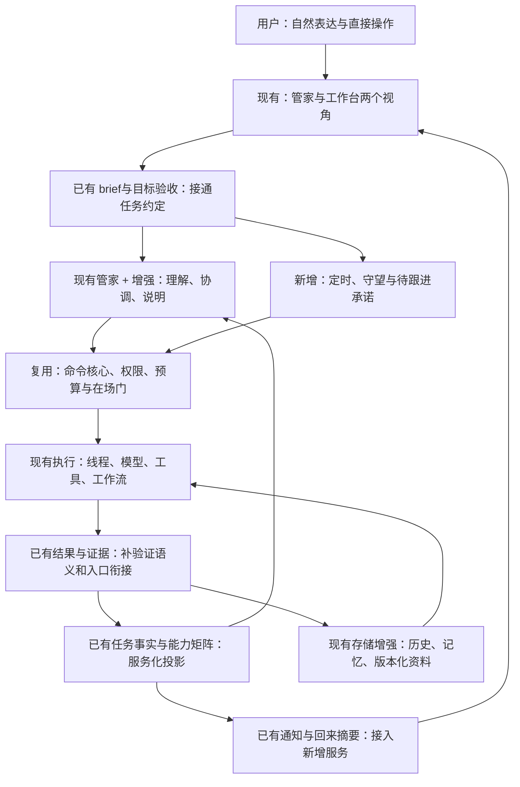
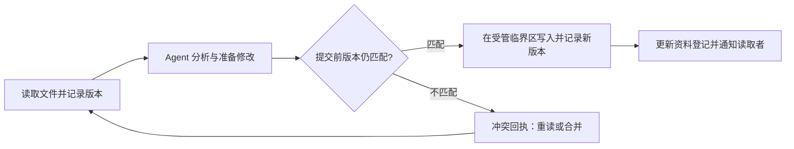
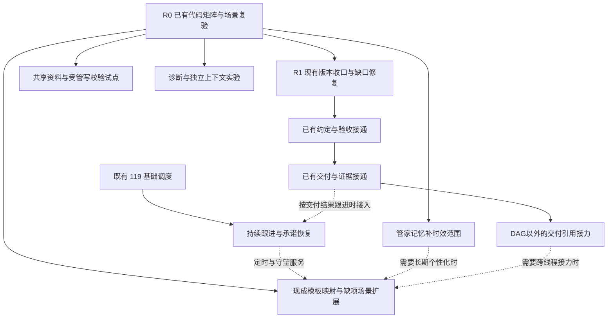

# 如意个人综合工作台：产品与架构迭代方案

版本：代码核查修订稿 v1.1 · 2026-09-12

适用定位：个人综合工作台，覆盖研究、资料、开发、日常事务。

方案基线：2026-09-12 的仓库 HEAD `84fee4b`；源码、生产调用点与已有测试定义交叉核对。
文档边界：本文件现纳入项目，作为后续产品迭代的核查与设计输入；不代表功能已实现，也不构成执行、发布或对外发送授权。后续派单、代码状态与排期以更新后的活跃方案和提交记录为准。

## 0. 核心判断与阅读方式

下一阶段应把如意从“能够调用工具、管理线程的工作台”，推进为“能够持续照看一件事、准确交付结果、尊重用户节奏的个人服务入口”。

芯片化继续作为内部工程方法：上下文复用、模型分工、资源版本、观测与恢复。用户面对的主线则是：**说得清、接得住、看得懂、改得动、交得准、跟得上**。

不能用单一的成本收益排序替代产品判断。减少一次不必要的追问、保存一次被打断的现场、避免一条过时结论、让用户回来时立刻知道下一步，都可以单独构成立项理由。另一方面，“服务全面”不等于每个页面放满功能，也不等于把所有事务都自动执行。

本方案分三层阅读：

- 第 1–4 节：产品目标、真实基线、完整体验和目标架构。
- 第 5–7 节：详细功能设计、迭代顺序、可直接拆单的工作包。
- 第 8–12 节：数据契约、验收指标、发布与回退、待决事项、首轮启动计划。

所有数值验收线均为**建议目标**，不是当前实测成绩；首轮基线完成后可调整，但必须保留调整理由。

**v1.1 关键修订**：v1.0 对现状核查不足，把若干已有能力写成整块新增。本版重写第 2/7/8 节，并同步收缩各设计段、架构图、阶段与启动计划。任务目标/验收、结果快照/历史交付、证据图、失败分类、回来摘要、记忆作用域/过期/否决、能力矩阵和模板目录均有现成实现；后续工作限定为接通已有能力、补具体字段或补验证。原 31 个 ID 保留用于追踪，**不再表示 31 项都要新建**。逐项裁决在第 7 节，源码及测试定位在附录 C。

## 1. 产品目标：六个维度分别过关

| 维度 | 用户能够感受到的结果 | 不接受的替代指标 |
|---|---|---|
| 舒适性 | 不抢焦点、不突然换任务、少重复、信息逐层展开；忙时安静、需要时及时 | 字数越少越好、通知越少越好 |
| 准确性 | 结论有依据、时效说得清、执行状态真实，出错后能定位并纠正 | 模型自报高置信度、回复流畅、线程退出成功 |
| 方便性 | 自然表达即可交办，直接打开结果、回答问题、继续任务，不必理解线程和工具名 | 按钮更多、配置更全 |
| 服务完整性 | 一件事从接单到交付再到后续跟进有闭环；暂不支持时给出可用下一步 | 接入工具总数、自动开出的线程数 |
| 可控与连续性 | 随时插话、暂停、改范围、接管；重启、压缩、跨日后仍知道此前约定 | 永不询问、尽可能自动 |
| 效率与可维护性 | 满足质量与体验后控制延迟、成本、资源和代码复杂度 | 缓存命中率最高、调用最少 |

决策方式不是把六项加权成一个可以互相抵消的总分：错误交付、越权、现场丢失等先设硬门；其余维度做明确的取舍。某项优化即使不省 token，只要显著减少误操作或重复解释，仍应保留。

### 1.1 十条产品原则

1. **任务是服务单位，线程是执行单位。** 用户说“整理这批资料”，内部可能有多个线程，前台仍是一件事。
2. **默认能开始，必要时才问。** 可逆、低影响的呈现选择可用合理默认；对象、范围、时效、重要偏好不清且会改变结果时再问。
3. **承诺必须落地。** 只有任务、提醒或跟进规则实际保存成功，才说“已安排”；正在尝试不能说已经完成。
4. **简洁不损失要点。** 摘要不能隐藏未完成项、重大分歧、待批准动作或结果局限；关键事项可突破一般文字预算。
5. **用户接管优先。** 停止和修订是显式意图，自动重试、接力、后台唤醒不能悄悄抵消。
6. **服务主动性与执行权限分开。** “主动提醒我”不等于“可以替我改文件或发送消息”。
7. **记忆带范围和时效。** 本任务要求、项目约定、个人长期偏好不能混用；持仓、行程、安装状态等变化事实不能永久冻结。
8. **机械事实由程序提供，语义理解由模型辅助。** 不让管家猜状态，也不以字数、关键词等简单规则冒充任务难度或事实正确性。
9. **离线可以用，能力边界可见。** 本地环境、模型端点、连接器的可用性真实反映到服务承诺中。
10. **复用既有权威实现。** 沿用 command core、权限判据、任务状态、通知策略、会话存储和恢复机制；新展示不产生第二份执行规则。

## 2. 当前基线：已有能力与待完成边界

本轮读取实际函数、调用点、配置与代表性测试断言，未启动服务、运行 e2e 或调用真实模型。因此“已实现”表示源码路径成立；“已有测试”表示找到覆盖定义，**不表示本轮复跑通过**。读取期间管家前端及相关测试存在他人在途修改；其新增内容不计作已交付，涉及重叠文件的旧能力以 HEAD 已提交版本及后端路径佐证。项目文件均未修改。

状态口径：**已实现**＝该限定能力已有生产实现；**部分实现**＝底层已存在但目标入口/范围未接齐；**未实现**＝本轮生产源码未找到目标能力并结合相邻接口确认缺口；**待验证**＝已有机制，需要场景实测，不能据此预判缺陷。

| 领域 | 代码事实与证据编号 | 剩余增量；不再重做的部分 |
|---|---|---|
| 任务目标与验收 | 线程 `mission.goal/milestones/constraints`、机器检查；多线程容器 `goal/acceptance/cwd` 都已存在；管家另有 `session.brief`（C01/C02） | **部分实现**：普通管家线程可 `kind:'mission'` 但 `mission:null`。优先接通委托、容器验收、线程账本；不新建整套目标/验收系统 |
| 任务控制与修订 | command core 已有 pause/continue/stop/retry/takeover/rollback/next_turn；追加验收、旧结果归档、`changeSeq` 已存在（C03） | **部分实现**：按具体竞态核对跨线程接力与用户意图修订；不能把停止/接管/续做当新增，也不能把 changeSeq 直接当意图版本 |
| 交付与验收快照 | `buildMissionResult` 已保存正文、验收计数、unfinished、artifacts、回退与审计；`resultHistory` 留最近十份；收尾重建当前结果（C04） | **部分实现**：管家普通线程交付与完整 mission 结果不是同一数据面；补展示衔接、验证来源及必要的修订关联，不另造结果仓库 |
| 管家原件展示 | 收件箱交付带 `sessionId/turnSeq`，前端按指定回合读原件、展开/全文查看（C05） | **已实现**原件查看与回合定位；新增仅限文件可用性、统一验收信息、跨任务/线程引用语义 |
| 证据与判断 | DAG 已有 `run.evidence`、事件 ID、依赖闭包/工作区可见性校验、claims verified/unverified、高风险门与研究核验模板（C06） | **部分实现**：普通研究交付的来源呈现、时效和语义支持度仍需补齐。现有 verified 是引用合法性，不等于主张已被语义证明 |
| 能力与模板 | `getCapabilities`、`TOOL_REQUIRES`、不可用提示；playbook `available/unavailableReason`；15 个内置办公模板及多种 DAG 工作流（C07） | **已实现**基础目录/能力过滤；F01 改为服务映射和管家入口接线，不另建能力探针/模板引擎 |
| 首用引导 | 六步向导、预设、完成状态、重新引导、完成页模板入口已有（C08） | **已实现**基础引导；只接 K7 管家模型配置并做个人综合场景走查 |
| 一台两视与现场 | 视角切换、滚动保存、焦点独立、事件重连已有；K6a 安静卡已实现（C09/C10） | **既有在途**：K6b/K8/K7。U02 先复现启动/慢配置问题；不能宣称现场保护整体缺失 |
| 通知 | 免打扰、设置持久化、基线去重、安静卡五分钟合并、非抢焦点、普通 done 过滤已有（C10） | **部分实现**：安静卡“稍后”目前是关闭，不是登记稍后重提醒；跨重建语义先验再补，不新造通知策略层 |
| 回来摘要 | `stewardVisitDigest/Visit/PendingList` 已聚合增量事件、归档对话、列待决、给焦点（C11） | **已实现**回来摘要；新增只限未来调度承诺和更细交付的摘要接入 |
| 失败与恢复 | 已有工具失败分类含 `side_effect_unknown`、节点分类、瞬态重试、管家限次自理与降级、续跑轨迹（C12） | **部分实现**：分类遥测不等于已驱动所有管家恢复；接通必要信号、验证未知结果语义，不重写分类器和重试器 |
| 一般记忆 | project/global、来源、reviewAfter/expiresAt、过期不注入、修订提议、冲突关系已有（C13） | **已实现**范围/时效/维护基座；不同线程输入与偏好优先级做集成验证 |
| 管家个人记忆 | sourceSessionId/sourceSeq、active/vetoed、同义拒写、编辑/恢复/导出等已有；本轮条目结构未含 project scope/expiresAt（C14） | **部分实现**：补管家记忆的作用域/时效接线及变化事实语义；不重做来源、否决、编辑和整个记忆存储 |
| 定时与守望 | 生产源码无 119 调度 API、`steward_schedule_*`、nextFireAt；现有 DAG scheduler 与输入预判 schedule 不是定时执行（C15） | **未实现目标闭环**：继续 119，再增加持久 watch；当前进度事件收件箱已实现，不重造它 |
| 线程接力 | DAG 已传前序结果、结构化产物及可引用证据；子代理邮箱已有（C06/C16） | **部分实现**：任意管家兄弟线程按指定交付版本自动接力尚未交付，复用 DAG/邮箱底座 |
| 共享 L3 与写校验 | 资源租约和会话内版本重验读取缓存已有；生产 file_write/modify 未见读取版本绑定的条件提交（C17） | **未实现限定共享版本闭环**：仅受管文件试点新增；既有 oldText 匹配和租约不等于无条件缺乏冲突防护 |
| 模型与上下文 | engineRoute 就地更新、strong/fast 派工、快照回读/摘要/notes/缓存已有；firstChangedSegment 与管家专用布局未见实现（C18） | 保留小实验和 111 既有队列；自动升档不等价于已有模型选择 |

**最重要的结构边界**：`session.brief`、单线程 `session.mission`、多线程 mission container、DAG run 是不同对象，各自已有职责。后续先把它们的已有数据投影到同一用户旅程，不把四者都改造成新的 TaskIntent/Deliverable 总数据库。

## 3. 以真实服务旅程定义需求

### 3.1 四类主场景

| 服务场景 | 用户说法 | 合格服务闭环 | 首期边界 |
|---|---|---|---|
| 研究与判断 | “把这三个方案比较一下，周五给我结论” | 明确评估口径 → 收集来源 → 比较与分歧 → 结论和证据 → 可选到期复核 | 无网时使用本地资料并标明截止时间，不伪装已经查到最新 |
| 资料与产物 | “把这批文件整理成能用的资料包” | 理解组织方式 → 预览结构 → 授权范围内整理 → 交付索引和文件 → 可修订 | 支持格式按能力表宣告；只有可回退的本地变更才展示撤销 |
| 开发与问题处理 | “定位这个问题，修好并告诉我怎么验证” | 复现与范围 → 修复 → 验证 → 变更与剩余风险 → 可接管或继续 | 未运行的测试清楚标明；执行成功不自动变成验收通过 |
| 日常事务与长期跟进 | “每周整理一次这些资料，有异常叫我” | 保存规则 → 到点/事件触发 → 执行或等待条件 → 仅有意义时提醒 → 调整/暂停 | 依赖本地进程时明确运行条件；对外发送另有明确授权与回执 |

### 3.2 同一任务的九个服务时刻

| 时刻 | 用户最关心的问题 | 界面和管家应该提供什么 |
|---|---|---|
| 接单 | 你理解对了吗？ | 一句具体回执；可展开的目标、范围、结果形式；可立即纠正 |
| 开始 | 到底开始没有？ | 入队或启动的真实状态；排队原因；避免“马上开始”无限悬挂 |
| 执行 | 现在在做什么？ | 当前阶段和有用里程碑；需要细节时打开工作台；不展示猜测的百分比 |
| 提问 | 为什么要我回答？ | 一个具体问题、推荐选项及影响；已经有授权且答案明确时不重复问 |
| 改口 | 我改变主意了怎么办？ | 显示新要求作用于本次还是以后；旧计划被替代；防止旧结果冒充新结果 |
| 卡住 | 还能继续吗？ | 已知原因、已尝试恢复、可用下一步；无依据不归因于模型弱 |
| 离开再回来 | 有什么变化、哪件要我处理？ | 最多三条优先摘要；先需处理，再交付；其余留在任务索引 |
| 交付 | 结果在哪里、能信到什么程度？ | 直接打开的产物、简短结论、验证状态、关键依据和未完成项 |
| 后续 | 下次还能接着做吗？ | 已保存的任务约定、交付版本、待办或明确登记的跟进规则 |

### 3.3 舒适性具体化

- 在研究任务中输入一段长修改意见时，其他任务的结果不抢焦点、不移动输入框、不更换递送目标。
- 切换视角后保留各自草稿、滚动和焦点；启动配置迟到不能覆盖用户刚作出的视角选择。
- 用户说“这次先简短一点”，只影响当前任务；说“以后先给结论”，才形成长期候选偏好。
- 用户说“先停一下”，得到真实停止/正在停止回执；已停任务的恢复必须遵循该次停止的原因与后续明确指令。
- 常规进展不发系统通知；用户明确约定“做完叫我”的完成通知可以发。重要截止风险不能只因为默认合并策略而消失。
- 对长文、图表、代码和文件支持直接查看与局部修改，不要求用户反复复制路径、寻找产物或重新解释上下文。
- 窄屏和放大字体下保留首要动作；键盘、读屏和减少动效模式有真实验收，不靠截图推定可用。

## 4. 目标架构：任务服务层与执行层分工

以下为目标形态，标注“接通/扩展”的节点已有底层实现。只有明确标“新增”的部分才按新能力讨论；大框是职责，不要求每框新建一个模块。



三个不能混淆的边界：

1. **表达与授权**：模型能提出动作，最终仍由既有 handler 和命令核心判断。任务约定及其增量字段记录意图，不隐式授予权限。
2. **状态与叙述**：运行状态、保存成功、权限状态、来源时间来自系统事实；模型把它们讲清楚，不能自己生成事实。
3. **通知与持久执行**：SSE 负责显示新变化；持久任务/运行账本负责重启后的继续与核对。丢了一条 UI 帧不应该丢掉承诺。

执行轴沿用现有五态。交付展示先派生自已有 `mission.result.acceptance/unfinished`、里程碑 check/evidence、DAG gate/claims；只为目前无法区分的“模型自报完成/机器检查通过/尚未检查”补明确来源。`未产出 / 已产出待验证 / 已验证 / 部分交付 / 需修订` 是建议的用户呈现语义，不是必须新增的第二套状态机。

## 5. 详细迭代设计

### 5.1 好交办：任务约定与有边界的澄清

**代码裁决：部分实现，改为接通而非新建（C01/C02/C03）。** 目标、限制、验收项、追加回合验收和管家委托已有。新增范围只剩：把管家 brief 的目标/限制映射到已有账本，明确任务容器与线程验收的对应，按证据决定是否补字段级来源和意图修订。下列体验要求中已有部分作为回归目标。

**要解决的问题**：管家虽然会开线程，但任务对象、交付形式、完成标准常藏在自然语言里。多次转述、跨日接续或用户改口后容易漂移。

**设计**：以已有 brief/goal/constraints/acceptance 生成用户可读的最小任务约定投影；预期交付、字段来源、可选截止时间确有消费者时才增加。简单任务可保持没有完整 mission 账本的轻量路径；不为了统一结构强制所有聊天建验收表。

- 给出一句具体回执：“我会比较这三份方案，按准确性和维护成本列出取舍，结果放到当前任务。”
- 可展开查看约定；每个推断默认注明来源为系统假设，可被用户改掉。
- 只对会改变对象、重要结果或权限边界的缺项追问；可逆呈现选择直接开始。
- 缺少部分信息时先做独立工作，保留待答点；不能因为一句可选偏好而阻塞全部任务。
- 路由提示是建议，正文意图优先；同名任务、指代不清时展示少量候选，禁止默默把话发往错误线程。
- “这次 / 这个项目 / 以后”明确作用域；修改产生新修订，旧修订仍可追踪。

**示例**：“把刚才那个再整理一下”若唯一焦点任务明确则直接继续；若同时存在两份不同报告，问“是市场报告还是代码审查？”而不重问所有交付要求。

**实现落点**：已有 `prerouteText` 多特征候选评分与 routeHint、递话五通道优先复用；用户约定投影接 mission/session.brief，不能另加一套路由器。意图版本若需要，必须区别于记录所有事件的 `changeSeq`，先用修订竞态样本证明必要性。

**验收**：典型交办场景目标/对象/输出正确；错误线程递送在歧义夹具中为零；简单请求无新增必填表单；修订后下一次执行与交付明确引用新修订。

### 5.2 好相处：注意力、现场和信息密度

**代码裁决：主干已实现，以现有计划收口和缺口验证为主（C09/C10）。** 视角现场、quiet-card、不抢焦点、免打扰、合并和普通 done 过滤不是新功能。下面的通知表是目标口径；截止风险、承诺级完成通知、真正的稍后再提醒才是候选扩展。启动配置问题先复现，因为现有代码已检查显式 classic 偏好，不能仅靠旧文档断言仍会覆盖。

**要解决的问题**：即使每条通知都正确，重复、抢焦点、时机不对也会让用户疲劳；过度压缩又会掩盖关键事实。

**设计**：先完成 121 K6b/K8/K7，之后只扩展既有注意力通路。

| 情形 | 默认呈现 | 例外 |
|---|---|---|
| 正在操作当前线程 | 当前线程原位更新 | 其他任务不自动取代焦点 |
| 其他任务常规进展或普通完成 | 更新任务行、回来摘要 | 用户明确要求完成提醒时按约定通知 |
| 其他任务需要回答/已失败 | 安静卡，可直接处理 | 静默时段遵循偏好；需保留“待处理”状态 |
| 用户离开 | 记录并合并；符合通知约定时发系统通知 | 未连接可用通知渠道时不能声称已经叫到用户 |
| 同一原因重复触发 | 更新同一事项，不重复轰炸 | 问题内容、截止风险或可执行动作发生变化时可重新提示 |
| 截止将到且任务受阻 | 明确说明时间风险和可选行动 | 不仅凭模型情绪化“紧急”标签升级打扰 |

- 三种服务偏好可逐步选择：仅按需、关键节点主动、约定的定期整理。它们只控制服务主动性，不能改变执行权限。
- 界面遵循一个结论、最多两个主动作、细节展开；有重大限制时必须在摘要中保留。
- dismiss、稍后提醒、暂停跟进、停止任务四种动作不同；关闭提示不等于停止任务，也不等于授权执行。
- 只在实际需要时提出偏好设置，不把第一次使用变成长问卷。
- 不用假进度或未经校准的 ETA 安慰用户；可以显示阶段、最近有效输出、已知等待条件。

**实现落点**：服务端现有在场/动作判断保持权威；客户端通知模块管理呈现与合并，不复制业务权限。重连后由持久状态和快照对齐，不能把内存消息序号当作跨重启唯一事件 ID。

**验收**：输入、滚动、选中任务无意外跳变；同一未解决问题重复回放不重复创建通知；关键待答信息可达；200% 字体、窄屏、键盘与 reduced-motion 实测通过。

### 5.3 说得准：证据、时间与状态真实性

**代码裁决：证据和机器验收已有，跨入口表达与语义时效部分缺失（C04/C06/C12）。** DAG 已核验引用 ID、工作区和依赖可见性，并有研究对抗核验模板；线程账本也有 command/file_exists 检查。新增只扩普通交付的证据呈现、来源时效，以及“自报完成/机器检查”的区分，不新造 Evidence Catalog 或全局验证器。

**要解决的问题**：管家用快速模型转述时，可能把“线程说做完了”讲成“已验证”；把旧资料讲成最新；把两个有分歧的来源合成一个确定结论。

**设计**：区分三类内容，使用不同验证方法。

| 内容类别 | 验证方式 | 用户呈现 |
|---|---|---|
| 系统状态与动作 | handler 回执、运行账本、产物存在性与验证结果 | “文件已生成”“等待你的回答”“发送结果未确认” |
| 外部事实 | 来源、观察时间、适用范围、关键主张的证据对应 | 简短结论；按需展开来源；过时或冲突直接指出 |
| 判断与建议 | 明示假设、比较标准、反例或分歧，必要时独立复核 | “建议 A，前提是…”而非伪造置信百分比 |

- 研究任务明确资料截止时间；“最近”“现在”等时效请求不能用历史快照直接回答。
- 数值优先按工具结果校验单位、时间区间和计算过程；表格、引用、文件版本要能回指。
- 关键主张有证据不等于证据有效：网页引用本身不保证内容支持结论；真实模型评测必须加入不支持、矛盾和过期来源。
- 不用实体逐字出现判断整句真假，也不把缺少逐字匹配作为禁止概括的理由。
- 未验证产物仍可交付，但标签是“已产出、尚未验证”；简单答复无需人为制造一套审批流程。
- 复核强度按任务后果与验收难度提高，不默认所有任务都多跑一轮大模型。

**实现落点**：关联现有 `run.evidence`、gate/claims、里程碑 `check/evidence`、`mission.result`；保留各自验证范围。需要新增的是普通线程交付与上述记录的引用映射、语义时效字段。不能把现有 `claims.status='verified'` 直接翻译成“事实已证实”。

**验收**：没有保存回执却声称已安排、没有执行回执却声称已发送、测试未跑却标通过等夹具零误报；来源冲突不被摘要静默抹平。

### 5.4 交得好：结构化交付与局部修订

**代码裁决：结果记录、原件查看、未完成项和历史交付已经存在（C04/C05）。** v1.0“线程结束往往只剩最终回复”的描述过宽。真正的缺口是这些能力在 mission 账本线程与普通管家线程间是否贯通，以及是否有足够的验证来源和意图关联。

**要解决的问题**：两类已有交付路径表达能力不同；用户不应因从管家开线程就看不到已有验收、未完成项和历史结果。跨线程接力需要明确引用哪一份交付。

**设计**：优先以既有 `sessionId + turnSeq` 定位管家交付，并关联现有结果快照；`finishedAt/resultHistory` 保持已有语义。只有跨线程长期引用超过当前十份历史保留边界时，才设计额外稳定归档引用。已有 artifacts、acceptance、unfinished 不复制成另一套持久字段。

- 研究：结论 → 对比依据 → 来源与截止时间 → 分歧。
- 资料：整理结果 → 可打开的索引和产物 → 处理范围 → 未处理文件。
- 开发：行为变化 → 验证结果 → 改动入口 → 未覆盖风险。
- 日常事务：实际完成动作 → 明确回执 → 后续约定；草稿与发送分开。
- 用户可以直接说“第二部分更详细”“只保留本地资料”“撤回刚才那项”；修订沿用任务约定和产物版本，不重新开一件无关联的事。
- 管家摘要与线程原件绑定同一交付版本，避免摘要更新了但文件链接仍指旧版。
- 下游接力消费指定交付 ID/版本和必要资料引用，不只接收管家转述的全文。

**验收**：所有交付文件链接可打开；文件缺失、验证失败、部分完成能在摘要中区分；修订后旧版不覆盖新版；用户两步内可从任务定位产物。

### 5.5 跟得住：定时、守望与承诺履约

**代码裁决：119 目标闭环尚未实现；普通进度收件箱与恢复底座已实现（C11/C12/C15）。** `prerouteText` 能识别时间意图、源码中有 DAG scheduler，都不代表已经有定时服务。C01–C03 保留新增，但其事件收集、授权和执行恢复尽量接既有实现。

**要解决的问题**：用户口头说“之后提醒我”后，系统容易只给自然语言应答；本地进程休眠或重启后，承诺可能失效或重复执行。

**设计**：先实现 119 的提醒与消息回合闭环，再接事件守望，最后接 playbook/workflow；不同载荷分别过门，表面入口可以一致。

- 创建成功回执包含下次发生时间、适用时区、执行内容、可取消入口和必要的运行条件。
- “线程做完叫我”是登记明确目标与触发条件；“关注这个主题”先具体化为来源、频率、变化阈值与提醒规则。
- 没有可用日历/邮件服务时，不声称已经建立外部日程或已发送；可以先落本地提醒或草稿。
- 本地进程未运行时不能保证触发；界面说明“如意运行时执行；错过后按 X 处理”，不能只藏在文档。
- 休眠/重启恢复显示补跑、跳过、状态未知等实际结果，不悄悄把失约记成正常完成。
- 对无副作用的失败可限定重试；对外发送等无法判定结果的操作先核对回执，不盲目重发。
- 到期、暂停、已取消、已触发是规则状态；运行成功、失败、待用户是一次执行的结果，二者不混用。
- “每周资料汇总”可以自行执行；“每周替我发出去”需要对应发送范围与授权，复用既有政策。

**实现落点**：119 的持久任务定义、触发历史、runId 与授权；通过既有运行入口启动，最终状态回收件箱。即时事件可加速唤醒，持久游标与启动核对负责补偿。

**验收**：假时钟覆盖月末、闰日、时区变更、错过时点；崩溃窗口覆盖登记前后、启动前后、执行结束未回执等；未知结果绝不默认成功。对任意外部副作用不承诺系统级 exactly-once。

### 5.6 懂你但不乱记：偏好、项目规则与变化事实

**代码裁决：一般记忆的范围/时效/修订、管家记忆的来源/否决/编辑已经实现（C13/C14）。** 不再立项重做这些。增量仅针对管家个人记忆条目尚无项目作用域和 expiresAt、两套记忆的选择规则，以及变化事实和来源内容的语义核对。用户消息来源检查只证明该回合有用户发言，不证明待存文本逐义得到支持。

**要解决的问题**：用户每次重复偏好很累；自动推断过头、记忆过期、跨项目串味同样降低信任。

**设计**：一般记忆继续使用已有 project/global 与 reviewAfter/expiresAt；管家记忆保持现有存储与编辑/否决 API。先确定哪些条目应留管家库、哪些应引用一般记忆，再补管家库必要的适用范围与时效，避免把已有一般记忆机制再实现一次。

- 任务要求不自动晋升为个人长期偏好；用户说“以后”或明确同意后才持久应用。
- 项目约定优先于一般呈现偏好，但本任务最新明确指令优先；冲突时给出简短解释，不隐式改变安全权限。
- 持仓、行程、文件状态等带观察时间和失效规则，过期后不作为当前事实自动代答。
- 记忆可以概括，但应保留用户原话引用，支持“它为什么认为我喜欢这个”的查看。
- 用户否决后在后续检索、注入和摘要中生效；不能换一种说法重新写回。
- 编辑、纠正、停止使用和删除分开说明；只从活动检索排除不冒充已经物理清除全部历史/备份。
- 不把工具输出、他人文字、线程模型推断直接当成个人偏好来源。
- 多个工作区默认按作用域检索；跨域共享由任务需要和既有访问权限限定。

**实现落点**：复用 06d 的过期过滤、维护提议与关系图，以及 13l 的 active/vetoed、编辑与同义拒写。新增检索过滤只作用于新增字段的消费者；已有否决安全性保留测试，不把所有语义改写都能被 Jaccard 识别作为既有保证。

**验收**：本次/本项目/长期三类指令各走正确范围；过期事实不被当作当前事实；否决条目后续任务不再注入；摘要后的记忆依据仍可追踪。

### 5.7 做事有连续性：失败恢复、用户修订与模型分工

**代码裁决：停止/续做/旧结果归档、失败分类、限次重试、断点轨迹已有（C03/C12/C18）。** 新增重点是让管家消费现有分类证据，补跨线程修订关联，并验证模型切换边界；以下故障表是对既有机制的服务化映射，不是新写分类器的规格。

**要解决的问题**：把所有失败解释为模型能力不足，会产生无效升档；重新开线程又丢掉现场。用户插话时旧计划还在跑，也会产生错版交付。

**设计**：先分类并保留现场，再选择恢复动作。

| 已知情形 | 首选动作 | 模型升档的关系 |
|---|---|---|
| 工具临时失败或网络中断 | 限次重试/等待恢复，保留结果未知状态 | 通常没有直接帮助 |
| 权限或工作区限制 | 使用现有待决和授权链路 | 不以换模型绕过 |
| 缺资料或用户要求矛盾 | 提取最小待答问题 | 强模型可协助解释，但不能替用户造答案 |
| 输出格式失败 | 受限修复并记录次数 | 重复失败后可建议换模型 |
| 语义质量不足、复杂推理卡住 | 补证据、改变分解或建议强模型 | 保留任务约定和已有交付，用户预算选择优先 |
| 用户主动停止/改口 | 取消后续自动动作，建立新修订 | 不自动恢复旧目标 |

- 管家可以采用用户配置的快速模型；关键事实由系统提供，复杂工作经执行线程。
- 静态规则只处理明确已知任务族，不以 brief 长度自动判定难度；建议选择可带依据，用户显式选型优先。
- 就地切换只发生在安全回合边界，先核引擎协议、工具历史、能力支持和预算；同 provider 不代表所有模型都兼容相同历史。
- 如需新线程，交接单带任务修订、已完成工作、资料版本、未完成项和执行限制，不用一个压缩 brief 假装完整迁移。
- 优先使用已有 turnSeq、DAG attempts、结果归档与取消路径处理旧执行；只在跨线程/承诺场景无法表达意图替代时新增 intentRevision。先验证现有收尾重建和追加验收的边界，不能假设所有旧结果保护都缺失。
- 自动恢复必须有次数上限、停止条件和可见记录；不新增 handler 外的独立权限判官。

**验收**：故障类型能与证据对应；网络失败不触发自动付费升档；主动停止后无自动重启；修订/取消与迟到结果竞态覆盖；明确支持的模型切换组合逐项验证。

### 5.8 协作可靠：先共享交付，再建设限定 L3

**代码裁决：DAG 前序结果、证据可见性、邮箱与租约已有；任意管家线程的版本化接力和共享文件读写版本闭环未实现（C06/C16/C17）。** “共享交付引用”只扩到当前 DAG 外的服务链，不能重复认领节点之间已有的数据传递。

**要解决的问题**：多个 Agent 重复找资料、转述失真，或基于旧文件内容修改；但为了少数场景建设通用一致性层会拖累全局。

**递进实现**：

1. **共享交付引用**：同任务共享产物与来源引用，按权限读取，减少管家全文转述。
2. **共享资料登记**：资源 ID、作用域、版本、来源、观察时间、读取者；先观测旧读发生频次与后果。
3. **失效提示**：新版本产生后提示相关读取者更新；这只改善协作，不构成正确性保证。
4. **受管写入校验**：读取时持有版本，提交前在受管写路径校验；不符则拒绝并要求重读/重新合并。



**严格限定保证范围**：`mtime+size` 适合当前受限缓存的快路径，不足以作为所有写入的可靠内容身份。受管文件可引入内容摘要/单调修订并把校验与提交放进同一协调边界；任意外部编辑器或绕过工具的命令不遵守该锁，单次“校验后写入”仍有竞态。没有平台级原子条件写时，应明确只保障协作写者，检测外部变化、缩小窗口并提供冲突恢复，不能宣称全局无丢失更新。

- 只读研究共享的是观察和证据，不强制所有 Agent 对同一问题持相同结论。
- 回读历史原文与读取最新文件两种操作要分清，不能通过失效广播改写历史证据。
- shell/MCP 写入面未覆盖时标记为未知/未受管；完整性度量必须包含覆盖范围。
- 先处理同任务文件协作；跨项目语义记忆一致性、通用 MESI、投机预取后置。

**验收**：A/B 同读后 A 写、B 再写必须在受管场景中检出冲突；路径别名/大小写/删除重建/同大小改内容/外部编辑纳入用例；通知丢失不使受管写校验失效。

### 5.9 服务全面：可发现的服务目录与能力降级

**代码裁决：能力矩阵、按能力禁用工具、可用/不可用模板卡、15 个内置办公模板与 DAG 模板已有（C07/C08）。** 新增只做个人综合服务的分类映射、管家入口的发现与缺项模板，不新建目录引擎、探针或模板 DSL。定时/守望仍依赖 119；能力未知时现有代码有放行语义，应如实显示未知，不能通过文案映射把它升级成已验证可用。

**要解决的问题**：用户不知道如意能帮什么；模型可能承诺没有接入的能力；接入很多工具却不能完成一件事。

**设计**：把已有 playbook 与 DAG 模板映射为六类“完成一件事”的服务：研究比较、资料整理、产物撰写、代码任务、定时汇总、变化守望。前四类先盘点复用；后两类缺运行基座，另排新增。模板入口与可用性直接读既有清单。

- 模板定义输入、产物、完成标准、能力依赖与后续动作；尽量使用现有 playbook/workflow，避免新 DSL。
- 服务状态为可直接使用、需要配置、当前不可用；结合网络、端点、工具、授权范围实时说明。
- 在用户问“还能帮我什么”、空任务或刚完成相关任务时给少量相关建议；不常驻占据主界面。
- 语音按 114 先做输入回填、可纠正再提交；音频理解错误不能直接触发高影响动作。语音播报属于后续可选服务，先评估打扰和隐私。
- 文件/图片/音频可用范围来自能力表；不同引擎不做未经验证的能力对齐承诺。
- 邮件、日历、消息等后续接入按完整服务闭环验收：读取、草稿、授权、执行、回执、失败恢复；不是连通 API 就算出门。
- 离线降级有具体下一步：改用本地资料、保存待执行任务、保留草稿或指导恢复连接；不能把旧资料装成实时结果。

**验收**：未接入服务不出现成功承诺；可用服务从自然语言进入不超过一次必要配置引导；六类模板各有一条完整成功路径和一条能力不足路径。

### 5.10 内部架构优化：以体验质量为前置条件

**代码裁决：保留独立增量（C18）。** 现有 layout_shadow 已测两布局前缀长度，不能再作为新增遥测平台。只补 firstChangedSegment 和确有消费方的关联；rules/管家专用布局仍是未验证实验，111 仍是原有计划。

保留上一轮值得验证的方向，但不以芯片名词决定排期：

| 方向 | 本轮定位 | 必须额外验证 |
|---|---|---|
| 管家 rules 进入稳定层 | 小范围对照实验 | user/system 指令层级变化、不同语言、真实任务正确率 |
| 管家专用尾部布局 | 按会话类型独立实验 | 跨唤醒、工具调用多轮、摘要后、不同 provider 的实际缓存与行为 |
| firstChangedSegment | 请求变化诊断 | 比较的是实际序列化布局；缺 usage 时不编造命中或费用 |
| 111 压缩 v2 | 现有规划继续 | 最新任务修订、未答问题、来源和限制在压缩后仍可用 |
| 模型放置校准 | 先复用决策日志与结果 | 记录任务类型、失败原因与重试；不把相关性当因果 |
| 交付物复用 | 优先于通用预取 | 引用版本、权限、资料时效及用户新要求 |
| CLOCK、G6 换序、预取 | 暂列研究候选 | 当前蒸发机制并非逐项替换；共享前缀不是共享知识；只在需求与实测成立后立项 |

每个实验同时报告：任务正确性、端到端时间、用户纠正/介入、全部尝试费用、本地开销。默认开关按既有 22/23 号证据门决定，不能只以命中率上升翻默认。

## 6. 迭代顺序：先让现有产品好用，再逐步扩大服务

### 6.1 两条发布边界

**发布 A：当前版本收口。** 继续已有 121 K6b → K8 → K7，并按现有路线图处理 119、114、111 与 107。31 号线已经关联的能力按各自范围推进。本方案不把共享 L3、完整长期服务层、所有新连接器等新增能力塞进 107，避免发布门无限后移。

本方案可立即影响发布 A 的内容：场景验收、能力真实性、焦点/草稿保护、已有通知规则核对、已有交付文案的诚实性。涉及新增持久字段、权限行为、协议的项目默认进入发布 B；若确需进入 A，应先写明替换的范围和验证成本，不悄悄追加。

**发布 B 及之后：服务能力递进。** 将任务约定、交付验证、跟进、记忆和协作分成可以独立使用的增量。每个增量交付一条完整服务旅程，不先铺半年通用框架。

### 6.2 建议阶段与可感知成果

| 阶段 | 范围 | 完成后用户能做什么 | 前置与退出门 |
|---|---|---|---|
| R0 基线与范围冻结 | 以本轮代码矩阵为起点，复用已有测试补旅程缺口 | 明确哪些已能用、哪些还不能承诺 | 不另造探针与全新测试平台；每项现状有源码与验证状态 |
| R1 舒适与可见 | 121 既有队列收口；现场、通知、引导先复验再补缺口 | 平稳地同时处理几件事，随时看见结果与待答 | 已有保护保持；疑似缺陷有复现后再安排修复 |
| R2 准确交办与交付 | 接通 brief/容器验收/线程账本及两类交付；复用证据与失败分类 | 少解释一次；管家入口也能看到已有验收与正确原件 | R1；优先读投影；只有缺口证明后才增加意图/验证来源字段 |
| R3 持续照看 | 119 新增闭环、持久 watch；现有回来摘要接承诺；管家记忆补时效范围 | 安排一次后能够跟进，跨日回来能接上 | 基础 119 不等 R2；承诺摘要只依 C01/C03，交付增强部分才依 D01 |
| R4 服务扩展与多线程接力 | 现有模板服务映射；限定代答；DAG 以外的交付引用接力 | “像上次一样再做一次”，多个帮手接着做而不丢依据 | 复用已有 playbook/工作流/邮箱；不重新开发六套框架 |
| R5 针对性深化 | 受管文件版本校验、模型恢复策略、上下文实验、按需连接器 | 协作更可靠、恢复更聪明，常用服务体验持续改善 | 按各项目证据独立进入；不能等待所有方向完成才发布 |

R5 中不涉及新服务依赖的诊断或独立实验可提前开展，但不抢占 R1/R2 的产品关键路径。R3 的“基础调度”与“调度后的长期服务体验”分开：前者接 119 现有排期；后者增加持久跟进记录，其中按交付结果触发的服务才需要交付关联。现成模板和一般回来摘要不等待这些增量。

### 6.3 时间与资源规划假设（去重后重估）

**撤回 v1.0 的 R2/R3/R4 整块迭代时长。** 原估计包含已实现的目标、交付、记忆、回来摘要与模板工作，不能继续直接用于排期；也不能简单减去比例后编出新工期。

- R0 的源码盘点本轮已完成主要部分；下一步是执行既有验证并补真正缺少的旅程，建议先给 1–2 个工作日的验证时间盒，不重读全仓。
- R1 跟随当前 K6b/K8/K7，不另设平行交付队列；U02/U03 只有复现缺口才转开发任务。
- R2 先完成 T01+D01 的读投影与一条端到端样例，再判断是否需要新持久字段；前者是接线，后者才是协议变更，分别估算。
- R3 主要新增成本在 119 与持久 watch；已存在的回来摘要、一般记忆和收件箱不重复计入。
- R4 先列出每类现成模板的映射与缺项，再估新模板和跨线程接力；不按“六类服务”乘以六份完整实现成本。
- R5 每项独立计量；firstChangedSegment 与布局实验不包含新建遥测平台的成本。

完成两个实际增量后，以实现/验收/返工记录估算后续；保留约四分之一容量处理真实使用卡点和回归。发布顺序仍可规划，尚未证实的工作量不转换成保证日期。

建议工作分配：约一半投入当前阶段主旅程，约四分之一体验修复和验证，其余用于必要基础设施与独立实验。这是节奏建议，不是用配额压制关键正确性缺陷。

### 6.4 依赖图



## 7. 可拆单工作包

本节替代 v1.0 的整块新增清单，保留 31 个 ID 用于对照。“代码裁决/证据”列中的 C 编号指附录 C 的核查证据；“ID”和依赖描述中的 C01–C04 指持续服务工作包，两者按列区分。“待验证”不等于有缺陷，“已有”也不等于本轮真实运行通过。已具备的子项从开发范围删除，只保留回归；在途项沿既有派单。优先级与大小待实际增量冻结后再估，不保留已被重复建设放大的 M/L 标记。

### 7.1 R0/R1：先完成用户可以稳定使用的工作台

| ID | 代码裁决/证据 | 剩余工作 | 依赖与验收 |
|---|---|---|---|
| F01 | 基础已实现；C07/C08 | 能力矩阵与现成模板映射到服务/管家入口；对照文档状态 | 不新建探针；明确 unavailable 与 unknown；引用现有 available 判定 |
| F02 | 已有大量测试；待补旅程；C01–C18 | 复用 capabilities/onboarding/mission/steward/memory/事件测试，补跨模块旅程缺口 | 不另建测试框架；读过用例不算复跑通过 |
| U01 | 部分已交付，剩余在途；C09/C10 | 仅 K6b/K8/K7 原范围；本次不与其他执行者重复派单 | 沿现有验收与独占文件安排 |
| U02 | 现场保护已有；疑似边界待复现；C09 | 复验慢配置、快速切换、重连；只有失败样本才修 | 不先判 P0；保留现有滚动、焦点、草稿和 classic 偏好判断 |
| U03 | 合并/免打扰/安静卡已有；C10 | 验证重建去重；明确关闭与真正 snooze 的区别；若要 snooze 再加持久提醒语义 | 真正 snooze 依 C01/C03；普通关闭不依调度器；重复帧先跑既有测试 |
| U04 | 引导/能力降级已有；C07/C08 | 仅补 K7 管家模型配置与个人服务场景的指引缺口 | 复用 onboarding.completedAt/version 与现有模板入口 |
| U05 | 局部实现与既有浏览器件；待验证；C09/C10 | 补未覆盖的 200% 字体、键盘、窄屏长内容场景 | 不把全部可访问性重做一遍；新增代码由走查缺陷驱动 |

### 7.2 R2：让任务被准确承接并形成可信交付

| ID | 代码裁决/证据 | 剩余工作 | 依赖与验收 |
|---|---|---|---|
| T01 | 约定/验收/brief 已有，入口部分未接；C01/C02 | 做已有数据的读投影与映射；确需才补字段来源/意图修订 | 不强制轻量聊天建立 mission；与普通管家线程 mission:null 路径兼容 |
| T02 | 停止/接管/追加验收/旧章归档已有；C03/C04 | 针对跨线程与未来承诺补修订关联；先复验现有迟到结果保护 | 既有 turnSeq/attempts/changeSeq 各守原义；不得全部替换成新 generation |
| T03 | 输入预判、评分候选与递话通道已有；C02 | 补歧义/反复追问的模型质量样本，再调整必要提示或候选 | 可独立于新持久 schema；不新建路由器 |
| D01 | 结果正文/验收/unfinished/artifacts/history 已有；C04/C05 | 接通普通管家交付与 mission 结果；只增验证来源、必要意图关联 | 普通线程无账本时诚实显示未记录；不复制结果仓库 |
| D02 | 原件展开/全文与回合定位已有；C05 | 将已有验收和产物信息带到统一呈现；查文件可用性与缺失提示 | 不等待新 D01 才维护现有原件查看；新增验收呈现依 D01 |
| A01 | handler 回执/决策日志/检查与结果已有；C03/C04/C12 | 核对用户可见成功声明是否正确消费回执；区分自报完成与机器验证 | 新调度/发送承诺的真实性检查随 C01/对应连接器做；不是新状态引擎 |
| A02 | DAG 证据图/引用验证/研究核验模板已有；C06 | 普通研究交付复用证据；补外部资料时效与主张支持度验证 | 不把引用合法性 verified 当语义准确；不重建 Evidence Catalog |
| E01 | 故障分类/退避/限次自理/轨迹已有；C12 | 查现有分类到管家反馈的消费链，补确有缺失的语义解释和恢复门 | 先诊断和展示；遥测 allowedRepair 不能直接成为新自动执行授权 |

### 7.3 R3：从一次性任务走向持续服务

| ID | 代码裁决/证据 | 剩余工作 | 依赖与验收 |
|---|---|---|---|
| C01 | 119 运行闭环未实现；C15 | 保留原 119 实施：提醒/消息回合、持久 occurrence 与授权 | 不依赖新 T01/D01 才开始；基础提醒不调用模型 |
| C02 | 定时运行恢复未实现，普通恢复已有；C12/C15 | 仅补 119 的结果未知、撤销与重复发生竞态 | 随 C01 交付，不作为所有现有重试器的重写项目 |
| C03 | 通用持久 watch 未实现，收件箱已有；C11/C15 | 保存目标/条件/动作/去重记录并消费已有持久事件 | 基础 watch 不依 D01；只有按交付版本触发才依 D01/H01 |
| C04 | 回来摘要已实现；C11 | 现有摘要新增未来承诺/过期/失约项；K7 承接“接下来” | 不再以 C01/D01 为现有摘要的前置；对应新字段成熟时接入 |
| M01 | 一般记忆范围/时效已实现，管家库部分缺；C13/C14 | 先定两库职责，再补管家库必要 scope/expiresAt 与条目来源投影 | 不依赖新任务 schema 即可推进；复用一般记忆语义，不迁移整个库 |
| M02 | 过期过滤/修订/否决/编辑已实现；C13/C14 | 扩到 M01 的新字段；测纠正/否决在摘要和引用消费中的语义覆盖 | 既有否决重写拦截只对匹配范围有保证；补失败样本而非重写机制 |
| M03 | 基于依据自动代答/白名单代批未交付；C15 | 保留 31 号代答试点；有来源、适用范围、用户在场与权限门 | 依既有记忆即可启动受限试点；变化事实自动代答才依 M01 时效 |

### 7.4 R4/R5：服务组合与内部深化

| ID | 代码裁决/证据 | 剩余工作 | 依赖与验收 |
|---|---|---|---|
| S01 | 模板基础与多数常见场景已有；C07 | 15 个办公模板及现有研究/开发 DAG 映射六类服务；只开发缺项 | 不依新 D01/M01 才提供现成服务；定时两类依 C01/C03 |
| S02 | 模板发现/向导入口已有，管家服务化部分缺；C07/C08 | 将自然语言与既有模板入口接通；按需给相关建议 | 不新增常驻服务墙；不是重新开发工具发现协议 |
| H01 | DAG 前序数据/邮箱已有，任意线程版本接力未齐；C06/C16 | 仅扩到管家兄弟线程按 sessionId/turnSeq 或可靠产物引用的接力 | 依新增接力语义与 31 编排；保持现有 DAG 路径不重做 |
| H02 | 通用共享读版本/读取者登记未实现；C17 | 同任务受管资源的读写关联与旧读观测 | 可独立于 H01 做工具事件试点；历史原文回读不等于当前版本读 |
| H03 | 条件提交协议未实现；租约和文本匹配已有；C17 | 限定工具的读版本绑定与临界区校验、冲突恢复 | 有 H02/协作写需求再做；外部写不能靠租约保证 |
| E02 | 就地模型配置与档位派工已有；C18 | 先建议升档与兼容验证；有预算授权再做自动决策 | 不新建模型切换 API；不把切权限档与切模型档混淆 |
| X01 | 布局 shadow 已有，分段诊断未实现；C18 | 仅补 firstChangedSegment 与消费所需关联字段 | 不把现有前缀比较/日志平台算新增；无需 F01 整套服务投影先完成 |
| X02 | 候选实验尚未实现/验证；C18 | 独立测 rules 稳定化与管家专用尾部布局 | 复用原 G1/G2/布局实验；行为与费用一起测 |
| X03 | 压缩基础已有；111 原有待推进项；C18 | 按 111 原序列；新增字段实际入版本后才补兼容验收 | 不要求 111 等 T01/D01；不重做 105 的快照/回读/notes |

注：H03 的版本校验是该协作试点启用后的必需条件，不代表全项目现在转向 L3。F02/U02/U05 等验证型条目允许以“现有行为满足要求，无新增代码”收口，不应为了保留原排期而制造改动。

31 号“眼睛”启用之前，应补一项独立准入门：工具读取与结构化回复 actions 两条通路统一记录外部来源，在实际动作 handler/回合上下文的权威判断中落实污染回合的降级。只缩减 tools 清单不能覆盖 actions 通道；只有提示词写了“外部内容不是指令”也不算实现了该门。M03 及任何消费外部内容后自动写入的服务，依赖此门验证通过。

### 7.5 单个切片的派单模板

每个工作包开始时补齐以下信息，控制在一页，避免执行者重新猜范围：

1. 用户触发：用一句真实输入描述场景。
2. 当前行为与期望行为：明确可观察的前后差别。
3. 实现边界：现有权威入口、允许修改的模块、新增持久化/事件/工具契约。
4. 依赖与不包含项：哪些能力尚不可用，哪些相邻功能本次不交付。
5. 验收：一条成功、一条失败、一条取消/重连/修订竞态；涉及语义变化时加入真实模型验证。
6. 数据兼容与回退：旧数据怎么读，关闭新行为是否还能看见已有产物和承诺。
7. 交付证据：代码入口、测试结果、用户路径截图或走查记录、已知未覆盖范围。

这是一份实施检查表，不要求每个低影响样式修复都写新测试；涉及行为、协议、权限或恢复时遵循仓库已有 e2e 要求。

## 8. 现有数据映射与最小扩展

v1.0 的 TaskIntent/Deliverable/EvidenceRef 示例容易被误读成三套新数据库，本版撤回这种实施方式。先做现有数据的只读投影；新增持久字段必须指出哪个用户问题无法由现有数据回答。不能因为目标视图有一个名称，就再建同名事实源。

### 8.1 任务约定：投影优先

```text
TaskIntentView（建议视图，不落第二份目标）
  identity       <- mission container ID / session.missionId
  objective      <- container.goal 或 session.mission.goal；无账本时显示 brief 原意
  acceptance     <- container.acceptance + 各线程 milestones；保留归属，不盲合并
  constraints    <- session.mission.constraints / session.brief.userText,supplement
  workspace      <- 已有 cwd 与授权工作区投影
  source         <- brief.by, createdAt, userText, memoryIds
  changeCursor   <- 已有 changeSeq（变化游标，不等于意图版本）

仅有明确消费者时新增候选：
  fieldSources?, intentRevision?, supersedesIntentRevision?
  dueAt?, timezone?（由未来调度/任务期限持久对象提供）
```

权威归属仍为现有持久化层。容器验收与线程里程碑不能只因字段类似就认为语义相同；优先定义展示/更新映射。`session.mission` 惰性建立是当前合法路径，不能为了本视图强行给所有聊天设置完成门。

### 8.2 交付：已有结果快照与回合原件

```text
DeliverableView（建议视图）
  sourceKey       <- sessionId + turnSeq（已有管家原件定位）
  content         <- 指定回合原文 / mission.result.deliverableText
  finishedAt      <- mission.result.finishedAt（已有）
  acceptance      <- mission.result.acceptance + milestone.check/evidence（已有）
  unresolved      <- mission.result.unfinished（已有）
  artifacts       <- mission.result.artifacts / turnFiles（已有）
  history         <- mission.resultHistory（已有，最多十份）
  audit, rollback <- mission.result.audit/checkpoints（已有）
  evidence        <- 可见 DAG run.evidence / gateResult / structuredResult（已有）

尚需设计的增量：
  验证来源分类（模型自报、机器检查、人工复核、未记录）
  普通管家交付与 mission 结果的可用关联
  跨线程意图修订/长期归档引用（需求成立后再新增）
```

已有 `mission.result.status='complete'` 代表里程碑完成，不保证所有 milestone 都跑过机器检查；已有 claims verified 代表引用有效性，也不是语义真值。视图必须保留区别。普通线程缺账本时，显示“未记录验收”，不能填充伪造的 passed。结果快照的 `deliverableText` 截取最多 16,000 个 JavaScript 字符串单元，artifacts 最多 50 项；十份历史保留也不等于无限期完整原件归档。长正文查看应沿指定回合的原件读取路径，不以结果快照替代全文。

### 8.3 跟进承诺与一次执行

```text
Commitment
  id, missionId, revision
  trigger                  // 时间或明确事件；引用 119 定义
  actionRef, grantRef?
  notificationPolicyRef
  state, nextDueAt?
  sourceRef

CommitmentRun
  id, commitmentId, commitmentRevision
  occurrenceKey, executionGeneration
  phase                    // registered / dispatched / running / reconciled
  outcome                  // unknown / succeeded / failed / needs_you / skipped
  targetRunRef?, receiptRef?
```

承诺定义与一次运行分开。重试引用同一次 occurrence，人工“再跑一次”产生明确的新运行；取消不能删除历史回执。幂等键去重内部派单，外部副作用还必须依靠目标能力的幂等或结果核对，不能由本地字段凭空保证。

### 8.4 来源、记忆与共享资料：不重复已有字段

```text
已有 run.evidence：
  eventId, kind, digest, ref, workspace, ts, redaction
  ref 中包括 nodeId, attemptId, stepIdx, tool, argsHash
  继续用既有依赖闭包/工作区校验；不另造 EvidenceRef ID 体系

已有一般记忆：
  scope(project/global), sourceSessionId/sourceRunId
  reviewAfter, expiresAt, core/importance
  已有关系 supports/contradicts/supersedes/derived_from
  已有修订、维护提议与过期过滤

已有管家记忆：
  id, kind, text, sourceSessionId/sourceSeq, createdAt/updatedAt
  state(active/vetoed), mergedFrom, confidence, lastUsedAt/useCount
  保留现有编辑乐观版本与否决逻辑
  仅增量候选：适用 scope/project、expiresAt/reviewAfter 及其读取过滤

SharedResource（未实现的限定试点扩展）：
  resourceId, scope, version, producerRef
  readerRefs[], observedAt, managedWriteCoverage
```

现有 evidence.ts 是索引时刻，digest 是脱敏工具步骤摘要的摘要值，不能直接冒充网页内容发布时间或文件原始内容版本。真正新增的来源时效/资源版本必须从原始观察提取并说明语义。来源类别也不是真伪评分；一般记忆和管家记忆保留各自状态，不把 active/vetoed 改成不兼容的新枚举。

### 8.5 事实、策略、界面三种责任

| 层 | 负责 | 不负责 |
|---|---|---|
| 持久事实层 | 任务修订、动作回执、产物版本、承诺执行、来源 | 编造自然语言结论 |
| 现有执行与政策层 | 权限、预算、运行并发、用户接管、动作准入 | 为每个界面写第二套判据 |
| 服务表达层 | 管家理解、澄清、总结、结果组织、下一步建议 | 绕过 handler 执行结构化 actions |
| 展示与通知层 | 密度、合并、呈现时机、可访问性、用户现场 | 改变实际任务/权限状态来迎合 UI |

客户端可缓存投影以加速显示，但权威操作成功后必须对齐服务端修订；离线或事件缺口时显示更新状态而不是继续伪装实时。

## 9. 验收与评测：产品体验和正确性一起计量

### 9.1 指标定义与建议门槛

先跑基线，再将下表作为候选出门线。所有“零”指指定测试集中的零违例，不能解释为真实世界零风险；小样本结果必须同时列样本量。

| 维度 | 指标与分母 | 建议出门线 | 采集方式 |
|---|---|---|---|
| 交办准确 | 目标、对象、范围正确的任务数 / 有标注交办任务数 | 初期 ≥95%；错误工作区或错误线程递送在关键夹具中为 0 | 脱敏固定任务集 + 人工核对 |
| 澄清质量 | 无必要却追问的次数 / 有足够信息的交办数 | 相比基线减少 ≥30%，且不增加误交办 | 标注“可合理开始/必须澄清”；不能以少问作为唯一指标 |
| 连续性 | 使用最新要求的执行/交付数 / 含修订的任务数 | 关键修订、停止和迟到结果夹具 100% 正确 | 确定性竞态测试 + 真实模型修订任务 |
| 系统真实性 | 无支持回执的成功声明数 / 涉及动作状态的声明数 | 指定集为 0 | 由动作回执与可见文案逐项对应 |
| 事实支持 | 被证据实际支持的重要主张数 / 抽样重要主张数 | 不低于当前基线；首轮建议 ≥95%，关键主张单列 | 人工标注 + 真实模型对照；引用存在不等于支持 |
| 交付完整 | 达到任务完成条件的交付数 / 到达交付阶段的任务数 | ≥90%，并分任务族报告；部分完成不计完整成功 | 任务专属验收器/人工标准 |
| 产物可达 | 从任务打开正确产物所需操作数 | 常见场景 ≤2 步；失效链接夹具 0 | 真浏览器任务脚本 |
| 现场稳定 | 意外焦点/草稿/目标/滚动丢失事件 | 关键切换与重连夹具 0 | 浏览器交互，不能只做静态 DOM 断言 |
| 提醒舒适 | 用户判定无用/重复的主动提醒数 / 已展示主动提醒数 | 两周试用建议 ≤10%；样本少于 20 仅报计数 | 轻量主动反馈，不对每条通知追问 |
| 提醒完整 | 应按约定展示但未展示的关键提醒数 / 应提醒事件数 | 确定性集为 0 | 通知策略矩阵与可用渠道/本地运行条件分组 |
| 记忆准确 | 正确作用域、未过期且有来源的注入条目数 / 抽样注入条目数 | 关键跨域/否决/过期夹具 100%；语义抽样 ≥95% | 记录引用 ID，按需本地核查 |
| 承诺履约 | 在约定运行条件下正确触发并有结局记录的 occurrence 数 / 到期 occurrence 数 | 确定性集 100%；不可运行/漏报/失败分别统计 | 假时钟 + 持久日志核对 |
| 感知响应 | 用户动作到本地可见反馈；服务端事件到 UI 的 p95 | 本地操作反馈建议 ≤200ms；事件传播沿用 121 的 ≤1s 目标 | 明确本机负载与客户端条件；不拿模型首字延迟混算 |
| 效率 | 全部尝试费用 / 验收成功任务数；端到端 p50/p95 | 质量和体验过门后比较；成功数为 0 则不可计算 | 含管家、失败、修复、摘要与后台调用；缺数据标缺失 |
| 使用轻松度 | 完成整条旅程后用户 1–7 分评价 | 初期中位数建议 ≥6；任何 ≤3 的场景必须有分析 | 每类代表旅程一次，不在日常每回合打扰 |

不要把网络离线、程序未开等条件从报告中隐藏。可以分别报告“系统运行条件内的履约”和“用户实际感受到的总履约”，二者都看；否则工程指标很好，用户仍会觉得失约。

### 9.2 四层验证

1. **确定性正确性**：授权、动作回执、版本、去重、取消、重启、存储兼容；复用现有 e2e 和故障注入。
2. **真实模型质量**：交办、概括、来源理解、修订与长期接续；使用成对任务、重复运行、盲评，不以 fake 模型证明语义质量。
3. **真实界面旅程**：鼠标/键盘、双主题、窄屏、放大字体、长内容、并发任务；检查焦点、滚动、链接和提醒时机。
4. **连续使用**：至少覆盖一周中的跨日/周计划；建议两周个人试用，记录误自动、重复解释、失约、无用提醒和撤销。试用未覆盖的能力不宣称总体改善。

对容易确定性验证的缺陷，不必等待两周才修复；对依赖使用习惯的主动服务策略，不能仅凭单条单测翻默认。

### 9.3 首批 16 条验收场景

| 编号 | 场景 | 必须观察到的结果 |
|---|---|---|
| J01 | 三份本地资料比较，要求给结论 | 正确识别对象、给出来源和可打开交付，不无意义追问 |
| J02 | 无网时要求“最新进展” | 清楚说明时效能力，提供本地结果或待查选项，不伪装联网 |
| J03 | 同时存在两个近似任务，用户说“继续那个” | 通过当前焦点确定或只问必要区别，不误递话 |
| J04 | 用户正在长输入，其他线程失败 | 安静呈现，不抢焦点、不改变输入目标 |
| J05 | 连续切视角，启动配置慢返回 | 草稿/焦点/滚动保持，迟到配置不覆盖显式选择 |
| J06 | 任务进行中从“三份”改为“只看第二份” | 新修订可见；旧任务结果不作为新要求的完整交付 |
| J07 | 用户停止任务，恢复逻辑随后收到失败事件 | 不自动重启；明确保持停止 |
| J08 | 产物生成但测试失败/文件随后缺失 | 显示实际验证或可用性状态，不声称完成全部验收 |
| J09 | 两个来源互相矛盾，摘要器压缩历史 | 分歧及关键来源仍可回查，不被改写成一致事实 |
| J10 | 到期前休眠，醒来后补跑 | 根据约定补一次/跳过，并显示真实触发模式 |
| J11 | 外部动作已发生，回执前进程崩溃 | 状态 unknown，先核对，不盲目重发，不错误确认成功 |
| J12 | 用户纠正一项旧偏好并否决旧记忆 | 后续任务与压缩回注使用新偏好；旧条目不换说法复活 |
| J13 | 项目 A 与 B 对报告风格/术语要求相反 | 各自按项目规则；本次显式要求优先 |
| J14 | A/B 同读文件，A 修改，B 尝试旧版提交 | 在受管试点内阻断冲突，通知丢失也不绕过校验 |
| J15 | 长任务压缩后用户回来问“做到哪、还差什么” | 从真实执行/交付记录答复，不靠猜测恢复进展 |
| J16 | SSE 重连/重启并重放重复待决事件 | UI 对齐当前状态，不制造新承诺、不重复提醒、不复活已解决问题 |

另为服务模板补：无对应能力、权限待决、用户修改交付形式、局部失败四类分支。不同引擎只对已经验证的组合承诺能力。

### 9.4 评测与观测数据纪律

- 默认记录 ID、时间、分类、修订、时长和结果；原文、文件路径、完整提示词仅在明确需要的本地诊断中按现有脱敏与作用域处理。
- 实验模型调用使用独立授权的测试配置，不能为了评测擅自向其他 provider 上传用户任务资料。
- 不需要的“全局 rawRef/路径日志”不加；跨事件关联优先稳定 ID，可用原始记录按权限回查。
- 指标要报告覆盖率与 unknown：没有读取事件不能认定不存在旧读；没有回执不能认定失败或成功。
- 自报模型评分可以辅助筛查，但不能独自裁决准确性、用户舒适性和权限正确性。

## 10. 与既有规划的衔接、发布与回退

### 10.1 衔接表

| 既有规划 | 本方案关系 | 本次不做的规划动作 |
|---|---|---|
| 22/23 芯片化与上下文序列 | 保留成本口径和 A/B 纪律；体验、交付、来源复用已有机制后补消费者 | 不重开已完成的结构工程，不自动翻主动开关 |
| 25：111–113 | 压缩验证加入最新约定/来源；检索继续复用 | 不把“更大记忆库”当作默认下一步，不整体重写摘要器 |
| 26：114 语音 | 接入回填/纠正/能力说明的用户旅程 | 不默认增加常开监听或自动语音播报 |
| 27：管家 | 接通已有 brief/验收/结果/回来摘要与能力矩阵 | 不另造总控 agent、交付库、摘要服务 |
| 28：118 引导 | 面向服务能力的渐进引导，与 K7 衔接 | 不推翻已交付向导，不重复索取已配信息 |
| 29：119 调度 | C01/C02 直接接现有方案；补结果未知与承诺回执 | 不为“更主动”新造第二个调度器 |
| 31：七轴 | 时间/嘴先形成服务闭环；眼睛/记忆/代答/编排逐轴推进 | 不把“除钱外放权”解释为不受既有来源/权限/工作区约束 |
| 32/34：当前派单与一台两视 | R1 从 K6b/K8/K7 继续；尊重正在进行的文件边界 | 不覆盖在途文档、不另起一套任务栏或通知 UI |
| 107 发布批准点 | 发布 A 的边界继续独立 | 不要求全方案完成后才能发布 |

### 10.2 状态与文档维护

建议后续由执行者在实际交付后同步一个权威状态表，并让各方案引用它。状态使用：候选、已排期、开发中、已实现待验证、限定可用、默认可用、暂缓；“已做”不能同时表示有代码、已测试和默认开。

记录以 commit、功能开关、验证范围为主；文件行号只是定位辅助。每次派单重新核对源码，避免拿历史 13g 或 22 号开头的旧状态推导现状。

### 10.3 逐步启用

- 纯展示与现场修复按现有 UI 验收后交付，不为每处文案创造永久开关。
- 新的语义行为和自动动作独立启用：先限定任务族，再扩大；优先复用已有设置/实验开关，避免形成几十个面向用户的调参项。
- 新数据先可读、可记录，消费者逐步接入；旧任务显示“未记录验证/来源”，不伪造历史证据。
- 模型相关改变先固定任务集对照，后台采样只在用户数据许可和成本范围内进行。
- 服务模板每个单独列支持条件与失败路径，不把六个模板的平均成功率当成每个都可用。

### 10.4 回退与兼容

| 变化 | 回退策略 | 必须保留 |
|---|---|---|
| 新提示词布局/模型策略 | 关闭候选分支，回到此前布局与显式选型 | 原会话、任务约定、已产出结果 |
| 主动服务策略 | 停止新主动动作，保留手动入口和待处理列表 | 已登记承诺；明确显示哪些被暂停，不能静默遗失 |
| 新记忆规则 | 回退检索/晋升行为，兼容读取新增可选字段 | 否决/纠正记录继续生效 |
| 共享资料试点 | 关闭共享复用，改为独立重新读取 | 旧版本证据与冲突记录；不能关闭校验后继续宣称同一保证 |
| 数据结构升级 | 优先附加字段、容错旧记录；必要迁移先留可恢复备份 | 任务 ID、用户输入、授权与执行回执 |
| 服务/连接器失效 | 能力降级、停止新触发、保留草稿和结果未知状态 | 用户可查看、修复、取消，不能无声切换外部目标 |

“撤销”仅用于实现确实支持的动作。本地可恢复文件修改、取消未来提醒、停止使用记忆、已发送消息的补救分别处理，不能统一包装成“所有操作一键撤回”。

## 11. 主要风险、取舍与默认设计

### 11.1 提前反证

| 风险 | 早期信号 | 收敛办法 |
|---|---|---|
| 管家越来越啰嗦 | 完成一次任务要读很多服务卡与配置提示 | 主路径只呈现当前必要信息；服务目录按需出现；走查实际阅读负担 |
| 任务约定变成表单系统 | 简单请求也要确认六个字段 | 最小可空字段；默认推断可纠正；只问会改变结果的关键问题 |
| 为准确而过度停下来问 | 追问次数上升、用户重复说“直接做” | 区分可逆默认和必要澄清；复用既有授权与明确偏好 |
| 管家转述扭曲执行事实 | 原件写“未验证”，摘要写“已完成” | 系统事实结构化提供；关键状态直接渲染；摘要绑定交付版本 |
| 主动服务变成骚扰 | 提示多但用户大多关闭 | 缩小触发条件，区分关闭/稍后/停跟进；不以沉默推断长期偏好 |
| 假设本地服务永远在线 | 定时任务错过却仍显示已安排成功 | 显示运行条件、补跑/跳过策略、最近实际履约 |
| 共享记忆泄漏范围 | 不相关工作区内容进入当前回答 | 先按作用域过滤再检索；引用读取仍走权限；明确跨域共享 |
| 版本校验只做表面 | 校验后外部编辑仍被覆盖 | 限定协作写者、临界区与外部写边界；用故障注入证明实际保证 |
| 自动升档掩盖工具缺陷 | 成本上升但失败原因不变 | 先故障分类、证据回流；显式模型和预算优先 |
| 新层重复已有机制 | 两份状态、两套通知、两个调度器 | 每切片列权威 owner；接现有 API/handler，不复制核心判据 |
| 范围过大拖住发布 | 107 不断追加长期候选 | 发布 A 冻结，后续按独立服务增量上线 |
| 遥测看起来完整但误导 | 缺事件被当作零、缺 usage 当作免费 | 显式 unknown 与覆盖率；指标核对回原始受管记录 |

### 11.2 本稿采用的默认方案

这些是为了使方案可执行而提出的默认设计，不替代用户此前授权，也不要求此刻一次拍板全部设置。

| 事项 | 建议默认 | 需要再做产品决定的时机 |
|---|---|---|
| 产品主对象 | 个人综合任务；研究/资料/开发/日常四类并重 | 有实际使用分布后调整模板顺序 |
| 服务主动性 | 关键节点主动，常规进展安静 | 首用或一次相关反馈后可改成仅按需/定期整理 |
| 长期偏好 | 显式长期表达可形成可见候选/按现有设置写入；本次偏好不外溢 | 31 记忆轴实际启用前 |
| 模型 | 管家采用用户配置；工作线程显式选择优先 | 自动升档触及钱轴，实施前单列预算与权限方案 |
| 交付验收 | 程序/任务标准能验证就验证；简单任务不强求用户按“验收” | 高影响和专业判断场景单独定义 |
| 外联 | 先草稿与回执闭环，既有明确授权按范围执行 | 真正引入发送渠道时明确能力、目标、撤销/补救边界 |
| 跨项目资料 | 默认不自动混入；按任务需要授权读取 | 首次跨域工作流设计时 |
| 通用 L3 | 暂不建设；先同任务交付引用与受管文件试点 | 出现明确旧读/重复工作痛点且能验证时 |
| 语音 | 输入回填并允许纠正；不常开监听 | 114 输入体验成熟后再讨论播报 |
| 发布 | 当前版本独立收口；新服务分批 | 改变 107 冻结范围时才单列裁决 |

## 12. 首轮启动计划与完成定义

### 12.1 前两个工作周的建议安排

这是一份后续执行建议，本次不实际启动开发或自动化任务。若 121 已有执行者在做，R1 工作优先配合其现有范围，避免并发改动同一组 UI 文件。

| 时间盒 | 工作 | 可审阅交付 |
|---|---|---|
| 第 1–2 天 | 复用本轮矩阵和现有测试，挑八条旅程复验，不重新盘点或重建框架 | 每条旅程“已满足/可复现缺口/未覆盖”的证据表；不能预先宣布有五个卡点 |
| 第 3–5 天 | 跟随 121 验证焦点栏与密度；仅修 U02 确认复现的现场问题 | 两视角真实操作记录；保护已存在则直接验收 |
| 第 6–7 天 | U03/U04：通知与首用/缺能力回执走查；不新增自动权限 | 在场/离开/离线三组对照记录和修复 |
| 第 8–9 天 | T01/D01 先接现有 brief、账本、result、turnSeq 原件，跑本地资料比较→用户修订 | 列出现有字段满足哪些要求；只有无法表达的缺口才提持久字段，不再新建交付与目标系统 |
| 第 10 天 | 复核验收、估算返工与容量、冻结下一批 | 是否进入 R2 实现的具体范围；更新后的时长估计与风险 |

如果当前发布范围不接受 T01/D01 的新增数据契约，第 8–9 天只做仓外原型/契约评审，正式实现留到发布 B。未完成的 119/114/111 仍按既定队列，不让这十天表格自动改写现有排期。

### 12.2 最先落地的三个产品闭环

**闭环一：多任务使用舒服。** 你写自己的东西，其他任务安静更新；需要你时原位给问题；切换回来现场不丢。主要使用现有 121 能力，最容易快速产生可感知改善。

**闭环二：接通一次交办的已有能力。** 复用 brief、目标验收、原件和结果快照，让管家普通线程也能表达必要的验收信息；你改一句话时优先走已有追加验收/结果归档，只补跨线程关联缺口。

**闭环三：一项约定可靠跟进。** 从“每周整理本地资料”或“这条任务完成叫我”开始，保存、触发、执行、恢复、提醒、取消都可验证。先把一项长期服务做可靠，再扩到日历/邮件等外部服务。

### 12.3 本方案完成后的产品定义

一个代表性用户应该能够：

1. 用自然语言交办研究、资料、开发和日常事务，并清楚知道哪些能力当前可用。
2. 同时处理多件事而不被打断，不需要理解内部线程拓扑。
3. 随时改目标、接管或停止，系统尊重新意图，不交出错版结果。
4. 快速找到交付，理解证据、时效、验证范围和剩余问题。
5. 跨日、跨压缩、重启后继续任务；明确知道承诺何时能执行、错过后如何处理。
6. 让管家使用正确作用域的偏好，并能看到、纠正和停止使用这些记忆。
7. 在需要时组合多个帮手，而由系统承担资料交接、版本检查和恢复中的机械工作。

工程层的缓存与模型优化，应服务于这些体验，而不是让用户理解或手工管理“L1/L2/L3”。

## 附录 A：本轮核对的主要来源

以下均为本地仓库来源。行号用于本轮定位，未来派单前应按实际 HEAD 重新核对。未访问私人运行数据或生产密钥。

- [贡献边界：离线、依赖与 Windows 支持](../../CONTRIBUTING.md:5)
- [工程模块与契约规范](../ENGINEERING-SPEC.md:1)
- [当前总体路线图](../OPTIMIZATION-ROADMAP.md:1)
- [22：SoC 类比边界与收益证据](./22-agent-soc-microarchitecture.md:17)
- [23：架构偿还与上下文序列](./23-architecture-repayment-sequence.md:1)
- [25：压缩、过程可见性、检索](./25-waves-111-113-compaction-visibility-memory.md:1)
- [27：管家规划与交付](./27-waves-115-117-steward.md:1)
- [28：新手引导与离线/小白走查](./28-wave-118-onboarding.md:1)
- [29：定时任务与触发器](./29-wave-119-scheduler.md:31)
- [31：管家放权七轴](./31-steward-empowerment.md:1)
- [34：一台两视的产品原则](./34-wave-121-one-workbench-two-views.md:101)
- [34：最新 K6a 交付与后续边界](./34-wave-121-one-workbench-two-views.md:507)
- [默认开关与管家配置](../../ruyi-workbench/app/src/01-config.js:295)
- [管家线程的委托与模型选择](../../ruyi-workbench/app/src/13k-steward-threads.js:630)
- [管家记忆的用户来源检查](../../ruyi-workbench/app/src/13l-steward-ops.js:339)
- [管家提示词装配](../../ruyi-workbench/app/src/13o-steward-runner-prompt.js:294)
- [会话路由更新](../../ruyi-workbench/app/src/02-session-store.js:1034)
- [请求布局与历史副本](../../ruyi-workbench/app/src/09-workflow.js:1544)
- [历史观察缩减](../../ruyi-workbench/app/src/10-context-governance.js:595)
- [原文回读的会话隔离](../../ruyi-workbench/app/src/12-tool-dispatch.js:175)
- [受限工具读取缓存](../../ruyi-workbench/app/src/12-tool-dispatch.js:425)
- [内存事件广播与重放边界](../../ruyi-workbench/app/src/13r-event-stream.js:1)
- [安静卡的实际呈现与过滤](../../ruyi-workbench/app/public/js/quiet-card.js:7)

## 附录 B：评审时优先回答的五个问题

1. 是否把“个人综合服务”落实成了完整任务旅程，而不仅是新的工具或后台机制？
2. 是否有任何地方把候选能力写成已可用、把模型叙述写成系统事实、把未验证交付写成成功？
3. 是否增加了用户的解释、审批、配置和阅读负担；新增负担是否真为任务正确性所必需？
4. 每项自动动作的意图、权限、版本、停止和恢复是否走现有权威入口？
5. 当前版本能否独立收口，新服务能否逐项发布，失败时能否保留任务与承诺继续使用？

## 附录 C：v1.1 逐项代码证据与适用边界

本附录是第 2/5/7/8 节裁决的依据。已查看生产函数与代表性调用，测试条目仅表示读到覆盖定义，没有在本轮启动测试。基线 `84fee4b`；UI 在途内容不计入已交付。对“未找到”能力的判断采用生产 src、前端消费者与相邻接口的交叉检索，不把文档/测试名称或构建产物中的单一关键字当作实现证明。

### C01 · 单线程 Mission 的目标、约束、检查与验收

- [normalizeMission / applyMissionUpdate](../../ruyi-workbench/app/src/02-session-store.js:1493)：goal、milestones、constraints、check、evidence、changeSeq、result/resultHistory 已持久化；增量更新按里程碑 ID 合并。
- [runMissionDriver](../../ruyi-workbench/app/src/06e-mission-domain.js:40)：生产驱动器调用 evaluateMissionCheck，成功后更新里程碑；不是只有字段定义。
- [已有任务驱动测试](../../dev-harness/mission-driver.e2e.js)：保留其现成检查路径。
- 边界：可信输入才能设置机器检查；模型可自报 status/evidence。milestone done 不能统一解释为机器验证通过。

### C02 · 多线程任务容器、管家委托与输入预判

- [normalizeMissionContainer](../../ruyi-workbench/app/src/02-session-store.js:3680)：container goal、acceptance、cwd、sessionIds 已存在。
- [管家线程委托](../../ruyi-workbench/app/src/13k-steward-threads.js:630)：brief 保存 userText、supplement、memoryIds 等；随后选择模型、保存、启动。
- [prerouteText](../../ruyi-workbench/app/src/06i-steward-core.js:1064)：已有候选评分及预判，不应另写路由器。
- [输入预判测试](../../dev-harness/steward-preroute.e2e.js)、[任务容器测试](../../dev-harness/mission-threads.e2e.js)。
- 边界：容器验收、线程里程碑、brief 是三个对象；管家创建的线程可能没有完整 mission 账本，接通它们才是 T01 增量。

### C03 · 控制核心与追加要求

- [missionControlCommand](../../ruyi-workbench/app/src/02-session-store.js:1858)：pause/continue/stop/retry/takeover/rollback/next_turn；停止前更新活回合，追加新要求会建新的 pending 验收并归档旧结果。
- [followupAcceptanceCriterion](../../ruyi-workbench/app/src/02-session-store.js:1840)：已有研究/开发/通用任务的追加验收模板。
- [结果回归测试](../../dev-harness/mission-result.e2e.js:228) 已检查结果归档、当前轮结果重建与追加验收等路径；插话和回退还有现成独立测试。
- 边界：这些保护不能直接推导出所有跨线程未来承诺也具有同一意图版本协议；但它们已经覆盖大量 v1.0 所列“新控制能力”。

### C04 · 交付结果、未完成项与历史轮次

- [buildMissionResult](../../ruyi-workbench/app/src/02-session-store.js:1638)：正文快照、验收计数、unfinished、artifacts、回合/token 用量、检查点和不可逆项已有；用量字段不等于货币费用。
- [archiveMissionResult / finalizeMissionAfterTurn](../../ruyi-workbench/app/src/02-session-store.js:1689)：最近十份历史；旧章清理；模型先标完成再输出正文时，收尾重建结果，防沿用前一轮原文。
- [现有结果测试](../../dev-harness/mission-result.e2e.js)。
- 边界：只对有 mission 账本的结果成立；正文快照最多 16,000 个 JavaScript 字符串单元，artifacts 最多 50 项。不等于每条普通管家线程自动生成同样的记录，也不等于有永久可寻址的完整交付版本库。

### C05 · 管家回合原件与展示

- [按回合取正文与文件](../../ruyi-workbench/app/src/13j-steward-tool-base.js:118)：stewardTurnAssistantText / stewardTurnFiles。
- [交付原件进入收件箱提示](../../ruyi-workbench/app/src/13p-steward-runner-actions.js:422)：带 turnSeq、正文长度/截断信息，明确是线程原件。
- [原件显示消费者](../../ruyi-workbench/app/public/js/steward-conversation.js)：已提交版本存在 stewardDeliverableFrom、loadDeliverable(sessionId, turnSeq)、fillDeliverable、全文动作；本轮以 `git show HEAD:...` 复核，不认领在途新增。
- [已有交付测试](../../dev-harness/steward-deliverable.e2e.js)。
- 边界：全文打开已实现；所有 artifacts 的可用性/版本、普通回合与完整验收结果衔接需另外核查，不能把二者混为一项全新交付系统。

### C06 · 证据图、引用校验与研究核验

- [indexNodeEvidence](../../ruyi-workbench/app/src/08-agent-runs.js:1916)：eventId 含 run/node/attempt/step，记录 digest/ref/workspace/ts，幂等入索引。
- [verifyNodeClaims](../../ruyi-workbench/app/src/08-agent-runs.js:1979)：检查引用存在、唯一性、数量、工作区和依赖闭包可见性，派生 verified/unverified。
- [生产节点收尾索引/校验](../../ruyi-workbench/app/src/09-workflow.js:845)、[内置研究核验节点](../../ruyi-workbench/app/src/08-agent-runs.js:1468)；不是测试专用工具。
- [证据基准测试](../../dev-harness/evidence-claims-m4-benchmark.e2e.js)、[确定性证据测试](../../dev-harness/c2-deterministic-evidence.e2e.js)。
- 边界：引用校验不证明正文语义支持，索引 ts 不等于外部资料的有效日期；普通管家答复的时效/来源消费仍是增量。

### C07 · 能力矩阵与模板目录

- [TOOL_REQUIRES 与能力判定](../../ruyi-workbench/app/src/06-provider-engine.js:4)、[getCapabilities](../../ruyi-workbench/app/src/06-provider-engine.js:199)。
- [playbook 规范与读取](../../ruyi-workbench/app/src/06-provider-engine.js:788)、[evalPlaybookAvailability](../../ruyi-workbench/app/src/06-provider-engine.js:866)：已有 available/unavailableReason 及公共 listing。
- 内置资源已含 compare-documents、folder-inventory、archive-by-content、weekly-report、meeting-minutes、PDF/表格等 15 项；例：[资料对比模板](../../ruyi-workbench/resources/playbooks/compare-documents.json)。开发/研究还有 08 中的 DAG 模板。
- [能力测试](../../dev-harness/capabilities.e2e.js)。
- 边界：未知网络状态和未知依赖具有既有放行语义；能力可用也不保证某服务实际成功。增量是服务映射、缺项和未知态的诚实呈现，不是重新探测一切。

### C08 · 首次引导

- [已有向导](../../ruyi-workbench/app/public/js/onboarding-wizard.js:186)：六步、配置与完成状态、跳过/重新打开、完成页内置模板入口。
- [完整引导测试](../../dev-harness/onboarding.e2e.js)、[静态约束](../../dev-harness/onboarding.static.e2e.js)。
- 边界：K7 管家模型那一步和新增服务的实际能力引导可以追加；不能再估算一套首用向导。

### C09 · 两视角现场与事件恢复

- [滚动位置保存/恢复](../../ruyi-workbench/app/public/js/app-frame.js:120)、[视角切换与焦点](../../ruyi-workbench/app/public/js/shell-mode.js:130)。
- [配置到达后的显式偏好判断](../../ruyi-workbench/app/public/js/steward-shell.js:382)：已检查 stored classic 偏好，故“必然覆盖用户视角”不能仅凭历史登记认定。
- [已有事件客户端](../../ruyi-workbench/app/public/js/event-stream.js)、[事件重连浏览器测试](../../dev-harness/event-stream-client.browser.e2e.js)、[pageshow 测试](../../dev-harness/event-stream-pageshow.browser.e2e.js)。
- 边界：上述是已有保护，慢启动/短时多次切换/200% 字体是否仍有问题需要实测；本轮没有实际复现缺陷。

### C10 · 安静卡与提醒策略

- [notify-policy](../../ruyi-workbench/app/public/js/notify-policy.js:16)：enabled、quietStart/quietEnd、持久设置及迁移、待决集合基线/去重已有。
- [quiet-card](../../ruyi-workbench/app/public/js/quiet-card.js:7)：非当前线程、普通 done 过滤、五分钟同类合并、polite、不抢焦点、创建时系统通知。
- [关闭动作](../../ruyi-workbench/app/public/js/quiet-card.js:161) 仅 removeCard；“稍后”尚非持久 snooze。
- [安静卡浏览器测试](../../dev-harness/quiet-card.browser.e2e.js)、[通知策略单测](../../dev-harness/unit/notify-policy.test.js)。
- 边界：安静卡是事件适配，不能要求直接套用为快照设计的 reconcileNotifications；持久重新提醒是新语义，不是简单“统一”两个模块。

### C11 · 回来摘要与持久事件收集

- [stewardVisitDigest / PendingList / Visit](../../ruyi-workbench/app/src/13q-steward-runner-turn.js:336)：按 inbox 游标计数，返回摘要、待决和焦点；归档失败不推进到访状态。
- [收件箱源与游标恢复](../../ruyi-workbench/app/src/13i-steward-inbox.js:727) 已读持久账本/会话回合；SSE 只负责即时显示。
- [管家运行测试](../../dev-harness/steward-runner.e2e.js)、[收件箱完整性测试](../../dev-harness/steward-inbox-integrity.e2e.js)。
- 边界：到访状态本身有进程内部分，不代表完整跨重启服务承诺；C04 只补新承诺接入，不重建回来摘要。

### C12 · 失败分类、有限重试和执行轨迹

- [classifyRuntimeToolFailure](../../ruyi-workbench/app/src/07-autonomy.js:632)：含 side_effect_unknown、transient_read、permission_denied、edit_conflict、invalid_arguments、verification_failed 等。
- [真实调用点](../../ruyi-workbench/app/src/09-workflow.js:1722)：在工具结果处理时分类，供遥测使用；allowedRepair 不是动作授权。
- [节点错误分类](../../ruyi-workbench/app/src/08-agent-runs.js:180)、[管家自理限次和准入](../../ruyi-workbench/app/src/13p-steward-runner-actions.js:164)、[断点步骤轨迹](../../ruyi-workbench/app/src/09b-replan-ledger.js:1)。
- [管家护栏测试](../../dev-harness/steward-guardrails.e2e.js)、[重规划测试](../../dev-harness/agent-workflow-replan.e2e.js)。
- 边界：遥测分类与管家按事件类自理并非已经完全接通。E01 是补消费者与验证；新自动修复必须经过现有权威门。

### C13 · 一般记忆的作用域、时效与维护

- [范围与日期定义](../../ruyi-workbench/app/src/06d-memory-domain.js:30)、[条目元数据](../../ruyi-workbench/app/src/06d-memory-domain.js:163)：project/global、来源、reviewAfter/expiresAt。
- [修订提议](../../ruyi-workbench/app/src/06d-memory-domain.js:506)、[召回排除过期条目](../../ruyi-workbench/app/src/06d-memory-domain.js:1539)。
- [过期仍可查看但不注入的测试](../../dev-harness/workbench-memory-core.e2e.js:73)、[记忆维护测试](../../dev-harness/memory-maintenance-tools.e2e.js:55)。
- 边界：reviewAfter 表示应复核，不等于 expiresAt；不能将两者统一改成过期。一般记忆已支持这些，不能把管家库缺字段描述为全项目缺失。

### C14 · 管家个人记忆

- [写入/来源/去重/否决](../../ruyi-workbench/app/src/13l-steward-ops.js:340)：active/vetoed、同义拒写、来源回合、合并历史。
- [搜索与注入](../../ruyi-workbench/app/src/13l-steward-ops.js:425)、[prompt 消费同一搜索](../../ruyi-workbench/app/src/13o-steward-runner-prompt.js:33)：默认不注入 vetoed。
- [面板编辑乐观版本](../../ruyi-workbench/app/src/13g-steward.js:243) 与恢复、清理、导出已有；[既有测试](../../dev-harness/steward-memory.e2e.js)。
- 边界：当前规范化/写入条目未含 scope/expiresAt。来源检查只证明指定回合包含用户话；同义拒写采用词项相似度，不保证识别任意语义改写。M01/M02 针对这些精确边界扩展。

### C15 · 119、七轴与未实现能力的负向核查

- 已在生产 `app/src` 和前端 `.js` 搜索 `schedulerEnabledV1`、`/api/scheduler/tasks`、`steward_schedule_*`、`nextFireAt`；未找到定时服务实现。
- 时间意图预判已有：[stewardPrerouteIsSchedule](../../ruyi-workbench/app/src/06i-steward-core.js:941)。DAG scheduler 也已有，但两者都不提供定时运行闭环。
- 对照 [119 的接口/触发模型](./29-wave-119-scheduler.md:31) 与当前 [管家线程动作](../../ruyi-workbench/app/src/13k-steward-threads.js:1)：未找到对应定时 CRUD/触发执行、任意线程 after 接力或依据式代答/白名单代批消费者。
- 未找到 31 候选 `steward_web_search`、`steward_notify`、`steward_playbook_run`、`stewardApprovalWhitelist`、tainted 回合门的生产实现；现有本地通知不因此被否认，它走 C10 的 UI 通路。
- 边界：这是该基线限定范围的核查结果。实施前先复查 HEAD，不能忽略别的 agent 后续新增。

### C16 · DAG 与子代理协作已有数据面

- [deriveNodeOutputs / buildUpstreamContext](../../ruyi-workbench/app/src/08-agent-runs.js:1806)、[前序结果进入生产节点任务](../../ruyi-workbench/app/src/09-workflow.js:678)。
- [证据消费者的依赖闭包](../../ruyi-workbench/app/src/08-agent-runs.js:1850) 限定可见范围；子代理执行和邮箱也已有。
- [子代理测试](../../dev-harness/subagent.e2e.js)、[DAG 重规划测试](../../dev-harness/agent-workflow-replan.e2e.js)。
- 边界：现有 DAG run 内的节点关系，不等于多个独立 session 的任意版本化接力；H01 只扩后者。

### C17 · 文件版本、资源租约和共享 L3

- [资源租约](../../ruyi-workbench/app/src/06g-resource-leases.js:1)：有路径/资源冲突判定与占用协调。
- [读取缓存](../../ruyi-workbench/app/src/12-tool-dispatch.js:425)：按会话隔离，mtimeMs+size 重验，并在权限检查后命中。
- [file_modify 文本匹配](../../ruyi-workbench/app/src/12-tool-dispatch.js:631)：已有 oldText 匹配防错，不是完全没有编辑冲突检测。
- 生产工具中未找到 expectedVersion/expectedHash 类读取版本绑定条件提交，亦未找到通用读取者登记/失效广播闭环。
- 边界：记忆面板已有 C14 的版本冲突检查，不应扩大表述为“项目没有版本检查”。这里缺的是受管文件读→写一致性协议；外部写者的竞态仍须限定保证。

### C18 · 模型与上下文实验

- [会话 engineRoute 更新](../../ruyi-workbench/app/src/02-session-store.js:1034)、[管家 strong/fast 放置](../../ruyi-workbench/app/src/13q-steward-runner-turn.js:456)。
- [现有两布局 shadow](../../ruyi-workbench/app/src/09-workflow.js:2165)：stablePrefixCharsSent/Alt；未见 firstChangedSegment 生产字段。
- [管家规则装入 volatile](../../ruyi-workbench/app/src/13o-steward-runner-prompt.js:294)、[当前请求布局](../../ruyi-workbench/app/src/09-workflow.js:1544)：尚未按管家会话独立选择候选布局。
- [既有压缩/快照/回读](../../ruyi-workbench/app/src/10-context-governance.js:595)、[既有配置开关](../../ruyi-workbench/app/src/01-config.js:170)。
- 边界：自动升档策略、管家专用布局与 rules 位置实验仍需实现/验证；已有 105 机制、106 布局测量和 111 原队列不重做。

### 本轮裁决后的实施入口

1. 继续 121 当前在途队列，不与其重复开发。
2. 复验 U02/U03/U05 的具体边界；现有机制满足则直接关闭对应候选，不制造代码任务。
3. T01+D01 先接已有数据的一条管家服务旅程；发现无法表达的缺口才扩存储。
4. 119 是明确未交付的新闭环，按原计划推进，不等待整套新 TaskIntent/Deliverable。
5. M01 聚焦管家库缺的时效/范围，E01 聚焦既有分类的消费，A02 聚焦既有证据的呈现与语义支持。
6. H01–H03、自动升档与布局实验作为独立增量，不再把已有 DAG、租约、模型选择和遥测算进新增工作量。
