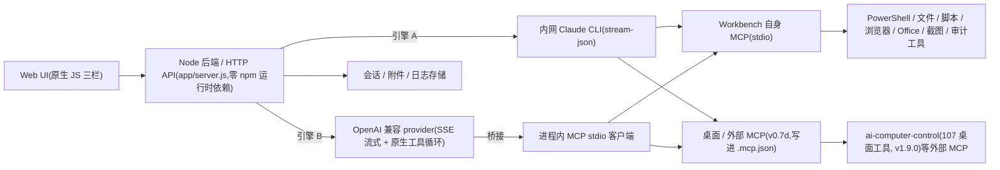

# 如意 Ruyi 架构(原 Win Claude Workbench)

> 版本基线:`app/server.js` `VERSION 2.0.0` / `configSchema 8` / 会话 `schemaVersion 1`。v2.0.0 基线:OpenAI 兼容引擎与 Claude CLI 共用的工具目录、任务预路由、按需装载、目录缓存与 schema token 计量；`toolLoadingMode:'full'` 保留旧的全部常驻行为。其余架构延续 v1.5 团队模式、Skills、用量看板及 v0.7d–v2.0 的多引擎、检查点、Agent 工作流、桌面/Office MCP 桥接能力。
>
> **品牌与兼容(v1.0-S9 发布工程)**:产品名为**如意 Ruyi**(`APP_NAME`,/api/status.app 与启动横幅随之)。目录名已改 `ruyi-workbench/`、可执行文件名已改 `Ruyi.exe`(启动/检测脚本双名兼容旧 `WinClaudeWorkbench.exe`)。**数据目录解析**:`RUYI_HOME` 优先,旧变量 `WIN_CLAUDE_WORKBENCH_HOME` 继续识别(至少保留一个大版本);默认目录仍 `~/.win-claude-workbench`。**以下存量兼容标识有意保持不变(v2.0 仍保持不变(存量兼容))**:MCP server id `win-claude-workbench`、默认数据目录 `~/.win-claude-workbench`、环境变量 `WIN_CLAUDE_WORKBENCH_HOME`(存量 `.mcp.json` 兼容)。子进程 MCP 配置注入的是旧变量名(值=已解析 dataRoot),故老 `.mcp.json` 照常工作。

## 组件



> **界面(历史引入:v1.0 已重构;当前 v2.0.0)**:上图 UI 节点标「原生 JS 三栏」为后端视角的历史称谓;**截至 v2.0.0 的当前界面**——青花主题重铸(配色去 Claude 化,青花/鎏金/藏蓝墨/月白令牌双主题 + WCAG 对比度红线;引擎身份色保留赤陶)、信息架构减负(顶栏 5 项 +⋯菜单、右侧常驻页签 [文件|产物|变更|Agent 工作流|用量|审计] + 开发者组 5 个 终端|桌面|MCP|调试|存储[专家模式 only]、权限「安全」chip 四档人话弹层)、简易(默认)/专家双模(**新装默认 `uiMode simple`**)、新手起步引导(首跑空状态大拖放区 + 引擎就绪判断 + 任务卡)。界面细节与操作以 `docs/manuals/{USER-GUIDE_CN,ADMIN-GUIDE_CN}.md` 双手册为准。

## 引擎(v0.5+ 多引擎)

后端围绕一套**引擎无关的事件协议**(`assistant_delta / thinking_delta / tool_use / tool_result / usage / result / permission_request / ask_user`;v0.8-S3 加 `todo` = `{items:[{id,text,status}]}` 与 `turn_summary` = `{turnSeq, filesChanged:[{path,op,revertible,entrySeq?}], commands, artifacts:[]}`,均在 `result` 之前发,**只加不改**;v0.8-S4b:`permission_request` 加 `tier`(read|edit|exec)与 `revertible`(bool,仅 file_write/file_edit/file_delete 为 true)两字段,供权限弹窗渲染风险徽章与可撤销性行;`turn_summary` 的 journal 驱动文件条目加 `entrySeq`,供单文件撤销定位;**v0.8-S5 加 `compact` = `{mode:'evaporate'|'summary', beforeTokens, afterTokens}`**——provider 引擎自动压缩时发,前端复用现有 🗜 system 消息渲染路径;**v0.8-S7 加 `steered` = `{text}`**——provider 引擎在配对安全边界注入用户插话时发,前端渲染带「插话」muted 徽标的 user 消息(本地乐观渲染时按文本+时间窗去重);`result` 事件的 `errorClass` 枚举补 `tool_loop`(循环护栏中止,区别于 `idle_timeout`/`network_down`/`tool_error`);**v0.9-S5 加 `plan` = `{planId, markdown}`**——计划模式真流程(仅 provider 引擎),模型首答以 `PLAN:` 开头且无 tool_call 时发,turn 暂停等待 `POST /api/plan/decision`;approve → 本 turn 闭包解锁执行,reject → 收尾 `result.errorClass='plan_rejected'`;配套 `plan_note = {text}`(带 note 的 approve=修改意见时发,前端渲染一行 muted 注)。**批准解锁是本 turn 闭包标志,绝不改全局 `config.permissionMode`(防一次批准永久放权)**;**v0.9-S6 加 `subagent` = `{id, state:'start'|'end', task, toolTier?, ok?, resultChars?, tookMs?}`**——子代理 spawn_agent(仅 provider 引擎)派子回合时发 start/end 对;**子回合的 `tool_use`/`tool_result` 照发但加 `subagentId` 字段**(UI 据此嵌套渲染,**不据此改协议语义**——纯加法);**子回合的 `assistant_delta` 不转发**(避免污染主气泡,最终结论作为 tool_result 回父);**v0.9-S7 加 `tool_image` = `{toolCallId, note}`**——视觉回路(仅 provider 引擎、`provider.vision===true`)把桥接工具截图剥离进一条 user 图片消息时发(位置在完整 tool 块之后,连续性铁律),UI 可选据此显示缩略(**纯加法,不改协议语义**);**v1.0-S6 加 `failover` = `{type:'failover', providerId, from, to, reason}`**——provider 引擎的 `extraBaseUrls` 备用端点故障转移:候选序列 `[baseUrl, ...extraBaseUrls]`(去重),**仅在预首字节失败**(连接失败 / 502·503·504)时切下一个端点并发此事件并落审计;**401 等鉴权错、SSE 正文已开始后的中断均不切端点**(归因保留 / 防重放),仅 provider 引擎发,**只增不改**)驱动前端;两条引擎路径并存,由 `config.activeProvider` 选择:

- **引擎 A · Claude CLI**(`activeProvider` 为空或 `'claude-cli'`,默认):`runClaudeTurn` spawn 内网 `claude` CLI,走 `--input-format/--output-format stream-json --include-partial-messages`。`engineMode`:`legacy`(stdin 关闭,单向)| `interactive`(stdin 常开,支持 AskUserQuestion / 权限桥接)。MCP 工具由 CLI 原生发现调用。
- **引擎 B · OpenAI 兼容 provider**(`activeProvider` = 某个 `providers[].id`):`runOpenAiTurn` 直连 HTTP + SSE 流式,自带**原生工具循环**(把本机 MCP 工具翻成 OpenAI function-calling,`openaiMaxToolIterations` 上限 12)。provider 引擎**无状态**——server.js 维护 `session.providerHistory` 每轮回传;手动上下文压缩走 `/api/provider/compact`(非流式让模型出摘要重播种)。**v0.8-S5:每次 API 调用前在迭代边界自动检查 `estimateHistoryTokens([system, ...providerHistory])`,超过 `autoCompactThreshold × provider.contextWindow` 即两级自动压缩(一级蒸发老工具结果 → 仍超则二级摘要重播种,与手动 🗜 共用 `providerSummaryCall` 内核),压缩前把 providerHistory 快照写 `checkpoints/<sid>/history-<turnSeq>.json.gz`,发 `compact` 事件 + 追加 🗜 system 消息;蒸发只改 `role:'tool'` content(配对铁律,绝不删消息),两次压缩间保持只追加(上游前缀缓存友好)。** 支持 `reasoning_content` / `reasoning` 推理链。**v0.8-S6:系统提示词由 `buildProviderSystemPrompt` 四层拼装(仅 provider 引擎;Claude CLI 自建提示词、原生读 CLAUDE.md,不可注入)——身份层(钉死 `由 {provider.label} 的 {model} 模型驱动`,产品名永不入)、能力层(能力矩阵摘要 + TOOL_REQUIRES「当前不可用」+ D6 主动检索指令位)、项目层(cwd 的 CLAUDE.md/AGENTS.md ≤16KB 围栏注入)、provider 层(`provider.systemPrompt` 追加)。** **v0.8-S7 循环护栏 + steering(仅 provider 引擎)(v0.8-S7 时;47a 起双引擎,见下文):工具循环按 `sig=name+JSON(args)` 计**连续**相同调用——第 3 次给 tool_result 注 `loopWarning`,第 5 次拒执行并以自成一体的收尾文案(`⚠ 检测到重复调用，已停止本轮。`,**与迭代上限 `已达工具调用上限` 明确区分**)中止本轮、`result.errorClass='tool_loop'`;计数器随 turn 生命周期不跨 turn。steering 经 `POST /api/steer` 入队 `reg.steerQueue`(上限 3),`drainSteerQueue` **只在迭代边界**(每次 API 调用前)消费——**不做批内消费**:多工具批次要求 role:'tool' 应答紧随且**连续**于其 assistant 消息,批内注入 user 消息会拆散 tool 块(严格 provider 硬 400),且插话本就要等下一次 API 调用才被携带,迭代顶已覆盖全部语义;注入 `[用户插话] …` user 消息 + session.messages 打 `steered:true` + 发 `steered` 事件。** **v0.9-S5 计划模式真流程(仅 provider 引擎):`config.permissionMode==='plan'` 时给本 turn `sys` 追加计划提示词(turn-local,不入 `buildProviderSystemPrompt`,故不泄漏进摘要/身份调用或 Claude 引擎);首答经 `looksLikePlan()`(`PLAN:`/`plan:`/`计划:` 容错)判定且无 tool_call → 计划文本入 providerHistory + 发 `plan` 事件 + `requestPlanApproval` 注册 `pendingPlans`(仿 pendingPermissions)并 `await`、超时=`permissionTimeoutMs`→reject;approve → 闭包 `planApproved=true`,工具循环里 `gate==='block' && plan 模式 && planApproved → 'allow'`(计划级批准替代逐工具批准,**不改全局 mode**),带 note 注入 `[计划批准] <note>` 继续;reject → 追加「计划已被拒绝。」+ 注入 `[计划被拒绝]`、`result.errorClass='plan_rejected'`、不跑任何工具、正常收尾;首答不合 PLAN: 格式 → 退回普通 plan 模式(非读工具照旧硬拦截,向后兼容);`planPhase` 一次性只认首答,计数随 turn 不跨 turn。** **v0.9-S6 子代理 spawn_agent(仅 provider 引擎):`spawn_agent{task,toolTier?='read',maxIters?=6,model?}`(tier exec)在工具循环里**特判**(仿 todo_write/bridge,需 provider/session/journal/onEvent 闭包),`toolCall()` 里若被调恒拒(context-free)。`runSubAgent` 起**独立子回合**——独立 `subHistory`(**不共享父 providerHistory**,父的配对铁律天然不破)、身份变体 system(「你是子任务执行体…输出最终结论」)+ 复用 `buildProviderSystemPrompt` 能力/项目/provider 层、工具集经 `buildOpenAiTools(config,caps,{tierFilter,noSpawnAgent})` 按 toolTier 过滤(read=只读/edit=+写/exec=全量+桥接;**子回合不含 spawn_agent**——禁嵌套)、独立迭代预算(钳 1..12)、模型 `model||provider.subagentModel||主 model`;子回合文件工具用**同父 `session.id+turnSeq`** ctx 入 journal(天然同 turnSeq)。**并发 ≤2 是不可放宽的安全边界**:工具循环逐个 await 执行故同刻串行,真正「并发」= 一条 assistant 消息并列 >2 个 spawn_agent → **第 3 个起拒**(`SUBAGENT_FANOUT_MAX=2`,每批次开头 `subagentBatchCount` 归零);另 `config.subagentMaxPerTurn`(默认 4,钳 0..8)按**整回合总数**兜底,**0=停用**(`buildOpenAiTools` 不注册)。**禁嵌套双保险**:工具集不含 spawn_agent + 子回合内若收到 spawn_agent 仍拒。事件:`subagent` start/end 对 + 子回合 tool_use/tool_result 加 `subagentId` 字段转发(UI 嵌套渲染);**子回合 assistant_delta 不转发**(`openAiStreamOnce` 传 `onEvent:()=>{}` 吞掉,结论作为 tool_result 回父)。**tier 执行期二次闸**(纵深防御):`tierRank[ntier]>allowed` 直接拒——read 子回合即使 bypass 也写不成文件。`providers[].subagentModel`(sanitizeProvider 透传,空=同主 model)。** **v0.9-S7 视觉回路 + 桌面操控规程(仅 provider 引擎;门=`provider.vision`;D3 拍板两路径分别 robust):**图片附件走 parts**——vision 开且本轮附件含图,则该 user 消息 `providerHistory.content` 升级为 `[{type:'text'},{type:'image_url',data URI}…]`(`buildUserContentParts` 读 `dataRoot/uploads` 文件转 base64,≤5MB/张,超限/失败降文本占位;估算器 S5 已 parts-aware,image 1100/张);vision 关保持纯文本注入。lazy-reseed 从 `session.messages` 重建时**只重建图片附件的文本部分**(不重读图,避历史膨胀)。**工具截图入回路**——桥接工具结果含 `image`/`image_base64`/`screenshot.image`(`extractToolImages`)且 vision 开:tool 消息里图字段剥离为占位 `[截图见随后的图片消息]`(`stripToolImageFields` 浅克隆,保 JSON 精简),**在完整 tool 批次结束后**追加一条 `role:'user'` 图片消息(连续性铁律——批内累积 `pendingToolImages`、批后 flush,绝不插在 tool 块中间;aborted 批不 flush)+ 发 `tool_image` 事件;vision 关则图字段保留在 tool 结果、不转 image 消息(文本模型走 OCR/元素 grounding)。**历史保图 ≤2**(`pruneOldImages`,`HISTORY_IMAGE_KEEP=2`)——每次注入图片消息后把最老的 image_url part 降为文本 `[截图已淘汰:N]`,**只改 user 消息内的 part 不删消息**(配对铁律不破;仿 evaporateHistory,仅新图落地后跑不投机)。**操控规程层**(`buildProviderSystemPrompt` 能力层,仅 `caps.desktopMcp.present` 时注入,两路径分别):vision→「截图→观察→操作→wait→再截图验证,优先 observe」;无 vision→「ocr_find_text/ui_find 拿坐标→操作→wait_for_window_idle→ocr 复核,没有视觉靠元素/OCR 文本」;**视觉门 key 用 LIVE `provider.vision`(与图片回路同字段)而非 60s 缓存的 `caps.provider.vision`**,避免刚切 vision 的一轮注错规程。操控 playbooks 2 个(`desktop-open-app`/`web-form-fill`,`requires:['desktopMcp']`)。** **v0.9-S9 联网检索(D6,tier read,能力矩阵门控):`web_search`/`web_fetch` 经 S6 的 TOOL_REQUIRES 管道门控——`toolRequirementsMet` 新增 `searchBackend` cap 键(读 `config.searchBackend.type!=='none'`,配置事实非探测事实,离线可确定性判);web_search requires `network`+`searchBackend`、web_fetch requires `network`,不满足即 `buildOpenAiTools` 不 offer + 能力层「当前不可用」注明原因。**web_fetch 的 SSRF 硬防御**是本切片安全核心:url 为模型/网页给的**不可信**输入,`ssrfCheck` 按字面 host 拒 loopback/私网/link-local·云元数据/`.local`·`.internal`、仅 http/https、重定向逐跳复验(≤3);**搜索后端 baseUrl 是管理员配的可信端点,出站不过 SSRF**(注释显式区分两类)。正文抽取 `extractMainText` 零依赖自写(剥 head/script/style、block 标签转段落换行、解常见实体)、`dataRoot/webcache/<sha256>.json` 缓存离线复用(`fromCache`,无 TTL,ts 供判新鲜度)。**D6 主动检索指令位**(S6 早埋)因 web_search 首次真被 offer 而点亮:在线且工具在列时能力层渲染「对时效性/外部事实应主动 web_search 后再答」。**apiKey 掩码**抽共享 `maskSecrets`/`unmaskSecrets`,一次覆盖 `providers[].apiKey`+`searchBackend.apiKey`(响应掩 `••••后4`,写盘还原)。**

**双进程工具执行(实现时刻牢记)**:引擎 B 的 `toolCall()` 在 **serve 进程内**执行;引擎 A 的工作台工具则跑在 CLI 拉起的**一次性 `node server.js mcp` 子进程**里(`startMcp`,该进程置 `RUNTIME.isMcpChild=true`),两进程不共享内存,只共享 dataRoot 与注入的 env。凡涉及**跨 turn 内存态**的能力必须写明走哪条路径。**v0.8-S2 的持久 shell 会话族即因此为 provider 引擎独占**:会话状态(powershell 子进程 + 环形缓冲)活在 serve 进程的模块级 `shellSessions` Map,一次性 MCP 子进程无法跨回合承载它——所以在 MCP 子进程路径 5 个 `shell_*` 分支返回引导性错误(`shell 会话仅在原生 provider 引擎可用…`,建议改用 `powershell_run`),但 `tools/list` 仍列出这 5 个工具以便 CLI 侧模型看到引导语。若未来要让 CLI 也可用,走 loopback 注册(仿权限桥),v0.8 不做。
- **内置 provider 预设**(Settings 可"从预设添加"):`deepseek`(`api.deepseek.com`)、`dashscope`(通义千问兼容端点)、`glm`(智谱)。也可手填任意 OpenAI 兼容 baseURL(内网 vLLM / Ollama / Xinference 等)。密钥经 `redact()` 脱敏,不明文进日志。

## v0.7d · 桌面 / 外部 MCP 集成

把工作台和用户本机的其它 MCP(尤其是 `ai-computer-control` 桌面控制)接通,分两条"线":

- **线 1 —— 供给 Claude CLI**:`addExternalMcpServersToMap()` 在生成 `.mcp.json`(全局与 per-session)时,把桌面 MCP(id `ai-computer-control`)和每个启用的 `externalMcpServers` 条目一并写入。什么都没检测到时,输出与 v0.7d 之前**完全一致**(向后兼容)。
- **线 2 —— 供给 provider 引擎**:开关 `bridgeExternalToolsToProvider` 打开时,同一批工具经**进程内 MCP stdio 客户端**(`McpStdioClient`)桥接进原生工具循环,于是非 Claude 引擎也能调用桌面工具。关闭则 provider 只见工作台自身工具。
- **自动探测**:`detectDesktopMcp()` 认 `ai-computer-control` 仓库(存在 `src/ai_computer_control/server.py`),优先读 `AI_COMPUTER_CONTROL_HOME` 环境变量,再搜 `Documents\Claude Code\ai-computer-control`、`%LOCALAPPDATA%\Programs\ai-computer-control`、PATH 上的控制台脚本等;找到即用 `python -X utf8 -m ai_computer_control.server` 启动。config:`desktopMcp { enabled, command, args, cwd, autodetect }`,`command` 留空 + `autodetect` 时才探测,探测不到则优雅缺席。

## 入口

- `Ruyi.exe serve --open`:启动前端和 HTTP API。
- `Ruyi.exe mcp`:启动 MCP stdio server,供 Claude CLI 调用。
- `Ruyi.exe mcp-config`:生成可导入 Claude CLI 的 MCP JSON(含 v0.7d 桌面/外部 MCP)。
- `Ruyi.exe install`:尝试自动注册 MCP。
- `Ruyi.exe doctor`:输出本机诊断信息。

## HTTP API

- `GET /api/status`:状态、配置、MCP 路径、工具列表、模型、数据目录;v0.8-S1 加顶层 `binaries:{rg}`(vendor-bin/rg.exe 探测,file_search 快路径开关;S6 能力矩阵接管——`/api/status` 的 `binaries` 保留向后兼容)。
- `POST /api/bootstrap`(open 级,host 门挡 DNS rebinding):浏览器获取 token 的唯一通道。浏览器经 POST /api/bootstrap 换取 token 后存 sessionStorage;HTML 不再明文下发 token;index.html 带 CSP meta(`connect-src 'self'`)。非浏览器仍走明文注入兼容路径。
- `GET /api/capabilities`(v0.8-S6,同源门只读,`?force=1` 清 60s 缓存):能力矩阵 `{network:{online,checkedAt}, provider:{id,vision,reasoning}|null, binaries:{git,rg}, desktopMcp:{present,toolCount,optional:{ocr,uia,cv2,playwright}}, engine}`。network 对 provider baseUrl 或 `config.capabilityProbeUrl` 发 HEAD(3s;任何 HTTP 响应=在线,仅传输层失败=离线;无目标=null 未知);desktopMcp.optional 经桥接调 ACC `diagnostics` 一次。驱动顶栏能力徽章 + provider 引擎的能力层提示词与 TOOL_REQUIRES 工具过滤。
- `GET /api/models`:模型发现(代理 `/v1/models` ∪ 内置 ∪ 用过 ∪ 手动)。
- `GET /api/skills`:离线技能面板数据。
- `POST /api/config`:保存配置(需 UI token)。
- `POST /api/provider/test`:测试某 provider 连接 / 拉模型(需 UI token)。
- `GET/POST /api/sessions`、`/api/sessions/<id>`:会话列表、创建、改名/删除/置顶。
- `POST /api/upload`:保存附件到本地数据目录。
- `POST /api/chat/stream`:调用当前引擎,返回 NDJSON 事件流。
- `POST /api/chat/answer`:回传 AskUserQuestion 的回答(interactive 引擎)。
- `POST /api/stop`:停止当前回合。
- `POST /api/provider/compact`:provider 引擎的**手动**上下文压缩(非流式摘要重播种;v0.8-S5 起复用 `providerSummaryCall` 内核,与自动压缩二级同源)。自动压缩无独立端点——由 `runOpenAiTurn` 迭代边界的 `maybeAutoCompact` 触发。
- `POST /api/permission/request` · `POST /api/permission/decision`:权限桥接握手。
- `POST /api/plan/decision {sessionId, planId, decision:'approve'|'reject', note?}`(v0.9-S5,**需 UI header token**,**仅 provider 引擎的计划模式真流程**):UI 对暂停中计划的批准/否决。查 `pendingPlans[planId]` 并**校验 sessionId 匹配**(否则跨会话决策无效)→ resolve 唤醒暂停的 `runOpenAiTurn`;approve → 本 turn 闭包 `planApproved=true` 解锁非读工具(**不改 `config.permissionMode`**),reject → turn 收尾 `errorClass='plan_rejected'`。无此 planId / sessionId 不匹配 → `{ok:false,error:'no pending plan'}`;**幂等**(已决策/已消费再来 → 同错误)。超时(`permissionTimeoutMs`)与 abort/stop 均由 `clearPendingPlans` 以 reject 语义唤醒,暂停的 turn 绝不悬挂。
- `POST /api/todo`(v0.8-S3):MCP 子进程(Claude 引擎)的 `todo_write` loopback 落盘端点;**body token 门**(与 `/api/permission/request` 同款,不走 header token/同源门,因为调用方是子进程),校验 → `loadSession` → `session.todos=items` → `saveSession` → 若该 session 有活跃 turn 则经其 `onEvent` 发 `todo` 事件。
- `GET /api/checkpoints?sessionId=`(v0.8-S4a):读该会话的检查点 index(只读,同源门即可),返回 `{ok, entries:[index 条目], totalBytes}`。
- `POST /api/checkpoints/rollback {sessionId, turnSeq, entrySeq?}`(v0.8-S4a):文件级回滚(**需 UI header token**)。`entrySeq` 给定=单条回滚,缺省=整 turn(该 turnSeq 全部条目逆序);逆操作 create→删现文件、modify/delete→写回 before;`skipped:true`(>5MB 未存)条目回滚失败并列入 `failed`;成功条目从 index 移除(幂等:再滚同 turn → `{ok:false,error:'no entries'}`);回滚本身不再入 journal(防套娃)。响应 `{ok, reverted:[{path,op}], failed:[{path,reason}]}`。
- `POST /api/session/rewind {sessionId, targetTurnSeq, rollbackFiles?}`(v0.8-S4b,**需 UI header token**):对话级回溯。回到 `targetTurnSeq` **开始之前**——定位该 turn 的首条 user 消息(优先用 user 消息的 `turnSeq` 加字段,老消息回退到「后续 assistant 的 turnSummary.turnSeq」或序数),从该消息(含)起截断 `session.messages`;**`session.providerHistory` 清空 `[]`**(下一 turn 由 provider 引擎的 lazy-reseed 从 messages 重建文本上下文——简单且永远正确,含 compact 之后;代价是丢工具轨迹);`session.turnSeq` **不回拨**(单调性是 journal 主键);`session.todos` **保留**;`claudeSessionId` 置 null(旧 `--resume` 上下文不再匹配)。`rollbackFiles:true` 时对被丢弃的 turnSeq 集合**从新到旧**逐 turn 调 journalRollback。活跃 turn 进行中 → `{ok:false, error:'回合进行中,请先停止'}`。响应 `{ok, removedTurns, lastUserText, filesReverted:[], filesFailed:[]}`(`lastUserText` = 被移除的那条 user 文本,供前端填回 composer)。
- `POST /api/steer {sessionId, text}`(v0.8-S7,**需 UI header token**,**双引擎**,47a 起):流中插话(steering)。Claude(interactive)经 stdin 即时注入(print 模式/提问挂起拒);provider 把 `text` 入队到该会话**活跃 provider turn** 的 `reg.steerQueue`(上限 3),tool 循环在下一个配对安全边界注入为 `[用户插话] …` user 消息。语义:无活跃 turn → `{ok:false, error:'当前没有进行中的回合'}`;Claude print 模式(非 interactive)(`reg.kind !== 'openai'`)→ `{ok:false, error:'Claude print 模式不支持插话'}`;队列满 → `{ok:false, error:'插话队列已满'}`;成功 → `{ok:true, queued:N}`。注入点见「引擎」节 steering 说明。
- `POST /api/tools/<tool>`:从 UI 直接调用本机工具(需 UI token);v0.8-S4a 起可在 body 带 `sessionId`(可选 `turnSeq`)让文件改动工具入 journal。
- `GET /api/playbooks`(v0.9-S2):列出 playbook + 可用性(内置 ∪ 用户覆盖),`{ok, playbooks:[…带 availability]}`。只读,同源门即可。
- `POST /api/playbooks {playbook}`(v0.9-S2,**需 UI header token**):保存用户 playbook。经 `normalizePlaybook` 归一;缺 id/title/promptTemplate → 400 `{ok:false,error:'无效的 playbook(缺 id/title/promptTemplate)'}`;成功 `{ok,playbook}`。
- `POST /api/playbooks/draft {sessionId}`(v0.9-S2,**需 UI header token**):让当前引擎从会话起草一个 playbook 草稿(`draftPlaybookFromSession`);`sessionId` 非法 → 400。**须在通配 `POST /api/playbooks` 之前匹配**(`/draft` 后缀不被吞)。
- `DELETE /api/playbooks/<id>`(v0.9-S2,**需 UI header token**;经 `POST /api/playbooks/<id>` + `x-http-method:DELETE` 走同款约定):删用户 playbook(`id` 走 `path.basename` 防穿越)。内置 id(无用户覆盖文件)→ 403;用户覆盖可删(回退到内置)→ `{ok}`;不存在 → 404。
- `POST /api/workspace/resolve {name, children[]}`(v0.9-S3,**需 UI header token**):按指纹(basename + 一级子项名)定位拖入文件夹的真实绝对路径(`resolveWorkspace`)。永不抛,失败 → `{ok:false,error,matches:[]}`。
- `POST /api/pick-folder`(v0.9-S3,**需 UI header token**):弹原生 Windows 文件夹选择器(STA WinForms,`pickFolder`,120s 超时),返回选择结果。
- `GET /api/file/preview?path=&sessionId=`(v0.9-S4,**需 UI header token**,含文件内容,敏感级同 checkpoints):产物画廊 + 文件树的内容预览。**双闸**:①token 门(GET 不走 mutating auth 块,handler 内显式 `tokenOk` 再查);②**允许根**闸——`path` 必须绝对(否则 400),resolve 后必须落在**该 session 的 cwd ∪ `config.defaultWorkspace` ∪ `config.recentWorkspaces` ∪ `dataRoot()`(生成物/上传/检查点)**之内,否则 403 `{ok:false,error:'path not in an allowed workspace'}`(`pathWithinRoot` 用 `path.relative`+段判定,避开前缀-兄弟子串 bug)。**v0.9 F3**:允许根闸用 **realpath 后的路径**(target 与 roots 均 `fsp.realpath`,ENOENT 回落原路径让 `readFilePreview` 报常规 not found)——关掉「根内符号链接指向根外」的深度防御缺口。按后缀返回:文本类(md/csv/txt/html/json/js/py/…,≤1MB)→ `{ok,kind:'text',content,truncated}`;图片类 → `{ok,kind:'image',dataUri}`(base64+mime,≤5MB,超限 `{ok,kind:'image-toobig',canOpen}`);html → `{ok,kind:'html',content}`(server 只返原文,前端 `<iframe sandbox=\"\">` 全锁渲染);xlsx/docx/pdf/other → `{ok,kind:'binary',canOpen:true}`(前端 office_open;站内 office 预览留 v1.0——server.js 零 npm 不引解析库)。不另开 `/api/file/raw` 字节端点(统一走 preview 的 dataUri,收敛攻击面)。
- `GET /api/audit?limit=&source=&type=`(v0.9-S8,**需 UI header token**,含路径与命令,敏感级同 checkpoints):审计中心只读聚合。**两源合并**——(1) **workbench**:`dataRoot/logs/workbench-<day>.ndjson`(`logEvent` 落的)最近文件尾部 `limit` 条,逐行 parse(坏行跳过),归一化 `{ts, source:'workbench', type=record.kind, summary(人话化:turn_start→开始回合…), detail(经 `redact()` 脱敏后 parse 回对象)}`;(2) **desktop**(ACC 桥在且 `audit_tail` 工具存在):经 `McpStdioClient` 调 `audit_tail{n:limit}` 归一化 `{ts, source:'desktop', type=动作名, summary, detail(同样 redact)}`,桥不可用/失败 → 跳过 + `sources.desktop='unavailable'`(degraded,不报错)。合并 `ts` 降序、`limit` 钳 `1..500`(默认 100);`source` 过滤单源、`type` 精确过滤。响应 `{ok, entries:[…], sources:{workbench:bool, desktop:bool|'unavailable'}, truncated}`。GET 不走 mutating auth 块,**handler 内显式 `tokenOk` 再查**(真防线;白名单列它作意图声明)。`detail` 全程经 `redact()` —— 秘钥永不进审计响应(**S8 同步修了 `redact()` 的单捕获组回调 bug:旧逻辑把数字 offset 当第 2 组,导致 `sk-`/`ghp_`/JWT 等单组秘钥泄露为 `secret«redacted»`;改为按真实捕获组数分流**)。

> token 门:`/api/tools/*`、`/api/checkpoints/*`(回滚,UI 调用)、`/api/session/rewind`(回溯,UI 调用)、`/api/steer`(插话,UI 调用)、`/api/config`、`/api/provider/test`、`/api/playbooks`(+`/api/playbooks/*`,v0.9-S2)、`/api/workspace/resolve`、`/api/pick-folder`(v0.9-S3)、`/api/file/preview`(v0.9-S4)、`/api/plan/decision`(v0.9-S5)、`/api/audit`(v0.9-S8)需要注入 UI 的本地 header token(阻断同机其它进程),并校验同源;`/api/permission/request` 与 `/api/todo` 例外——由子进程 loopback 调用,改用 **body token** 校验(见各端点)。`GET /api/checkpoints` 只读,同源门即可。`GET /api/file/preview` 与 `GET /api/audit` 虽是 GET 但含文件内容/路径命令,故进 token 门(GET 不走 mutating 块,均在 handler 内显式 `tokenOk` 再查;preview 额外走允许根闸)。**`/api/bootstrap` 为 open 级(host 门挡 DNS rebinding),浏览器经它获取 token 存 sessionStorage;HTML 不再明文下发 token,非浏览器仍走明文注入兼容。****新增 token 门端点必须显式扩 needsToken 白名单表达式(该表达式不自动覆盖新路径,S0 教训)。**

## Workbench 自身 MCP 工具

`... mcp` 子命令暴露的 stdio server(`serverInfo.name = win-claude-workbench`)以 **50 个原生工具**(`TOOL_HANDLERS` 派发注册表轴)为当前工具数。**历史口径**:向 Claude CLI 曾列 37 个工具(不计内部的 `permission_prompt`;CLI 面 `tools/list` 过滤掉 provider-only 的 `spawn_agent`——它需 serve 进程回合闭包,CLI 侧调只会拒;含 `permission_prompt` = 38),`MCP_TOOLS` 数组本身曾含 39 条(含 `permission_prompt` + `spawn_agent`;不计 `permission_prompt` = 38);**provider 引擎**经 `buildOpenAiTools` offer 的工具数在 `subagentMaxPerTurn>0` 时含 `spawn_agent`(比 CLI 面多一),且 `web_search`/`web_fetch` 受**能力矩阵**门控(离线/无搜索后端时不 offer;见「能力矩阵」)。**S9 增量**:`web_search`+`web_fetch`(+2);**v1.0-S4 增量**:git 工具族新增 `git_diff`/`git_log`/`git_commit`(+3,`git_status` 早已在列);**v1.1+ 增量**:`file_move`+`file_copy`+`archive_zip`+`archive_unzip`+`http_download`(+5)→ `MCP_TOOLS` 数组由 34 增至 39,CLI 面不计 permission_prompt 由 32 增至 37(均为历史口径):

- 权限桥接:`permission_prompt`(interactive + 权限桥接时把权限询问路由回 UI)。
- 执行:`powershell_run`(一次性)、`script_run`。
- **持久 shell 会话族(v0.8-S2 新增,provider 引擎独占)**:`shell_start`、`shell_send`、`shell_poll`、`shell_kill`、`shell_list`(见「引擎」节说明)。
- 文件:`file_read`、`file_write`、`file_edit`、`file_delete`(v0.8-S4a 新增,tier edit;删前 journal `before`,可回滚;目录拒删)、`file_move`、`file_copy`、`file_list`、`file_search`、`glob`(v0.8-S1 新增,tier read;`**`/`*`/`?` 匹配,mtime 降序)。
- **打包/解压(v1.1+,tier edit)**:`archive_zip`(文件打包 .zip,deflate,可回滚)、`archive_unzip`(.zip 解压,Zip Slip 防护,可回滚)。
- **下载(v1.1+,tier edit)**:`http_download`(http(s)下载到工作区,SSRF 防护,可回滚)。
- 交接:`browser_open`、`office_open`、`desktop_screenshot`、`keyboard_send_keys`。
- 工程:`project_snapshot`、`git_status`、`git_diff`、`git_log`、`git_commit`(**v1.0-S4 git 工具族**:`git_status`/`git_diff`/`git_log` 为 read 档恒放行零弹窗、`git_commit` 为 exec 档[commit 触发 `.git/hooks` 任意代码];均 `execFile` 无 shell + `--` 防旗标走私)、`dependency_inventory`、`code_review_scan`、`frontend_audit`、`claude_md_audit`、`docs_search`。
- 网络:`http_request`。
- **联网检索(v0.9-S9 新增,tier read,能力矩阵门控)**:`web_search{query,maxResults=5}`(requires `network`+`searchBackend`:离线或 `searchBackend.type==='none'` → 不 offer + 能力层「当前不可用」;`searchBackend.type` 七枚举 `none/searxng/bing/brave/tavily/bocha/custom`,按 `type` 分流(v1.0-S6 增 tavily / 博查 bocha,`baseUrl` 可覆写)→ `{results:[{title,url,snippet}]}`;**搜索后端 baseUrl 是管理员配的可信端点,出站不过 SSRF**)、`web_fetch{url,maxChars=20000}`(requires `network`;http/https GET → 零依赖自写正文抽取 → `dataRoot/webcache` 缓存离线复用[`fromCache`])。**`web_fetch` 的 SSRF 硬防御**:url 是模型/网页给的**不可信**输入,`ssrfCheck` 按字面 host 拒 loopback/私网(`10.`/`172.16-31.`/`192.168.`)/link-local·云元数据(`169.254.169.254`)/IPv6 ULA·link-local/`.local`·`.internal`,仅 http/https,重定向逐跳复验(≤3)。**v0.9 F1**:补 IPv4-mapped/compatible IPv6 字面量(`::ffff:127.0.0.1`、hex 形 `::ffff:7f00:1`、`::ffff:a9fe:a9fe` 等)——`embeddedIpv4FromV6` 抽出内嵌 v4 交 `isPrivateIpv4` 判,私网即拒,公网映射(`::ffff:8.8.8.8`)放行;`64:ff9b::/96` NAT64 前缀整段拒;`::ffff:` 开头但解不出 v4 者按可疑拒。**v0.9 F2**:`httpGetGuarded` 逐跳在发起连接前 `dns.lookup(host,{all:true})`,任一解析地址落私网/回环即拒(reason `解析到内网地址`),关掉 `127.0.0.1.nip.io` 这类 DNS 重绑定(lookup 失败不拦,让后续 fetch 自然失败)。**搜索后端 baseUrl 仍为管理员配的可信端点,不走 DNS 校验**。**D6 主动检索**:web_search 被 offer 且在线时,能力层渲染「对时效性/外部事实应主动检索后再答」。
- **任务清单(v0.8-S3 新增,tier read,双进程路径)**:`todo_write{items:[{id?,text,status:pending|in_progress|done}]}`(全量替换语义,校验 ≤50 条 / text ≤200 字 / status 非法归 pending / id 缺省 t1..tN;见「引擎」节与下文双进程说明)。
- **子代理(v0.9-S6 新增,tier exec,provider 引擎独占)**:`spawn_agent{task, toolTier?='read', maxIters?=6, model?}`——派独立子回合执行子任务,返回 `{ok, result:子结论, iters, toolCalls}`。**只在 `runOpenAiTurn` 特判**(需回合闭包),context-free `toolCall()` / CLI 面恒拒;子回合独立 history + 按 toolTier 过滤工具集 + 独立迭代预算,**禁嵌套、单批次并发 ≤2、`subagentMaxPerTurn` 兜底(0 停用)**(详见「引擎」节)。**52x**:`config.subagentPreferredProvider`/`config.subagentPreferredModel` 可跨 provider 指定子代理优先端点与模型。**52a**:`PROMPT_EN` 常量控制子代理系统提示词模板。

v0.8-S1 工具增强(纯加法,向后兼容):`file_read` 增行号模式(`lineOffset/lineLimit` → `cat -n` 风格 + `totalLines`,图片/二进制后缀拒读并提示视觉通道);`file_search` 增 `context`(0-5 上下文行)/`glob`(相对路径过滤)/`group`(按文件分组),检测到 `vendor-bin/rg.exe` 时走 `spawn rg --json`(NDJSON)快路径、失败静默回退 JS 扫描;`file_edit` 未命中时返回 `closest`(最相近 ±3 行窗口,自写 Levenshtein 粗排)。

v0.8-S2 持久 shell 会话族(**provider 引擎独占**,纯加法):`shell_start{cwd?,name?,shellId?}` spawn 常驻 `powershell -NoLogo -NoProfile`(cwd/变量/后台进程跨调用存活),`shell_send{shellId,input,timeoutMs?}` 写入并 best-effort 捕获稳定输出、`shell_poll{shellId,cursor?}` 按**绝对 cursor(UTF-16 code unit 计,非原始字节)** 增量尾随、`shell_kill`、`shell_list`。环形缓冲 200KB(裁头累加 `baseOffset`,cursor 落入已逐出区间返回 `truncated:true`);并发上限 `config.shellSessionMax`(默认 3,钳 1..8;**只数 running 活会话**,已退出会话不占名额、留在列表可继续 poll);30min 空闲自动回收;serve 进程退出统一 `killAllShellSessions`。tier:`shell_list`=read,其余=exec。**为何 provider-only**:见「引擎」节。

v0.8-S3 任务清单(`todo_write`)与回合摘要(`turn_summary`,纯加法,双引擎):
- **双进程路径**:`todo_write` 全量替换 `session.todos`,但 `session.todos` 的落盘方式因进程而异——
  - **provider 引擎(serve 进程)**:`runOpenAiTurn` 工具循环对 `todo_write` **特判**(仿 bridged 特判),直接改闭包里的 `session.todos` 并发 `todo` 事件,产出标准 `{ok,count}` 工具结果;
  - **Claude 引擎(一次性 MCP 子进程)**:子进程**不得直接写 session 文件**(与 serve 进程 `saveSession` 竞态),`toolCall` 的 `todo_write` 分支检测 `RUNTIME.isMcpChild` → loopback `POST /api/todo`(带 `WCW_SESSION_ID/WCW_TOKEN`,超时 5s);env 缺失则返回引导错误(`todo 需要工作台会话上下文` / `独立 MCP 模式不支持`)。`runClaudeTurn` 收尾前**回读磁盘 todos** 再存盘,避免覆盖子进程经端点写入的清单。
- **`turn_summary`**:两引擎 turn 收尾统一发(`result` 之前),并存到本 turn assistant message 的 `message.turnSummary` 字段。数据源 = 工具记录 + **本 turn 检查点 journal 条目**(S4a);journal 条目按 path 合并进 `filesChanged`、用 journal 的 `op`(create/modify/delete,比工具记录准)、且 **`revertible:true`**(`skipped:true` 的仍 false);journal 未覆盖的(如 CLI 原生工具)保持 `revertible:false`。`powershell_run/script_run/shell_send`(claude 引擎另计非 workbench 集合的原生工具)→ `commands` 计数;`artifacts` 恒 `[]`(字段先立,C4/v0.9)。
- UI:chat-pane 顶部可收起「步骤条」(`session.todos` 非空或流式收到 `todo` 事件时显示);assistant 消息尾部渲染「本轮变更」摘要卡(空变更 + 0 命令 → 「本次未改动任何文件」安抚线)。

v0.8-S4a 检查点 journal 与文件回滚(信任层核心,纯加法,零 npm——gzip 用**内置 zlib** `gzipSync`/`gunzipSync`):
- **目录结构**(见「数据目录」):`dataRoot/checkpoints/<sessionId>/index.json` + `<turnSeq>-<entrySeq>.gz`(before 内容,op:create 无此文件);`history-<turnSeq>.json.gz`(**v0.8-S5 落地**:自动/手动压缩前的 providerHistory 快照,内置 zlib gzip;`writeHistorySnapshot` 写入,失败不阻断——安全网非闸门)。
- **双进程写入前提**:journal 是**文件系统级**共享状态,两引擎写同一目录——provider 引擎在 serve 进程 `toolCall()` 挂钩,Claude 引擎在一次性 MCP 子进程挂钩。**同一会话同一时刻只有一个引擎在跑 turn,天然无并发写**。MCP 子进程**不写 session 文件**(S3 铁律)但**可写 checkpoints 目录**(独立于 session 文件,无竞态)。`turnSeq` 来源:serve 进程取闭包 `session.turnSeq`;MCP 子进程读 session 文件(只读)取 `turnSeq`(`WCW_SESSION_ID` env;读失败/无 env → journal 跳过 + 工具照常)。
- **安全网非闸门**:`journalRecord` 任何失败均 try/catch 吞掉,**不阻断工具执行**(失败时 index 条目也不写)。挂点在 `file_write`(before=既有内容或 null→create/modify)、`file_edit`(before=原内容,modify)、`file_delete`(before,delete)**执行前**;`Buffer.byteLength(before) > 5MB` → 不存内容、条目 `skipped:true`;index.json 走 tmp+rename 原子写。
- **GC**:每次 record 后惰性触发——每会话仅保留最近 20 个 turnSeq 的条目与 `.gz`;全局 `checkpoints/` 超 200MB 时从最老会话(目录 mtime)整目录清。GC 失败静默。
- **回滚**:见 HTTP API 的 `GET /api/checkpoints` 与 `POST /api/checkpoints/rollback`。回滚按 turn(可指定 entry),逆序执行;每 entry 自带 before,GC 老 turn 不影响新 turn 回滚正确性。

另经 `resources/list` + `resources/read` 只读暴露工作台自身 config 文件(限定该文件,防目录穿越)。

## 离线插件包

`resources\plugins\win-workbench-offline` 是本地 Claude Code marketplace。它包含:

- `skills\*`:离线工作流,例如代码审查、前端审计、本地文档检索、API 调试、CI 复现和插件开发。
- `commands\*`:高频任务提示词,例如 `/offline-code-review`、`/frontend-audit`、`/commit-message`。
- `agents\*`:角色提示词,例如离线代码审查、离线前端、发布打包。

插件包只依赖本项目 MCP 工具和本机资源,不依赖在线 marketplace。

## 模块化构建

产物为单文件 `app/server.js`;源码在 `app/src/` 共 17 个模块(见 `app/src/manifest.json`),`app/build.js` 按依赖顺序拼接。改代码时改 `src/` 下的模块,产物由 `node app/build.js` 重建。

## 团队模式 v2 与 Skills / 记忆 / 用量(历史引入:v1.4→v1.5;当前 v2.0.0)

### 多 Agent 编排 + 团队模式

`runAgentWorkflow` 是 DAG 调度器:批次同步(取就绪批 → `Promise.all` 执行 → 边界重算),节点经 `runSubAgent`(OpenAI 引擎 `runSubAgentCore` / Claude 引擎 `runClaudeSubAgentOnce`)执行,配资源租约(`acquireResourceLease` + `wouldDeadlock` 等待图环检测)、质量门(JSON Schema 校验 / 投票 / 去重)、Git worktree 隔离。B8 状态语义区分 `rejected`(质量门否决)/`failed`(执行错)/`skipped`(条件不满足)。

v1.5 团队模式(历史引入:v1.5;当前 v2.0.0)

- **共享任务池**:子代理 `propose_task`(经 `runSubAgent` 闭包分发,`META_TOOLS` 豁免角色白名单)提案 → 审批(`manual`/`auto-capped`/`off`)→ `materializePoolItem` 走 `normalizeAgentWorkflow` 同款清洗 append 进 `run.nodes`。收尾竞态防线:`runtime.closing` 原子门 + 宽限窗(`waiting_pool` 状态,`WCW_POOL_GRACE_MS`)+ `pool_approve` 物化前同步复检(闭合 TOCTOU)。链深 ≤2、每 run 提案 ≤8。
- **Agent 邮箱**:`send_to_agent` 用 `runtime.mailQueues`(与用户 `steerQueues` **分池**),迭代边界先 drain steer 再 drain mail;资格判定 `nodeDeliveryEligibility` 与 `steer_node` 共用;`deliveredAt`/`dropped` 全生命周期回标。
- **定向插话**:`POST /api/agent-runs/<runId>` 的 `steer_node` action,per-node 队列,迭代边界注入;仅 OpenAI 引擎节点(Claude 单发进程不支持)。

### Skills 体系 v1

`loadSkillRegistry(cwd, config)` 合并四源(内置 toolkit / 用户 `dataRoot/skills` / 项目 `.ruyi/skills/<id>/SKILL.md` / Playbook 并入,优先级 project>user>builtin)。会话级 `session.skills=[{id,source}]`(上限 8)。渐进注入:`buildSkillsPromptSection` 只把紧凑索引进 system prompt(不可信参考带 + `<skill-index>` 围栏),provider 引擎经 `skill_read` 只读工具按需拉全文(白名单 + `path.relative` 目录守卫),Claude 引擎经 `--append-system-prompt`(`clampAppendWithSkills` 与用户 append 合成、总钳 8000)+ 自带 Read 展开。

### 跨会话工作台记忆

`loadMemoryRegistry(cwd)` 读 `dataRoot/memory/{global,project/<projectKey>}/<id>.md`(frontmatter + 正文),`projectKey`=sha256(win32 小写化 resolve cwd)截 16 + 组 `meta.json` 反查。写入 `draftMemoryFromSession` 镜像 playbook 起草(`providerRawCompletion` + `kind:'aux'` 台账),起草-确认才落盘。注入同 Skills:`<workbench-memory>` 围栏渐进注入,`{id,scope,projectKey}` 来源锁定;Claude 引擎按启用组追加最小 `--add-dir`。

### 用量台账

`appendUsageLedger` append-only 落 `dataRoot/usage/YYYY-MM.jsonl`(单 promise 链串行化防交错),`kind` 三值 `turn`/`subagent`/`aux`。`claudeCostFields` 定成本可信度(官方直连 notional USD / 第三方 Coding Plan `costTrusted:false` / provider pricing)。`buildUsageSummary` 聚合成 `/api/usage/summary`,成本按币种分组不换算。

## 数据目录

默认位于:

```text
%USERPROFILE%\.win-claude-workbench
```

包含:

- `config.json`
- `sessions/*.json`(v0.8-S0 原子写:先写 `<id>.json.tmp` 再 `rename` 覆盖;载入 parse 失败的文件改名 `<id>.json.corrupt` 隔离而非删除,列表/读取不再因单个截断文件 500;每个会话对象带 `schemaVersion`/`turnSeq`)
- `uploads/*`
- `generated/*`(含生成的 `.mcp.json`)
- `logs/*`
- `checkpoints/<sessionId>/*`(v0.8-S4a 文件检查点 journal:`index.json` + `<turnSeq>-<entrySeq>.gz`(内置 zlib gzip 的改前内容);每会话留最近 20 turn,全局 200MB 上限惰性 GC;**v0.8-S5** 同目录另有 `history-<turnSeq>.json.gz`——压缩/回溯前的 providerHistory 快照)
- `playbooks/*.json`(v0.9-S2 用户自定义 playbook;内置集只读随 `resources/playbooks/` 发)
- `webcache/<sha256(url)>.json`(v0.9-S9 `web_fetch` 正文缓存 `{url,title,text,ts}`,tmp+rename 落盘;离线时回落复用,无 TTL——`ts` 供模型判新鲜度)
- `agent-runs/<sessionId>/run_*.json`(多 Agent 工作流运行记录:节点状态 / 进度 / 任务池 `taskPool` / 邮箱 `messages`,2s 轮询驱动 UI)
- `usage/YYYY-MM.jsonl`(v1.5 用量台账 append-only:每回合 / 子代理 / 辅助调用一行 `{engine,provider,model,inTok,outTok,cost,currency,costTrusted,estimated,kind}`)
- `skills/<id>/SKILL.md`(v1.5 用户级技能;项目级在 `<cwd>/.ruyi/skills/`;内置随 `resources/plugins/.../offline-toolkit/skills/` 发)
- `memory/{global,project/<projectKey>}/<id>.md`(v1.5 跨会话工作台记忆:frontmatter + 正文;组 `meta.json` 存明文路径反查)

可通过环境变量覆盖:

```powershell
$env:WIN_CLAUDE_WORKBENCH_HOME = "D:\workbench-data"
```
